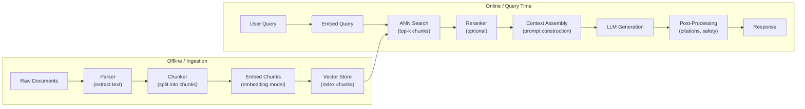

# RAG Fundamentals

## What is Retrieval-Augmented Generation?

Retrieval-Augmented Generation (RAG) is an architectural pattern that enhances LLM responses by fetching relevant information from an external knowledge base at inference time. Instead of relying solely on knowledge encoded in model weights during training, a RAG system retrieves relevant documents, injects them into the prompt as context, and generates a grounded response.

Introduced formally in the 2020 paper "Retrieval-Augmented Generation for Knowledge-Intensive NLP Tasks" (Lewis et al., Facebook AI), RAG has since become the dominant approach for building knowledge-grounded LLM applications in production.

---

## Why RAG? The Four Core Problems it Solves

### 1. Knowledge Cutoff

LLMs are trained on static snapshots of data. GPT-4 has a training cutoff; Claude has a training cutoff. Any event, product release, regulation change, or research paper published after that date is invisible to the model.

RAG allows you to inject current knowledge at query time without retraining. You update your document index; the model's behavior updates immediately.

### 2. Hallucinations from Parametric Knowledge

When an LLM doesn't know something with certainty, it often generates plausible-sounding but incorrect information. This is called hallucination. The model's parametric memory (what it learned during training) is compressed and lossy -- it encodes distributions over language, not precise facts.

RAG grounds generation in retrieved text. A faithfully implemented RAG system will cite its sources and stay close to what the retrieved documents actually say.

### 3. Cannot Cite Sources

A base LLM cannot tell you where its knowledge came from. With RAG, you have the retrieved documents. You can display sources to users, link back to original documents, and build trust through transparency.

### 4. Cost of Fine-Tuning for Every Knowledge Update

Fine-tuning a large model is expensive: compute, data preparation, evaluation, and deployment. For proprietary or frequently-changing knowledge (internal wikis, product docs, regulatory databases), you cannot fine-tune every time the knowledge changes.

RAG separates knowledge from model weights. You update the document store, not the model.

---

## The Full RAG Pipeline



### Step 1: Document Ingestion and Preprocessing

Raw documents come in many formats: PDF, Word, HTML, Markdown, code files, database exports, email archives. Each format requires a different parser.

Key parsing challenges:
- **PDFs**: PDFs encode layout, not structure. Tables, multi-column layouts, and headers are not trivially extractable as clean text. Tools like `pdfplumber`, `pymupdf` (fitz), and `unstructured` handle this with varying quality.
- **HTML**: Web pages contain navigation menus, ads, and boilerplate. You want the article body, not the header. `trafilatura` and `newspaper3k` are purpose-built for this.
- **Scanned PDFs**: Require OCR (Tesseract, AWS Textract, Azure Document Intelligence).
- **Code**: Preserve structure; function boundaries matter more than character counts.
- **Tables**: Require special handling -- serialize as CSV-like text, or index separately.

After parsing, clean the text: remove excessive whitespace, deduplicate repeated headers/footers, normalize unicode.

### Step 2: Chunking

Break documents into smaller pieces that fit within the embedding model's context window and that contain semantically coherent information.

This is covered in depth in `chunking_strategies.md`. Key decisions:
- Chunk size (128 to 2048 tokens depending on task)
- Overlap between chunks (typically 10-20%)
- Splitting strategy (fixed, sentence, semantic, structural)

### Step 3: Embedding Generation

Pass each chunk through an embedding model to produce a dense vector (typically 768 to 3072 dimensions). This vector represents the semantic content of the chunk in a high-dimensional space.

Common embedding models:
- `text-embedding-3-large` (OpenAI): 3072d, state of the art on MTEB
- `text-embedding-3-small` (OpenAI): 1536d, lower cost
- `BAAI/bge-large-en-v1.5`: Strong open-source option
- `sentence-transformers/all-MiniLM-L6-v2`: Fast, lightweight, good for prototyping
- `Cohere embed-v3`: Multimodal, 1024d, good for mixed content

The embedding model determines the semantic space. Query and document must use the same embedding model. Changing the embedding model requires re-indexing everything.

### Step 4: Vector Store Indexing

Store chunk embeddings in a vector database that supports approximate nearest neighbor (ANN) search. Along with each vector, store:
- The chunk text itself
- Metadata: source document, page number, creation date, author, section header, tenant ID
- A unique chunk ID

The vector store builds an index over the embeddings to enable sub-second similarity search over millions of vectors.

### Step 5: Query Time -- Embed the Query

At inference time, the user's query is passed through the same embedding model used during ingestion. This produces a query vector in the same semantic space as the chunk vectors.

### Step 6: Retrieve Top-k Chunks

Perform ANN search to find the k chunks whose embeddings are most similar to the query embedding. Cosine similarity is the standard metric (equivalent to dot product for normalized vectors).

Typical values: k=5 to k=20 before reranking, k=3 to k=5 after reranking.

### Step 7: Reranking (Optional but Recommended)

The initial retrieval uses bi-encoder similarity (query and document encoded independently). Reranking uses a cross-encoder: it attends to query and document jointly, producing a more accurate relevance score.

Common pattern: retrieve top-50 → rerank to top-5 → pass to LLM. The extra latency from reranking (50-200ms) typically improves answer quality significantly.

### Step 8: Context Assembly and Prompting

Assemble the retrieved chunks into a prompt. Standard structure:

```
SYSTEM: You are a helpful assistant. Answer questions based only on the provided context.
        If the answer is not in the context, say so.

CONTEXT:
[Chunk 1 text]
[Chunk 2 text]
...
[Chunk k text]

USER: {user_query}
```

Key decisions:
- Order of chunks (most relevant first or last -- recency bias in LLMs favors the end)
- Whether to include source metadata (document name, page)
- Token budget management (ensure total does not exceed context window)
- Instruction to not hallucinate beyond context

### Step 9: LLM Generation

The assembled prompt is sent to the LLM. The LLM synthesizes the retrieved information into a coherent answer.

Key LLM parameters:
- `temperature`: Lower (0.0-0.3) for factual RAG, higher for creative tasks
- `max_tokens`: Set appropriately for expected response length
- `stop_sequences`: Useful for structured outputs

### Step 10: Response Post-Processing

After generation:
- **Citation injection**: Match claimed facts to source chunks, add inline citations
- **Faithfulness check**: Optionally run a faithfulness classifier
- **Safety filtering**: Check for harmful content
- **Structured extraction**: If the output should be JSON, parse and validate

---

## RAG Variants

### Naive RAG

The simplest possible implementation: embed query, retrieve top-k, concatenate into prompt, generate.

Problems with naive RAG:
- Query-document mismatch: user queries are short and telegraphic; documents are verbose. Embedding similarity between a 5-word query and a 200-word chunk is often poor.
- Retrieval without understanding: no query transformation, no reranking
- No quality check: the LLM gets whatever is retrieved, good or bad
- Static chunking: ignores document structure

Naive RAG works for demos. It rarely works well enough for production.

### Advanced RAG

Advanced RAG adds components before and after retrieval:

**Pre-retrieval (query side):**
- Query rewriting: rephrase the query for better retrieval
- Query decomposition: break complex queries into simpler sub-queries
- HyDE: generate a hypothetical document, embed it instead of the raw query
- Query expansion: add synonyms and related terms

**Post-retrieval:**
- Reranking with cross-encoder
- Context compression: remove irrelevant sentences from chunks (LLMLingua)
- Chunk deduplication
- Citation-aware chunk ordering

### Modular RAG

Modular RAG treats the pipeline as composable, interchangeable modules. You can swap in different retrievers, rerankers, and generators without rebuilding the whole system. This maps well to production microservice architecture.

Examples of modular components:
- Retriever: dense, sparse, hybrid, graph
- Reranker: cross-encoder, ColBERT, no-op
- Context manager: truncation, compression, selection
- Generator: GPT-4, Claude, Llama, fine-tuned model
- Memory: none, conversation history, long-term

### Self-RAG

Self-RAG (Asai et al., 2023) trains the LLM itself to decide when to retrieve, what to retrieve, and to critique its own outputs using special control tokens.

The model generates several special tokens:
- `[Retrieve]`: should I retrieve now?
- `[IsRel]`: is this retrieved document relevant?
- `[IsSup]`: does this document support my generation?
- `[IsUse]`: is this response useful overall?

The model is fine-tuned to generate these tokens and act on them. This allows adaptive retrieval: simple factual queries may not need retrieval; complex multi-step queries trigger multiple retrieval calls.

**Interview insight**: Self-RAG requires fine-tuning the LLM, which is a significant overhead. It is more of a research technique than a production pattern in 2024.

### Corrective RAG (CRAG)

CRAG adds a retrieval evaluator that assesses whether the retrieved documents are relevant to the query. If documents are judged irrelevant or ambiguous, CRAG falls back to a web search (e.g., Bing Search API) to fetch fresh information.

CRAG workflow:
1. Retrieve from vector store
2. Evaluate relevance of each retrieved document (small classifier or LLM-judge)
3. If ALL documents are irrelevant: fall back to web search
4. If SOME documents are relevant: use them and optionally supplement with web search
5. Apply knowledge refinement (strip irrelevant content) before generation

**Interview insight**: CRAG is powerful for high-stakes QA but adds latency and API cost. The web search fallback handles time-sensitive or very specific queries that the local index cannot answer.

### Speculative RAG

Speculative RAG uses a small, fast "drafter" model to generate an initial answer using retrieved context, then uses the large "verifier" model to check and refine the answer.

Analogous to speculative decoding in LLM inference: the small model does cheap first-pass work; the large model validates and corrects.

Benefits:
- Reduces the number of tokens the large model processes
- Parallelizable: draft multiple candidates, verify in parallel
- Lower cost per query if the drafter is accurate enough

---

## Retrieval Strategies

### Dense Retrieval

Uses embedding-based semantic similarity. The embedding model maps query and documents to a shared semantic space.

**When dense retrieval works well:**
- The user query uses different words than the document (paraphrase, synonyms)
- The query is conceptual rather than keyword-specific
- Multi-language retrieval with a multilingual embedding model
- Queries with complex semantics

**Limitations:**
- Poor on rare, specific terms (product codes, names, technical identifiers)
- Poor on exact keyword matching (users searching for `"RuntimeError: CUDA out of memory"`)
- Requires embedding model that understands the domain

### Sparse Retrieval (BM25)

BM25 (Best Match 25) is the standard sparse retrieval algorithm, a descendant of TF-IDF. It computes term-frequency-based relevance scores with document length normalization.

BM25 score for a document D given query Q:

```
score(D, Q) = sum over terms t in Q:
    IDF(t) * (tf(t, D) * (k1 + 1)) / (tf(t, D) + k1 * (1 - b + b * |D| / avgdl))
```

Where:
- `tf(t, D)`: term frequency of term t in document D
- `IDF(t)`: inverse document frequency (log((N - n_t + 0.5) / (n_t + 0.5) + 1))
- `k1` (typically 1.2-2.0): term frequency saturation
- `b` (typically 0.75): document length normalization
- `avgdl`: average document length in the corpus

**When sparse retrieval works well:**
- Exact keyword matching (technical terms, IDs, names)
- Short, specific queries
- Out-of-domain queries where the embedding model has poor coverage
- Legal and medical documents with precise terminology

### Hybrid Retrieval

Best practice is to combine dense and sparse retrieval. This is covered in depth in `hybrid_search_and_reranking.md`.

The standard fusion algorithm is Reciprocal Rank Fusion (RRF):

```python
rrf_score(doc) = sum over retriever r:
    1 / (k + rank_r(doc))
```

Where k=60 is the standard constant. RRF is robust to differences in score scales between retrievers.

---

## Context Window Management

### How Much Context to Include

Modern LLMs have large context windows (128k-1M tokens), but:
- More context increases latency and cost linearly
- LLMs have a "lost in the middle" problem: they attend best to the beginning and end of context
- Irrelevant context dilutes the relevant signal and can cause the LLM to generate confused answers

Practical guidelines:
- Pass 3-10 high-quality chunks rather than 20 mediocre ones
- Set a token budget (e.g., 4096 tokens for context) and truncate at the chunk level
- Prefer a smaller number of highly relevant chunks over a large number of marginally relevant ones

### Context Compression

After retrieval, compress the retrieved content to remove sentences irrelevant to the query before passing to the LLM.

**LLMLingua** (Microsoft, 2023): Uses a small language model (GPT-2 scale) to score the importance of each token in the retrieved context relative to the query. Removes low-importance tokens. Achieves 3-5x compression with minimal quality loss.

**Selective Context**: A simpler approach that uses self-information (perplexity) of sentences to identify and remove redundant content.

**LLM-based summarization**: Use a cheap, fast LLM to summarize retrieved chunks before passing to the main LLM. Higher quality but adds latency.

### Chunk Ordering

Research shows LLMs attend better to content at the beginning and end of context ("lost in the middle" effect -- Liu et al., 2023).

Strategies:
- **Most relevant first**: Place highest-scoring chunk at position 0. Simple and commonly used.
- **Most relevant last**: Place highest-scoring chunk at the end. Works better if you believe the recency bias is stronger.
- **Bookend**: Place most relevant chunks at start and end, less relevant in the middle.

---

## Failure Modes of RAG

Understanding failure modes is critical for interviews. Be ready to discuss each category.

| Failure Mode | Cause | Detection | Mitigation |
|-------------|-------|-----------|-----------|
| Empty retrieval | Query too specific, index lacks data | Monitor retrieval count | Fallback to web search, tell user |
| Wrong retrieval | Query-document mismatch, poor embeddings | Retrieval eval metrics | Hybrid search, better chunking |
| Stale context | Index not updated | Track index freshness | TTL on chunks, incremental indexing |
| Hallucination on context | LLM fabricates beyond context | Faithfulness score | Prompt instruction, faithfulness check |
| Context overflow | Too many chunks, exceed context window | Token count monitoring | Compression, budget management |
| Conflicting docs | Multiple docs with contradictory facts | N/A (hard to detect automatically) | Date-prioritized ranking, source trust tiers |
| Irrelevant chunks diluting | Low-quality retrieval passed to LLM | NDCG, context relevance score | Reranking, minimum relevance threshold |

### Handling Conflicting Information

When retrieved documents contradict each other, the LLM may:
1. Generate an averaged or confused answer
2. Pick one source arbitrarily
3. Explicitly note the conflict (if prompted to do so)

Best practices:
- **Recency bias**: When documents conflict, prefer more recent ones. Store and sort by `last_modified` timestamp.
- **Source trust tiers**: Internal authoritative documents > external sources > user-generated content. Inject trust level into prompt.
- **Explicit conflict instruction**: Prompt: "If retrieved documents contradict each other, explicitly state the conflict and indicate which source is more recent."
- **Structured data sources**: For factual claims, prefer structured databases over unstructured text when available.

---

## RAG vs Fine-Tuning Decision Framework

This is one of the most common interview questions. Do not give a simplistic answer.

| Dimension | RAG | Fine-Tuning |
|-----------|-----|-------------|
| Knowledge update frequency | Daily/real-time (update index) | Weeks/months (retrain) |
| Knowledge type | Facts, documents, structured data | Style, format, behavior, domain reasoning |
| Source citation | Yes (native) | No (knowledge is implicit in weights) |
| Knowledge boundary control | Hard (filter at retrieval) | Soft (hard to unlearn) |
| Data volume required | Small (even 100 docs work) | Large (thousands of examples) |
| Compute cost | Low (index + inference) | High (training GPU hours) |
| Latency | +100-500ms for retrieval | Same as base model |
| Catastrophic forgetting | Not a concern | Risk: may forget base capabilities |
| Privacy | Documents stay in your store | Knowledge baked into weights |

**Rule of thumb**:
- Use **RAG** when the knowledge changes, when you need citations, when you have a document corpus, when you cannot afford to fine-tune.
- Use **fine-tuning** when you need to change how the model reasons or writes (tone, format, specialized domain jargon), not just what it knows.
- Use **both** for best results: fine-tune for style/behavior, RAG for knowledge.

---

## Minimal RAG Pipeline in Python

```python
"""
Minimal production-quality RAG pipeline using:
- sentence-transformers for embedding
- FAISS for vector search
- A simple prompt template
"""

import numpy as np
import faiss
from dataclasses import dataclass, field
from typing import Optional
from sentence_transformers import SentenceTransformer

# --- Data structures ---

@dataclass
class Document:
    text: str
    source: str
    chunk_id: int
    metadata: dict = field(default_factory=dict)

@dataclass
class RetrievedChunk:
    document: Document
    score: float
    rank: int

# --- Embedding ---

class EmbeddingModel:
    def __init__(self, model_name: str = "BAAI/bge-large-en-v1.5"):
        self.model = SentenceTransformer(model_name)
        self.dim = self.model.get_sentence_embedding_dimension()

    def embed(self, texts: list[str]) -> np.ndarray:
        """Embed a list of texts. Returns (n, dim) float32 array."""
        embeddings = self.model.encode(
            texts,
            normalize_embeddings=True,  # normalize for cosine similarity
            batch_size=64,
            show_progress_bar=False,
        )
        return embeddings.astype(np.float32)

# --- Vector Store (FAISS-backed) ---

class FAISSVectorStore:
    def __init__(self, dim: int):
        # IndexFlatIP: exact dot product search on normalized vectors = cosine similarity
        self.index = faiss.IndexFlatIP(dim)
        self.documents: list[Document] = []

    def add(self, documents: list[Document], embeddings: np.ndarray) -> None:
        """Add documents and their embeddings to the index."""
        assert len(documents) == len(embeddings)
        self.index.add(embeddings)
        self.documents.extend(documents)

    def search(self, query_embedding: np.ndarray, k: int = 5) -> list[RetrievedChunk]:
        """Retrieve top-k most similar chunks for a query embedding."""
        # query_embedding shape: (1, dim)
        query_embedding = query_embedding.reshape(1, -1)
        scores, indices = self.index.search(query_embedding, k)

        results = []
        for rank, (score, idx) in enumerate(zip(scores[0], indices[0])):
            if idx == -1:  # FAISS returns -1 for padding
                continue
            results.append(RetrievedChunk(
                document=self.documents[idx],
                score=float(score),
                rank=rank,
            ))
        return results

# --- Chunking ---

def chunk_text(
    text: str,
    chunk_size: int = 512,
    overlap: int = 64,
    source: str = "unknown",
) -> list[Document]:
    """
    Simple fixed-size character-based chunking with overlap.
    In production, use token-based chunking aligned with the embedding model's tokenizer.
    """
    chunks = []
    start = 0
    chunk_id = 0

    while start < len(text):
        end = min(start + chunk_size, len(text))
        chunk_text_str = text[start:end]
        chunks.append(Document(
            text=chunk_text_str,
            source=source,
            chunk_id=chunk_id,
        ))
        chunk_id += 1
        start += chunk_size - overlap  # advance by chunk_size - overlap

    return chunks

# --- RAG Pipeline ---

class RAGPipeline:
    def __init__(self, embedding_model: EmbeddingModel, vector_store: FAISSVectorStore):
        self.embedding_model = embedding_model
        self.vector_store = vector_store

    def index_documents(self, raw_texts: list[tuple[str, str]]) -> None:
        """
        Ingest and index a list of (text, source) tuples.
        Chunks each text, embeds chunks, adds to vector store.
        """
        all_chunks: list[Document] = []
        for text, source in raw_texts:
            chunks = chunk_text(text, chunk_size=512, overlap=64, source=source)
            all_chunks.extend(chunks)

        print(f"Indexing {len(all_chunks)} chunks...")
        texts = [c.text for c in all_chunks]
        embeddings = self.embedding_model.embed(texts)
        self.vector_store.add(all_chunks, embeddings)
        print(f"Indexed {len(all_chunks)} chunks.")

    def retrieve(self, query: str, k: int = 5) -> list[RetrievedChunk]:
        """Embed query, retrieve top-k chunks from vector store."""
        query_embedding = self.embedding_model.embed([query])
        return self.vector_store.search(query_embedding, k=k)

    def build_prompt(self, query: str, retrieved: list[RetrievedChunk]) -> str:
        """Assemble context and query into a prompt for the LLM."""
        context_parts = []
        for i, chunk in enumerate(retrieved):
            context_parts.append(
                f"[Source {i+1}: {chunk.document.source}]\n{chunk.document.text}"
            )
        context = "\n\n".join(context_parts)

        prompt = f"""You are a helpful assistant. Answer the question based only on the provided context.
If the answer is not in the context, say "I don't have enough information to answer this."
Do not invent information not present in the context.

CONTEXT:
{context}

QUESTION: {query}

ANSWER:"""
        return prompt

    def generate(self, prompt: str, llm_client) -> str:
        """
        Call the LLM with the assembled prompt.
        llm_client should have a .complete(prompt) -> str method.
        """
        return llm_client.complete(prompt)

    def query(self, question: str, k: int = 5, llm_client=None) -> dict:
        """End-to-end RAG: retrieve, assemble, generate."""
        retrieved = self.retrieve(question, k=k)
        prompt = self.build_prompt(question, retrieved)

        answer = None
        if llm_client:
            answer = self.generate(prompt, llm_client)

        return {
            "question": question,
            "retrieved_chunks": retrieved,
            "prompt": prompt,
            "answer": answer,
            "sources": [c.document.source for c in retrieved],
        }


# --- Usage Example ---

def main():
    # Initialize components
    embedding_model = EmbeddingModel(model_name="all-MiniLM-L6-v2")
    vector_store = FAISSVectorStore(dim=embedding_model.dim)
    pipeline = RAGPipeline(embedding_model, vector_store)

    # Index some documents
    documents = [
        (
            "FAISS is a library developed by Facebook AI Research for efficient similarity search "
            "and clustering of dense vectors. It contains algorithms for searching in sets of "
            "vectors of any size. FAISS is written in C++ with Python bindings and supports "
            "both CPU and GPU computation.",
            "faiss_overview.txt"
        ),
        (
            "Vector databases are purpose-built for storing and querying high-dimensional vectors. "
            "Unlike traditional databases, they index vectors using specialized data structures "
            "such as HNSW or IVF to enable approximate nearest neighbor (ANN) search at scale. "
            "Popular vector databases include Pinecone, Weaviate, Qdrant, and Chroma.",
            "vector_db_intro.txt"
        ),
        (
            "Retrieval-Augmented Generation (RAG) combines the parametric knowledge of a "
            "language model with non-parametric retrieval from an external document store. "
            "At inference time, the system retrieves the most relevant documents and injects "
            "them into the prompt as additional context for the language model to use.",
            "rag_intro.txt"
        ),
    ]

    pipeline.index_documents(documents)

    # Query (without LLM -- inspect retrieved chunks)
    result = pipeline.query("What is FAISS used for?", k=3)

    print("\n=== Retrieved Chunks ===")
    for chunk in result["retrieved_chunks"]:
        print(f"  Rank {chunk.rank+1} | Score: {chunk.score:.4f} | Source: {chunk.document.source}")
        print(f"  Text: {chunk.document.text[:100]}...")
        print()

    print("=== Assembled Prompt (first 500 chars) ===")
    print(result["prompt"][:500])


if __name__ == "__main__":
    main()
```

**Running this code:**
```bash
pip install sentence-transformers faiss-cpu numpy
python rag_pipeline.py
```

---

## Common Interview Questions and Model Answers

### "What is the difference between naive RAG and advanced RAG?"

Naive RAG: embed query, retrieve top-k, concatenate, generate. No query transformation, no reranking, no quality checks.

Advanced RAG adds:
- Pre-retrieval: query rewriting, decomposition, HyDE
- Post-retrieval: reranking with cross-encoders, context compression, chunk deduplication
- Quality gates: minimum relevance threshold before passing to LLM

The key insight is that naive RAG fails because the query and documents live in slightly different semantic spaces. Advanced RAG bridges that gap from both sides (better query representation, better chunk selection).

### "When would you use RAG vs fine-tuning?"

Use RAG when: knowledge changes frequently, you need citations, the task is primarily knowledge-retrieval, data privacy requires knowledge to stay in your own store, you have limited compute.

Use fine-tuning when: you need to change the model's behavior or style (not just its knowledge), the domain requires specialized reasoning patterns not present in the base model, you have labeled examples of the desired behavior, latency is critical and you cannot afford retrieval overhead.

Use both: RAG for knowledge, fine-tuning for behavior. For example, a medical QA system might fine-tune for clinical reasoning style while using RAG to ground answers in current clinical guidelines.

### "What are the failure modes of RAG?"

Retrieve nothing: no relevant documents in the index. Detection: monitor retrieval count and minimum score.

Retrieve wrong things: semantic mismatch between query and relevant documents. Detection: context relevance metric.

LLM ignores context: the LLM's parametric knowledge overrides retrieved context. Mitigation: explicit prompt instructions, self-RAG.

Stale documents: retrieved documents are outdated. Mitigation: TTL on chunks, freshness field in metadata.

Context overflow: too many chunks exceed context window. Mitigation: token budget management, compression.

Hallucination on context: LLM fabricates details not in retrieved docs. Detection: faithfulness score.

### "How do you handle conflicting information in retrieved documents?"

First, prevent it where possible by applying recency-based ranking: prefer more recent documents.

At prompt time, explicitly instruct the LLM: "If sources conflict, explicitly note the conflict and prefer the most recent source."

For structured knowledge (facts, numbers), consider a structured data store alongside the vector store that holds authoritative values. If a retrieved document and the structured store conflict, trust the structured store.

For high-stakes applications, add a post-generation faithfulness check that flags any claims not supported by retrieved chunks.

---

## Key Takeaways for Interviews

1. RAG = search engine + LLM. Master search first.
2. Most RAG failures are retrieval failures, not generation failures.
3. Chunking and embedding quality are the two highest-leverage improvements.
4. Evaluation is non-negotiable: build your eval harness before tuning.
5. Advanced RAG is a collection of independent improvements; each can be added incrementally.
6. RAG and fine-tuning are complementary, not competing.
7. Production RAG requires latency budgets, caching, observability, and index maintenance.
