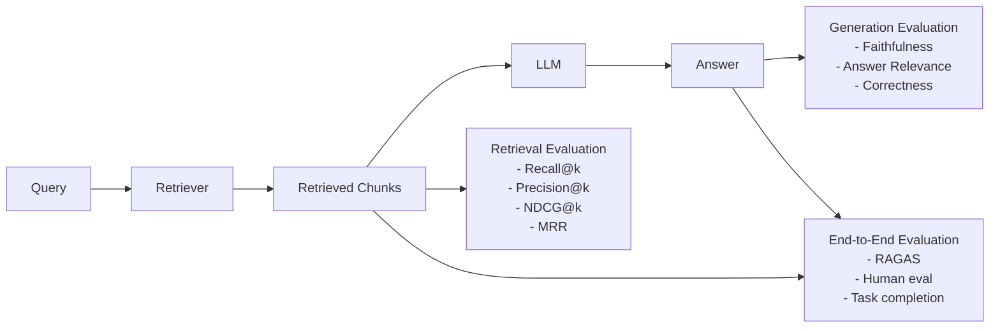
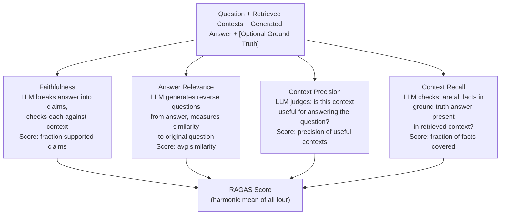

# Retrieval Evaluation

## Why Evaluation is Hard

Building a RAG system without a rigorous evaluation harness is engineering by guesswork. You cannot tell if a change to your chunking strategy, embedding model, or reranker actually improves the system. Yet evaluation of RAG systems is genuinely difficult for several reasons:

**Ground truth is expensive to create.** Knowing which chunks are truly relevant to a query requires human judgment. For a corpus of 100,000 documents and 1,000 queries, labeling which of the top-20 retrieved chunks are relevant requires significant annotation effort.

**Retrieval quality does not equal generation quality.** A system that retrieves perfectly relevant chunks might still produce bad answers if the LLM fails to synthesize them. Conversely, a system with mediocre retrieval might produce acceptable answers if the LLM is very good at working with noisy context.

**User satisfaction is the true metric, but it is the hardest to measure.** Did the user find the answer helpful? Did they accomplish their task? These require either A/B testing with instrumented user behavior or costly human evaluation.

**Queries are diverse.** A RAG system serving a product documentation site might receive everything from simple lookup queries ("What is the API rate limit?") to complex reasoning queries ("Explain the tradeoffs between synchronous and asynchronous processing for my use case"). A single aggregate metric may hide performance differences across query types.

Despite these challenges, rigorous evaluation is non-negotiable in production. The best practitioners build their eval harness before tuning and treat it as a first-class artifact.

---

## Two Separate Problems: Retrieval Quality vs Generation Quality

This is a critical distinction. Always evaluate the two components separately before evaluating end-to-end.



**Why evaluate separately?**

If end-to-end quality is poor, you need to know whether to fix retrieval or fix generation. If retrieval recall is 0.4 (only 40% of relevant chunks are being retrieved), improving the LLM will not help much. If retrieval recall is 0.95 but faithfulness is low, the retrieval is fine and you need better prompting or a better LLM.

---

## Retrieval Metrics

### Recall@k

**Definition**: Of all documents/chunks that are truly relevant to a query, what fraction appears in the top-k retrieved results?

```
Recall@k = |{relevant documents in top-k}| / |{all relevant documents}|
```

**Example**: A query has 3 relevant chunks in the corpus. The retriever returns 5 chunks, of which 2 are relevant. Recall@5 = 2/3 = 0.67.

**What it tells you**: Whether the retriever can find all the relevant information. Low recall means the LLM will give incomplete answers because it doesn't have all the relevant context.

**Limitation**: Recall says nothing about how many irrelevant results are also retrieved. A system that retrieves everything has recall = 1.0 but is useless.

### Precision@k

**Definition**: Of the top-k retrieved results, what fraction are truly relevant?

```
Precision@k = |{relevant documents in top-k}| / k
```

**Example**: Retriever returns 5 chunks, of which 2 are relevant. Precision@5 = 2/5 = 0.4.

**What it tells you**: Whether retrieved chunks are "clean" -- high proportion of relevant content with little noise. Low precision means the LLM receives a lot of irrelevant context, which can confuse it or waste context window budget.

**The precision-recall tradeoff**: Increasing k improves recall (more results, more chances to include relevant ones) but hurts precision (more irrelevant results diluting the relevant ones). Reranking improves precision without sacrificing as much recall.

### MRR: Mean Reciprocal Rank

**Definition**: For a given query, if the first relevant document appears at position r in the ranked results, the reciprocal rank is 1/r. MRR averages this over a set of queries.

```
MRR = (1/Q) * sum over queries q:
    1 / rank_q(first relevant document)
```

**Example**: Three queries. First relevant documents appear at ranks 1, 3, and 2.
MRR = (1/3) * (1/1 + 1/3 + 1/2) = (1/3) * (1.833) = 0.611

**What it tells you**: How quickly the retriever surfaces the first relevant result. A high MRR means users can find relevant information near the top.

**Best for**: Single-answer queries where the first correct answer is what matters (e.g., "What is the return policy?" has a single correct answer).

**Limitation**: Ignores all relevant results beyond the first. If a query has 5 relevant documents and MRR focuses only on the first, it misses whether the others are retrieved.

### NDCG: Normalized Discounted Cumulative Gain

NDCG is the most sophisticated retrieval metric. It handles graded relevance (not just binary relevant/not-relevant) and penalizes relevant results that appear lower in the ranking.

**Discounted Cumulative Gain (DCG)**:
```
DCG@k = sum over i from 1 to k:
    (2^rel_i - 1) / log2(i + 1)
```

Where `rel_i` is the relevance score of the document at position i (e.g., 0=irrelevant, 1=partially relevant, 2=highly relevant).

The log2 denominator is the "discount" -- results at position 1 contribute fully, results at position 5 contribute less.

**Ideal DCG (IDCG)**: DCG of the perfect ranking (all highly relevant results first).

**NDCG@k = DCG@k / IDCG@k**

NDCG is always in [0, 1], with 1.0 being perfect.

**Example with binary relevance (0/1)**:
- Ranking: [relevant, irrelevant, relevant, irrelevant, relevant]
- DCG@5 = 1/log2(2) + 0 + 1/log2(4) + 0 + 1/log2(6) = 1.0 + 0 + 0.5 + 0 + 0.387 = 1.887
- Ideal ranking: [relevant, relevant, relevant, irrelevant, irrelevant]
- IDCG@5 = 1.0 + 0.631 + 0.5 + 0 + 0 = 2.131
- NDCG@5 = 1.887 / 2.131 = 0.885

**What it tells you**: The overall quality of the ranking, accounting for both which results are relevant and where they appear.

**Best for**: Comprehensive evaluation of a ranked retrieval system.

### Hit Rate (aka Success@k)

**Definition**: Fraction of queries where at least one relevant result appears in the top-k.

```
Hit Rate@k = |{queries with at least one relevant result in top-k}| / |{queries}|
```

**What it tells you**: Binary success rate. Did the retriever find anything useful for this query?

**Best for**: Quick sanity check. If Hit Rate@5 is below 0.7, the retriever is fundamentally failing on most queries.

---

## Metric Summary Table

| Metric | Measures | Graded Relevance | Ranking Order | Best Use Case |
|--------|----------|-----------------|---------------|---------------|
| Recall@k | Coverage of relevant docs | No | No | Multi-answer queries |
| Precision@k | Signal-to-noise ratio | No | No | Context quality |
| MRR | Speed of first relevant result | No | Yes (first only) | Single-answer QA |
| NDCG@k | Overall ranking quality | Yes | Yes | Comprehensive eval |
| Hit Rate@k | Binary success rate | No | No | Quick sanity check |

---

## RAG-Specific Evaluation: The Generation Side

Traditional IR metrics measure whether the right chunks are retrieved. But in RAG, we also need to measure whether the generated answer is correct, grounded, and useful.

### Faithfulness

**Definition**: Does every claim in the generated answer have support in the retrieved context?

A faithful answer contains only information that can be traced back to the retrieved chunks. An unfaithful answer contains claims that are hallucinated or contradicted by the retrieved context.

**Example:**
- Retrieved context: "The speed of light in vacuum is approximately 299,792 km/s."
- Question: "What is the speed of light?"
- Faithful answer: "The speed of light in vacuum is approximately 299,792 km/s."
- Unfaithful answer: "The speed of light is exactly 300,000 km/s, and it was measured by Einstein."

Measuring faithfulness: An LLM judge breaks the answer into atomic claims and checks each claim against the retrieved context.

### Answer Relevance

**Definition**: Does the generated answer actually address the question asked?

An answer can be perfectly faithful (every claim sourced from context) but still be irrelevant (it answers a tangential question, not the one asked).

**Example:**
- Question: "How do I reset my password?"
- Irrelevant answer: "Our password system uses bcrypt hashing with salt rounds of 12." (Faithful to context, but doesn't address the user's need.)

### Context Precision

**Definition**: Of the retrieved chunks that were provided to the LLM, what fraction were actually useful for generating the answer?

High context precision means the retriever returned a clean set of relevant chunks. Low context precision means many retrieved chunks were irrelevant (noise that the LLM had to ignore).

### Context Recall

**Definition**: Is all the information needed to answer the question present in the retrieved context?

High context recall means the retriever found all the relevant information. Low context recall means the answer is necessarily incomplete because key information was not retrieved.

---

## RAGAS Framework

RAGAS (Retrieval Augmented Generation Assessment) provides an automated, LLM-based evaluation framework that measures all four dimensions above without requiring human annotations.

**Architecture:**



**RAGAS metrics in detail:**

**Faithfulness** (does not require ground truth):
1. LLM decomposes the generated answer into a set of atomic statements
2. For each statement, LLM judges: "Is this statement supported by the provided context?"
3. Faithfulness = number of supported statements / total statements

**Answer Relevance** (does not require ground truth):
1. LLM generates n questions that the given answer would be a good response to
2. Embed all generated questions and the original question
3. Answer Relevance = average cosine similarity between generated questions and original question
4. High similarity = the answer is on-topic

**Context Precision** (does require ground truth):
1. For each retrieved context, LLM judges: "Is this context relevant to the ground truth answer?"
2. Context Precision@k = weighted precision over relevant contexts at each position

**Context Recall** (does require ground truth):
1. LLM decomposes the ground truth answer into atomic statements
2. For each statement, LLM judges: "Is this statement present in the retrieved context?"
3. Context Recall = fraction of ground truth statements found in context

```python
from ragas import evaluate
from ragas.metrics import (
    faithfulness,
    answer_relevancy,
    context_precision,
    context_recall,
)
from datasets import Dataset

# Prepare evaluation dataset
eval_data = {
    "question": [
        "What is the boiling point of water?",
        "Who invented the telephone?",
    ],
    "contexts": [
        # Each entry is a list of retrieved context strings
        [
            "Water boils at 100 degrees Celsius (212 degrees Fahrenheit) at standard atmospheric pressure.",
            "The boiling point varies with altitude: at high elevation, water boils at lower temperatures.",
        ],
        [
            "Alexander Graham Bell is credited with inventing the telephone, receiving the first patent in 1876.",
            "Antonio Meucci filed a caveat for a voice communication device in 1871.",
        ],
    ],
    "answer": [
        "Water boils at 100 degrees Celsius at standard atmospheric pressure.",
        "Alexander Graham Bell is generally credited with inventing the telephone in 1876.",
    ],
    "ground_truth": [
        "The boiling point of water is 100 degrees Celsius at sea level.",
        "Alexander Graham Bell invented the telephone and received the first patent in 1876.",
    ],
}

dataset = Dataset.from_dict(eval_data)

# Run RAGAS evaluation
result = evaluate(
    dataset=dataset,
    metrics=[
        faithfulness,
        answer_relevancy,
        context_precision,
        context_recall,
    ],
    # Optionally specify LLM and embeddings to use as judges
    # llm=your_llm_instance,
    # embeddings=your_embeddings_instance,
)

print(result)
# Output example:
# {'faithfulness': 0.96, 'answer_relevancy': 0.89,
#  'context_precision': 0.83, 'context_recall': 0.91}
```

**Important RAGAS caveats:**
- RAGAS uses an LLM as the judge, which means it inherits LLM biases (verbose answers may be judged more favorably, etc.)
- The cost of running RAGAS on a large eval set can be significant (one LLM call per metric per sample, times 4 metrics)
- Use a cheaper model (GPT-4o-mini) for RAGAS if cost is a concern, but validate that it agrees with GPT-4 on a small sample
- Context Precision and Context Recall require ground truth answers; use synthetic generation if you don't have them

---

## Building Evaluation Datasets

### Option 1: Synthetic QA Generation

Use an LLM to generate (question, answer, relevant_chunk) triples from your document corpus. This is the most scalable approach.

```python
from openai import OpenAI
import json

client = OpenAI()

def generate_qa_pairs(chunk_text: str, chunk_source: str, n_questions: int = 3) -> list[dict]:
    """
    Generate question-answer pairs from a document chunk for evaluation.
    """
    prompt = f"""You are creating an evaluation dataset for a RAG (Retrieval-Augmented Generation) system.
Given the following document excerpt, generate {n_questions} diverse question-answer pairs.

Requirements:
- Questions should be answerable from ONLY the provided text
- Include a mix of: factoid questions, explanation questions, comparison questions
- Answers should be concise and accurate
- Include the exact sentence(s) from the text that support the answer (supporting_evidence)

Document excerpt (source: {chunk_source}):
{chunk_text}

Output as a JSON array with this structure:
[
  {{
    "question": "...",
    "answer": "...",
    "supporting_evidence": "exact quote from the text",
    "question_type": "factoid | explanation | comparison"
  }}
]

Output ONLY the JSON array, nothing else."""

    response = client.chat.completions.create(
        model="gpt-4o-mini",
        messages=[{"role": "user", "content": prompt}],
        temperature=0.7,
        response_format={"type": "json_object"},
    )

    try:
        data = json.loads(response.choices[0].message.content)
        # Handle both {"pairs": [...]} and direct [...] formats
        if isinstance(data, list):
            pairs = data
        else:
            pairs = data.get("pairs", data.get("questions", []))

        for pair in pairs:
            pair["source_chunk"] = chunk_source

        return pairs
    except (json.JSONDecodeError, KeyError):
        return []


def build_eval_dataset(chunks: list[dict], n_questions_per_chunk: int = 2) -> list[dict]:
    """Build a full evaluation dataset from a list of document chunks."""
    all_pairs = []
    for chunk in chunks:
        pairs = generate_qa_pairs(
            chunk_text=chunk["text"],
            chunk_source=chunk["source"],
            n_questions=n_questions_per_chunk,
        )
        all_pairs.extend(pairs)
    return all_pairs
```

**Concerns with synthetic QA:**
- Generated questions may not reflect real user queries (they're biased toward what's in the chunk)
- Answers may not match what real users find helpful
- Can create circular evaluation: if the same model generates the eval set and evaluates answers, you're measuring consistency, not quality

**Best practice**: Use synthetic QA for development and regression testing, but validate with a small sample of human-labeled queries before deployment.

### Option 2: Human Annotation

Have human annotators:
1. Write realistic queries for your domain
2. Mark which retrieved chunks are relevant (binary or graded)
3. Write or approve reference answers

**Cost**: $0.50-$5 per query-answer pair depending on complexity.

**Quality**: The gold standard. Human labels reflect real information needs.

**Scale**: Expensive to scale beyond 500-1000 queries for most teams.

**Annotation interface**: Use Label Studio or a custom annotation tool. Provide clear guidelines: what counts as "relevant"? What is "partially relevant"?

### Option 3: Adversarial Test Cases

Beyond typical queries, create adversarial test cases that stress-test failure modes:

```python
adversarial_cases = [
    # Empty retrieval: query about topic not in corpus
    {"question": "What is the population of Mars?", "expected": "no_context"},

    # Conflicting information: two chunks with contradictory facts
    {"question": "What is the rate limit for the API?",
     "context": ["The API rate limit is 100 requests/minute.",
                 "The API rate limit is 1000 requests/minute."],
     "expected": "should_note_conflict"},

    # Temporal: stale information
    {"question": "What is the current version of our SDK?", "expected": "should_check_freshness"},

    # Multi-hop: requires combining two chunks
    {"question": "Does the team lead of the ML team have a PhD?",
     "expected": "requires_two_chunks"},

    # Negation: asking about something NOT in the docs
    {"question": "Do you support Windows XP?", "expected": "not_in_docs_answer"},
]
```

### Option 4: Mining from Production Logs

Once your system is live, mine evaluation data from production:

- **User thumbs-up/thumbs-down**: Direct relevance signal on (query, answer) pairs
- **Follow-up questions**: If a user immediately asks a follow-up, the first answer was incomplete
- **Session abandonment**: User gave up without marking success
- **Click-through on source links**: Evidence that retrieved sources were relevant

---

## Online Evaluation

Offline eval with a static dataset is necessary but not sufficient. Production behavior can differ from eval behavior due to query distribution shift.

### User Feedback Signals

| Signal | What it measures | Implementation |
|--------|-----------------|----------------|
| Thumbs up/down | Direct answer quality | UI button, log query + answer + rating |
| Copied text | User found value in answer | Clipboard event tracking |
| Source clicks | Retrieved chunks were relevant | Link click tracking |
| Follow-up question | First answer was incomplete | Session analysis |
| Session abandonment | No useful answer found | Session timeout analysis |
| Task completion | End goal achieved | Domain-specific (ticket resolved, order placed) |

### Shadow Evaluation

Run a sample of production queries through your RAGAS pipeline automatically:

```python
import random
from datetime import datetime

def shadow_evaluate(query: str, retrieved_chunks: list, answer: str,
                    eval_rate: float = 0.01) -> None:
    """
    Probabilistically run RAGAS evaluation on production queries.
    eval_rate=0.01 means 1% of queries are shadow-evaluated.
    """
    if random.random() > eval_rate:
        return

    # Log for async evaluation
    eval_job = {
        "timestamp": datetime.utcnow().isoformat(),
        "query": query,
        "contexts": [c.text for c in retrieved_chunks],
        "answer": answer,
    }
    # Push to evaluation queue (e.g., SQS, Kafka)
    evaluation_queue.send(eval_job)
```

### Escalation Rate

Track the fraction of queries where the user indicates the answer was unhelpful and seeks human assistance. In customer support, this is the "escalation to human agent" rate.

An escalation rate above ~15-20% typically indicates the RAG system is not meeting user needs for that query category.

---

## Complete Evaluation Pipeline

```python
"""
Complete RAG evaluation pipeline combining offline metrics and RAGAS.
"""
from dataclasses import dataclass
from typing import Optional
import numpy as np
from ragas import evaluate
from ragas.metrics import faithfulness, answer_relevancy, context_precision, context_recall
from datasets import Dataset


@dataclass
class EvalSample:
    question: str
    retrieved_chunks: list[str]  # texts of retrieved chunks
    answer: str
    ground_truth: Optional[str] = None
    relevant_chunk_ids: Optional[list[int]] = None  # for retrieval metrics


@dataclass
class RetrievalMetrics:
    recall_at_k: float
    precision_at_k: float
    hit_rate: float
    mrr: float


def compute_retrieval_metrics(
    retrieved_ids: list[int],
    relevant_ids: set[int],
    k: int,
) -> RetrievalMetrics:
    """Compute standard retrieval metrics for a single query."""
    top_k = retrieved_ids[:k]
    top_k_set = set(top_k)
    relevant_in_top_k = top_k_set & relevant_ids

    recall = len(relevant_in_top_k) / len(relevant_ids) if relevant_ids else 0.0
    precision = len(relevant_in_top_k) / k if k > 0 else 0.0
    hit = 1.0 if len(relevant_in_top_k) > 0 else 0.0

    # MRR: position of first relevant result
    mrr = 0.0
    for rank, doc_id in enumerate(top_k, start=1):
        if doc_id in relevant_ids:
            mrr = 1.0 / rank
            break

    return RetrievalMetrics(recall_at_k=recall, precision_at_k=precision,
                            hit_rate=hit, mrr=mrr)


def evaluate_rag_pipeline(samples: list[EvalSample], k: int = 5) -> dict:
    """
    Run complete RAG evaluation: retrieval metrics + RAGAS generation metrics.
    """
    # --- Retrieval metrics (if relevant_chunk_ids are provided) ---
    retrieval_samples = [s for s in samples if s.relevant_chunk_ids is not None]
    retrieval_results = []
    for sample in retrieval_samples:
        retrieved_ids = list(range(len(sample.retrieved_chunks)))  # placeholder
        metrics = compute_retrieval_metrics(
            retrieved_ids=retrieved_ids,
            relevant_ids=set(sample.relevant_chunk_ids),
            k=k,
        )
        retrieval_results.append(metrics)

    avg_retrieval = {
        "recall@k": np.mean([r.recall_at_k for r in retrieval_results]),
        "precision@k": np.mean([r.precision_at_k for r in retrieval_results]),
        "hit_rate": np.mean([r.hit_rate for r in retrieval_results]),
        "mrr": np.mean([r.mrr for r in retrieval_results]),
    } if retrieval_results else {}

    # --- RAGAS generation metrics ---
    ragas_samples = [s for s in samples if s.ground_truth is not None]
    ragas_metrics = {}

    if ragas_samples:
        ragas_data = {
            "question": [s.question for s in ragas_samples],
            "contexts": [s.retrieved_chunks for s in ragas_samples],
            "answer": [s.answer for s in ragas_samples],
            "ground_truth": [s.ground_truth for s in ragas_samples],
        }
        dataset = Dataset.from_dict(ragas_data)
        ragas_result = evaluate(
            dataset=dataset,
            metrics=[faithfulness, answer_relevancy, context_precision, context_recall],
        )
        ragas_metrics = dict(ragas_result)

    return {
        "retrieval": avg_retrieval,
        "generation": ragas_metrics,
        "n_retrieval_samples": len(retrieval_samples),
        "n_ragas_samples": len(ragas_samples),
    }
```

---

## Evaluation in Practice: What to Measure When

| Phase | What to measure | How |
|-------|----------------|-----|
| Before launch | Retrieval recall@5, precision@5, RAGAS metrics | Offline eval set |
| Staging | End-to-end RAGAS + latency | Synthetic queries |
| Launch | Hit rate (online), latency, error rate | Monitoring |
| Week 1+ | User thumbs up/down, escalation rate | User feedback |
| Monthly | Re-run full offline eval (catch distribution drift) | Sampled production queries + labels |

---

## Common Interview Questions and Model Answers

### "How do you evaluate a RAG pipeline before deployment?"

I evaluate at two levels: retrieval and generation.

For retrieval: I build a test set of (query, relevant_chunk_ids) pairs. If my corpus is large, I use synthetic QA generation to create questions, then manually verify a sample. I measure Recall@5, Precision@5, and NDCG@5. My target is Recall@5 > 0.85 for the queries in my test set.

For generation: I use RAGAS with the same test set (which includes reference answers). I measure faithfulness, answer relevance, context precision, and context recall. I look for faithfulness > 0.9 (very few hallucinations), answer relevance > 0.8.

I also run adversarial tests: empty retrieval, conflicting documents, very specific queries. I measure how gracefully the system handles these edge cases.

Finally, before deployment, I run an internal pilot where team members use the system for real tasks and give feedback.

### "What is the difference between retrieval and generation quality?"

Retrieval quality measures whether the right documents were found. Generation quality measures whether the LLM used those documents to produce a correct, grounded answer.

A RAG system can have:
- High retrieval + high generation: the system works well
- High retrieval + low generation: the LLM is hallucinating or misusing the context; fix prompting or switch models
- Low retrieval + high generation: the LLM is using parametric knowledge to fill gaps; dangerous, produces unfaithful answers
- Low retrieval + low generation: fundamentally broken; fix retrieval first

Always diagnose which component is failing before making changes.

---

## Key Takeaways for Interviews

1. Always evaluate retrieval and generation separately. Treat them as independent problems.
2. Recall@k and NDCG@k are the primary retrieval metrics. Know how to compute them.
3. RAGAS provides automated generation evaluation using LLM-as-judge. Know its four metrics.
4. Building an evaluation dataset is as important as building the system. Start with synthetic QA, validate with humans.
5. Online signals (thumbs, escalation, follow-up questions) are the ultimate measure of production quality.
6. The goal is not to maximize any single metric but to build a system that reliably helps users accomplish their tasks.
