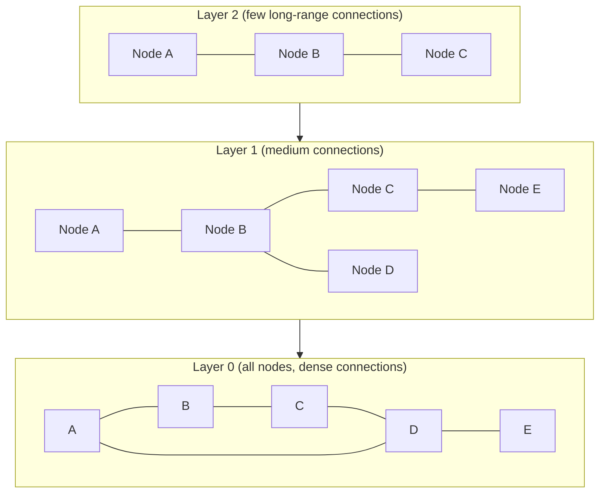

# Vector Databases

## Why Vector Databases Exist

Traditional relational databases organize data in tables and answer queries like "find all rows where `status = 'active'` and `date > 2024-01-01`." These queries use equality tests, range comparisons, and joins -- operations that work on structured, low-dimensional attributes.

Embedding vectors are fundamentally different. A vector representing a document's meaning might have 1536 dimensions. The question you want to answer is: "which of my million stored vectors is most similar to this query vector?" This is nearest neighbor search in high-dimensional space.

Regular databases cannot answer this efficiently because:
- There is no natural ordering on high-dimensional vectors that allows index-like pruning
- Brute-force scan over millions of 1536-dimensional vectors is too slow for real-time use
- SQL databases have no native concept of vector similarity

Vector databases solve this with specialized index structures for Approximate Nearest Neighbor (ANN) search, trading a small amount of accuracy (approximation) for orders-of-magnitude speedup.

---

## Approximate Nearest Neighbor (ANN) Search

### Why Exact Search Doesn't Scale

Exact nearest neighbor search (brute force) has complexity O(n * d) for n vectors of dimension d. For n=10M and d=1536:
- Each query requires ~15.36 billion floating point operations
- At ~1 TFLOP/s on CPU, that's about 15ms per query before any overhead
- 100 concurrent users = 1.5 billion ops/second
- This is feasible on GPU clusters but prohibitively expensive

ANN algorithms sacrifice a small amount of recall (the top-1 nearest neighbor might not always be truly #1) to achieve 10-100x speedup.

**Recall@10** is the standard benchmark metric: what fraction of the time is the true nearest neighbor in the returned top-10 results?

### The ANN Trilemma

ANN algorithms trade off between:
1. **Query speed**: latency per search
2. **Recall**: how often the true nearest neighbor is found
3. **Memory**: RAM required for the index

Different algorithms sit at different points on this tradeoff.

---

## Indexing Algorithms

### Flat Index (Exact Search)

**Structure**: No index; stores all vectors in a flat array. Every query scans all vectors.

**Query time**: O(n * d) -- linear scan

**Recall**: 1.0 (exact, by definition)

**Memory**: O(n * d * 4 bytes) for float32 vectors

**Use cases**:
- Baseline for accuracy measurement
- Tiny datasets (< 100k vectors)
- When recall must be exactly 1.0 (safety-critical applications)
- GPU brute force is viable at moderate scales

```python
import faiss

dim = 1536
index = faiss.IndexFlatIP(dim)  # Flat index, inner product (cosine for normalized vecs)
index.add(embeddings)           # Add (n, dim) float32 array
D, I = index.search(query_vec.reshape(1, -1), k=10)  # Returns distances, indices
```

---

### HNSW: Hierarchical Navigable Small Worlds

HNSW (Malkov & Yashunin, 2018) is the most widely deployed ANN algorithm in production vector databases. It achieves excellent recall with fast queries by building a multi-layer graph structure.

**Conceptual structure:**



**How HNSW works:**

1. **Construction**: Each vector is inserted into multiple layers. The number of layers for each node is sampled from a distribution (higher layers have fewer nodes). Each node connects to its M nearest neighbors at the current layer.
2. **Query (greedy search)**: Start at the top layer with a single entry point. Greedily move to the nearest neighbor of the query in that layer. Descend to the next layer at the found node. Repeat until Layer 0. At Layer 0, explore the neighborhood more thoroughly using a beam of width `ef_search` to find the top-k results.

The upper layers act as a highway for long-distance navigation; the bottom layer provides local precision.

**Key parameters:**
- `M` (typically 8-64): Number of connections per node at each layer. Higher M = better recall, more memory, slower insert. Sweet spot is usually 16-32.
- `ef_construction` (typically 100-200): Size of the dynamic candidate list during index construction. Higher = better quality graph, slower build.
- `ef_search` (typically 50-200): Beam width during query. Higher = better recall, slower query. Tunable at query time without rebuilding index.

**Performance characteristics:**
- Query time: O(log n) expected
- Build time: O(n * log n)
- Memory: O(n * M * 4 bytes) for the graph + O(n * d * 4 bytes) for the vectors
- Recall@10 vs latency: typically 95-99% recall at 1-5ms latency on millions of vectors

**HNSW advantages:**
- No training step (unlike IVF)
- Excellent recall at moderate latency
- Handles dynamic insertions well
- Consistent latency (no "bad case" clusters)

**HNSW disadvantages:**
- Higher memory usage than IVF (the graph adds overhead)
- Deletions are expensive (marking as deleted, periodic cleanup)
- Poor scalability past ~100M vectors without sharding

---

### IVF: Inverted File Index

IVF clusters the vector space and only searches nearby clusters at query time.

**How IVF works:**

1. **Training**: Run k-means to partition the vector space into `nlist` clusters (centroids).
2. **Indexing**: Assign each vector to its nearest centroid. Build an inverted list: for each centroid, store the list of vectors assigned to it.
3. **Query**: Compute distance from query to all centroids (fast, only `nlist` distances). Search the `nprobe` closest clusters (inverted lists) for the nearest neighbors.

**Key parameters:**
- `nlist` (typically 4 * sqrt(n) as a rule of thumb): Number of clusters. More clusters = finer partitioning = better recall when nprobe is proportionally large.
- `nprobe` (typically 8-64): Number of clusters to search per query. Higher = better recall, slower query. Also tunable at query time.

**Performance characteristics:**
- Query time: O(nprobe * (n/nlist) * d)
- Build time: O(n * d) for k-means (requires a training set)
- Memory: O(n * d * 4 bytes) -- comparable to flat, no large graph overhead
- Recall@10: 85-95% typical with moderate nprobe

**IVF advantages:**
- Lower memory than HNSW (no graph structure)
- Better suited for very large datasets (>100M vectors)
- Predictable memory footprint

**IVF disadvantages:**
- Requires a training step (representative data needed)
- Cluster boundaries cause recall loss (a vector near the boundary of two clusters may be missed if only one is searched)
- Less effective for very small datasets

**IVF + Flat vs IVF + PQ:**
Plain IVF still stores raw float32 vectors in the inverted lists. IVF+PQ compresses those vectors with Product Quantization, dramatically reducing memory at the cost of further recall.

---

### Product Quantization (PQ)

PQ compresses high-dimensional vectors into compact codes by splitting each vector into M subvectors of dimension d/M, and quantizing each subvector to one of K centroids (typically K=256).

**Example**: 1536-dim vector, M=96 subspaces, K=256 centroids
- Original: 1536 * 4 bytes = 6144 bytes per vector
- PQ code: 96 bytes per vector (96 subspace codes, 1 byte each)
- Compression ratio: 64x

**Asymmetric Distance Computation (ADC)**: At query time, precompute the distance from the query to all K centroids in each subspace (M * K lookups). Then the distance to any database vector is computed as the sum of M table lookups -- very fast.

**Use case**: When memory is the primary constraint and you can accept ~5-15% recall loss.

**IVF+PQ (IVFPQ)**: Combines IVF partitioning with PQ compression of the inverted list entries. This is the standard configuration for billion-scale search in FAISS.

---

### ScaNN (Google)

ScaNN (Scalable Nearest Neighbors, Guo et al., 2020) uses an anisotropic quantization technique that prioritizes preserving distances in the direction of the query rather than minimizing reconstruction error uniformly.

The key insight: when computing dot products, errors in the direction parallel to the query vector contribute more to the final score than errors in perpendicular directions. ScaNN's quantization is aware of this and allocates quantization budget accordingly.

**Result**: ScaNN achieves ~20-30% better recall than FAISS IVF+PQ at the same compression ratio, or equivalently the same recall at higher compression.

ScaNN is available as a Python library and is used internally at Google for Search.

---

## Major Vector Database Comparison

| Database | License | Architecture | Primary Index | Hybrid Search | Filtering | Managed Option | Scale |
|----------|---------|--------------|---------------|---------------|-----------|----------------|-------|
| Pinecone | Proprietary | Distributed cloud-native | HNSW (custom) | Yes (built-in) | Pre-filter | Yes (fully managed) | Billions |
| Weaviate | BSD-3 | Distributed, modular | HNSW | Yes (BM25 + vector) | Pre-filter | Yes (WCS) | Hundreds of millions |
| Qdrant | Apache 2.0 | Distributed, Rust | HNSW | Yes | Pre/post-filter | Yes (Qdrant Cloud) | Hundreds of millions |
| Chroma | Apache 2.0 | In-process or server | HNSW (hnswlib) | No | Basic | No | Millions (dev use) |
| Milvus | Apache 2.0 | Distributed (Kubernetes) | HNSW, IVF, DiskANN | Yes (with Attu) | Pre-filter | Yes (Zilliz Cloud) | Billions |
| pgvector | PostgreSQL license | PostgreSQL extension | HNSW, IVF | No (manual) | Full SQL | Via cloud Postgres | Millions |
| Redis Vector | Redis BSL | In-memory + persistence | HNSW, Flat | Partial | Pre-filter | Yes (Redis Cloud) | Tens of millions |
| OpenSearch k-NN | Apache 2.0 | Distributed Lucene | HNSW, NMSLIB | Yes (with BM25) | Pre/post | Yes (AWS OpenSearch) | Hundreds of millions |

### Pinecone

Fully managed, serverless vector database. No infrastructure to manage. Handles index building, replication, scaling, and backup automatically.

**Strengths:**
- Zero infrastructure overhead
- Excellent developer experience
- Serverless option: pay per query
- Fast, consistent performance

**Weaknesses:**
- Proprietary: vendor lock-in
- Most expensive option at scale
- Limited customization of index parameters
- No on-premise option

**Best for**: Startups, teams without MLOps, rapid prototyping, production use when cost is acceptable.

### Weaviate

Open-source, modular vector database with strong hybrid search capabilities. First-class support for GraphQL and multi-modal objects.

**Strengths:**
- Hybrid search (BM25 + vector) is native and excellent
- Module system: swap embedding models, rerankers, Q&A modules
- Multi-tenancy support built-in
- GraphQL and REST API

**Weaknesses:**
- Schema-first: requires defining object classes upfront
- Higher operational complexity than Pinecone
- Resource-intensive at large scale

**Best for**: Applications requiring hybrid search, complex object schemas, multi-tenancy.

### Qdrant

Open-source, Rust-based vector database focused on performance and correctness.

**Strengths:**
- Very fast (Rust implementation, zero-copy design)
- Rich filtering with a powerful JSON filter DSL
- Named vectors: store multiple embeddings per point (different models)
- Snapshots for backup
- Sparse vector support for hybrid search

**Weaknesses:**
- Younger ecosystem than Pinecone or Weaviate
- Smaller community

**Best for**: High-performance requirements, rich filtering, self-hosted deployments, Rust ecosystem.

### Chroma

Lightweight, developer-friendly vector store. Runs in-process (embedded) or as a server.

**Strengths:**
- Extremely simple API: `add`, `query`, done
- Great for development and testing
- LangChain and LlamaIndex integration out of the box
- No server required for embedded use

**Weaknesses:**
- Not designed for production scale
- No distributed mode
- Limited filtering and advanced features
- Performance degrades past a few million vectors

**Best for**: Prototyping, local development, unit tests, notebooks.

### Milvus

Fully open-source, distributed vector database built for billion-scale deployments. More operationally complex but the most capable open-source option.

**Strengths:**
- Billion-scale performance (DiskANN index can exceed RAM)
- Multiple index types including DiskANN (disk-based HNSW)
- Kafka/Pulsar integration for streaming ingestion
- Fully open source with Zilliz Cloud managed option

**Weaknesses:**
- High operational complexity (Kubernetes, etcd, Pulsar/Kafka dependencies)
- Steep learning curve
- Overkill for < 10M vectors

**Best for**: Large-scale enterprise deployments, teams with strong MLOps capabilities.

### pgvector

A PostgreSQL extension that adds a `vector` type and `<=>` (cosine), `<->` (L2), `<#>` (inner product) operators with HNSW and IVF indexes.

**Strengths:**
- Use your existing PostgreSQL infrastructure
- Full SQL: join vectors with metadata in a single query
- ACID transactions
- No new infrastructure to learn
- Simple deployment

**Weaknesses:**
- Limited scale (queries degrade past ~10M vectors without careful tuning)
- Recall lower than purpose-built vector DBs at equivalent index settings
- Not optimized for concurrent large-scale ANN workloads

**Best for**: Applications already on PostgreSQL, small to medium scale, teams who want SQL.

```sql
-- pgvector example
CREATE EXTENSION vector;

CREATE TABLE documents (
    id BIGSERIAL PRIMARY KEY,
    content TEXT,
    embedding vector(1536),
    source TEXT,
    created_at TIMESTAMPTZ DEFAULT NOW()
);

-- Create HNSW index
CREATE INDEX ON documents USING hnsw (embedding vector_cosine_ops)
WITH (m = 16, ef_construction = 64);

-- Similarity search with metadata filter
SELECT id, content, source,
       1 - (embedding <=> '[0.1, 0.2, ...]'::vector) AS cosine_similarity
FROM documents
WHERE source = 'product_docs'
ORDER BY embedding <=> '[0.1, 0.2, ...]'::vector
LIMIT 10;
```

---

## Metadata Filtering

Metadata filtering is critical for production RAG systems. Users often want answers from a specific data source, time period, or tenant.

### Pre-Filtering

Filter on metadata first, then perform ANN search only on the matching subset.

**Advantages**: Strict isolation; only vectors matching the filter are ever considered.

**Disadvantages**: If the filter is selective (returns few results), the ANN search has too few candidates and recall suffers. If the filter eliminates 99% of vectors, you're doing exact search on 1%.

Most vector databases implement pre-filtering by partitioning the HNSW graph per filter value or by using payload-indexed subsets.

### Post-Filtering

Perform ANN search over all vectors, then filter results by metadata afterward.

**Advantages**: Always retrieves the k best semantic matches.

**Disadvantages**: You might get zero results after filtering (if the top-k hits don't match the filter), requiring you to over-retrieve (fetch top-100, filter, hope enough pass).

### Filtered HNSW (Qdrant's approach)

Qdrant uses a sophisticated approach: it indexes payload (metadata) with a spatial index and, during HNSW traversal, skips nodes that don't match the filter condition. This efficiently combines ANN search with metadata filtering without pre-partitioning.

### Namespace / Partition Strategies for Multi-Tenancy

For applications serving multiple tenants (e.g., different enterprises), you need to ensure tenant data isolation.

**Option 1: Collection per tenant**
- Create a separate vector collection for each tenant
- Strongest isolation
- Operational overhead grows with number of tenants
- Good up to hundreds of tenants

**Option 2: Metadata filter per tenant**
- Single collection, filter on `tenant_id` field in every query
- Simple to operate
- Requires pre-filtering to be efficient
- Good for thousands of tenants with moderate per-tenant data

**Option 3: Namespace / partition**
- Pinecone: namespaces partition a collection into independent subsets
- Weaviate: multi-tenancy support with class-level tenant isolation
- Each tenant's data is physically separate within the same index

```python
# Qdrant multi-tenant example
from qdrant_client import QdrantClient
from qdrant_client.models import Filter, FieldCondition, MatchValue

client = QdrantClient(url="http://localhost:6333")

# Every query includes tenant filter
def search_for_tenant(query_vector, tenant_id, k=10):
    results = client.search(
        collection_name="knowledge_base",
        query_vector=query_vector,
        query_filter=Filter(
            must=[
                FieldCondition(
                    key="tenant_id",
                    match=MatchValue(value=tenant_id)
                )
            ]
        ),
        limit=k,
    )
    return results
```

---

## Operational Concerns

### Index Updates

Vector databases differ significantly in how they handle updates:

**HNSW update behavior:**
- Insertions: relatively cheap. New node is connected to its neighbors. The graph quality may degrade slightly over time compared to a fully rebuilt index.
- Deletions: typically implemented as soft deletes (marking as deleted). The node stays in the graph but is excluded from results. This causes "tombstone" bloat over time, requiring periodic index cleanup.
- Updates: delete + insert.

**IVF update behavior:**
- Insertions: add to the appropriate inverted list. Straightforward.
- Deletions: remove from the inverted list.
- Cluster quality: if the data distribution drifts significantly, cluster centroids become stale. Periodic full re-clustering is recommended.

### Consistency vs Performance

Vector databases are generally eventually consistent for writes. After inserting a vector, it may not be searchable immediately -- the index needs to be updated.

For production systems:
- Use write-through caching: if a newly inserted document needs to be immediately searchable, add it to an in-memory buffer that is searched alongside the main index.
- Understand your database's consistency guarantees and SLA implications.

### Monitoring

Key metrics to track in production:

| Metric | What it tells you | Alert threshold |
|--------|------------------|-----------------|
| Query latency (p50, p95, p99) | Index performance | p99 > 500ms |
| Throughput (QPS) | Capacity planning | Near provisioned limit |
| Index freshness | Time since last document was indexed | > your SLA |
| Recall@k (estimated via shadow eval) | Index quality | Drop > 5% |
| Memory usage | Index size vs available RAM | > 80% |
| Vector count | Index growth rate | Projected to exceed capacity |

---

## Code Examples

### Qdrant Example

```python
from qdrant_client import QdrantClient
from qdrant_client.models import (
    Distance, VectorParams, PointStruct,
    Filter, FieldCondition, MatchValue, Range
)
import numpy as np

# Initialize client
client = QdrantClient(url="http://localhost:6333")

# Create collection
client.create_collection(
    collection_name="documents",
    vectors_config=VectorParams(
        size=1536,
        distance=Distance.COSINE,
    ),
)

# Index documents with metadata
points = [
    PointStruct(
        id=i,
        vector=np.random.rand(1536).tolist(),
        payload={
            "text": f"Document {i} content",
            "source": "product_docs" if i % 2 == 0 else "support_docs",
            "tenant_id": f"tenant_{i % 3}",
            "created_at": "2024-01-15",
            "category": "technical",
        }
    )
    for i in range(100)
]
client.upsert(collection_name="documents", points=points)

# Hybrid filter + semantic search
query_vector = np.random.rand(1536).tolist()

results = client.search(
    collection_name="documents",
    query_vector=query_vector,
    query_filter=Filter(
        must=[
            FieldCondition(key="source", match=MatchValue(value="product_docs")),
            FieldCondition(key="tenant_id", match=MatchValue(value="tenant_0")),
        ]
    ),
    limit=5,
    with_payload=True,
)

for result in results:
    print(f"ID: {result.id} | Score: {result.score:.4f} | Text: {result.payload['text']}")
```

### Chroma Example

```python
import chromadb
from chromadb.utils import embedding_functions

# Initialize Chroma (in-memory for dev, persistent for staging)
client = chromadb.Client()  # in-memory
# client = chromadb.PersistentClient(path="/data/chroma")  # persistent

# Use sentence-transformers embedding function
ef = embedding_functions.SentenceTransformerEmbeddingFunction(
    model_name="BAAI/bge-large-en-v1.5"
)

# Create collection
collection = client.create_collection(
    name="documents",
    embedding_function=ef,
    metadata={"hnsw:space": "cosine"},
)

# Add documents (Chroma handles embedding automatically)
collection.add(
    documents=[
        "FAISS is a library for efficient similarity search.",
        "Vector databases support approximate nearest neighbor search.",
        "RAG combines retrieval with language model generation.",
    ],
    metadatas=[
        {"source": "tech_docs", "category": "databases"},
        {"source": "tech_docs", "category": "databases"},
        {"source": "ml_docs", "category": "ml"},
    ],
    ids=["doc_0", "doc_1", "doc_2"],
)

# Query with metadata filter
results = collection.query(
    query_texts=["What is vector search?"],
    n_results=2,
    where={"category": "databases"},  # metadata filter
)

print("Documents:", results["documents"])
print("Distances:", results["distances"])
print("Metadatas:", results["metadatas"])
```

---

## Common Interview Questions and Model Answers

### "Compare HNSW and IVF indexing."

HNSW is a graph-based index where vectors are connected to their nearest neighbors across multiple hierarchy layers. Query time is O(log n) via greedy graph traversal. It requires no training step and handles insertions well. Memory overhead is O(n * M) for the graph connections. Best for high recall requirements at moderate scale (< 100M vectors).

IVF clusters the vector space with k-means and at query time searches only the nearest `nprobe` clusters. It requires a training step. Memory is lower than HNSW since there's no graph structure. Recall can be lower at the same speed. Best for large-scale (> 100M vectors) or memory-constrained deployments, often combined with PQ compression.

Choose HNSW when: recall is critical, data volume is moderate, you need frequent updates.
Choose IVF when: scale exceeds HNSW's memory capacity, you can afford a training step, memory is the primary constraint.

### "How do you handle real-time updates to a vector database?"

First, distinguish between "real-time ingestion" and "real-time search." Most vector databases support near-real-time ingestion (vectors are searchable within seconds of insertion) but not true transactional consistency.

For HNSW: insertions are online and relatively cheap. Deletions use soft-delete with periodic compaction. Track a "not yet indexed" buffer for vectors in flight.

For IVF: insertions add to the appropriate inverted list. If data distribution drifts significantly, schedule periodic re-clustering.

At the application level: use an event-driven ingestion pipeline (Kafka or SQS) that processes document changes and updates the index asynchronously. Monitor index freshness as a metric.

For very high-frequency updates: consider a tiered architecture where recent documents are in a fast, smaller index (exact flat search) and older documents are in the main ANN index. Merge periodically.

### "How would you design a multi-tenant vector search system?"

Start with the scale question: how many tenants? How much data per tenant?

For < 100 tenants with large data per tenant: dedicated collection per tenant. Strongest isolation, easiest to provision capacity per tenant.

For > 1000 tenants with moderate data: shared collection with `tenant_id` metadata filtering. Use pre-filtering support in the vector DB (Qdrant, Pinecone namespaces). Ensure every query includes the tenant filter -- enforce this at the API layer, not trusting callers.

Key considerations:
- Isolation: one tenant's data must never appear in another tenant's results
- Performance: high-volume tenants should not starve low-volume tenants
- Onboarding: new tenants should be self-service without manual index provisioning
- Compliance: some tenants may require their data to reside in specific regions (data residency)
- Cost allocation: track per-tenant query and storage costs

For regulated industries: collection-per-tenant with strict access controls and audit logging. The operational overhead is justified by the compliance requirement.

---

## Key Takeaways for Interviews

1. ANN algorithms trade recall for speed. Understand the specific tradeoff (HNSW vs IVF vs PQ).
2. HNSW is the workhorse for most production systems. Know its parameters (M, ef_construction, ef_search).
3. Metadata filtering is often the hardest operational challenge. Understand pre-filter vs post-filter tradeoffs.
4. Choose your vector DB based on: scale (vector count), operational model (managed vs self-hosted), filtering requirements, and existing infrastructure (pgvector for PostgreSQL shops).
5. Index updates are eventually consistent. Design your application to handle this.
6. Multi-tenancy requires explicit design: don't leave it as an afterthought.
