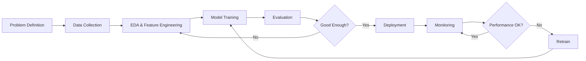

# 06 MLOps and Production AI

## Overview

**MLOps = Machine Learning + DevOps**

Getting a model to 95% accuracy in a notebook is 10% of the work. **Deploying, monitoring, and maintaining it in production is 90%.** This section covers the ML lifecycle from experiment to production.

## 📚 Contents

1. [ML Lifecycle](./ml_lifecycle.md)
2. [Experiment Tracking](./experiment_tracking.md)
3. [Data Versioning](./data_versioning.md)
4. [Model Versioning](./model_versioning.md)
5. [CI/CD for ML](./cicd_for_ml.md)
6. [Monitoring and Drift Detection](./monitoring_and_drift_detection.md) ⭐
7. [Feature Stores](./feature_stores.md)
8. [Batch vs Real-time Inference](./batch_vs_realtime_inference.md)
9. [Scalable Pipelines](./scalable_pipelines.md)
10. [Cloud Deployment Patterns](./cloud_deployment_patterns.md)
11. [Testing ML Systems](./testing_ml_systems.md)

## 🎯 Why MLOps Matters

**Without MLOps:**
- ❌ Models in notebooks never reach production
- ❌ No idea which experiment produced which model
- ❌ Can't reproduce results
- ❌ Model performance degrades silently
- ❌ Manual deployment prone to errors
- ❌ No rollback strategy when things break

**With MLOps:**
- ✅ Automated ML pipelines
- ✅ Reproducible experiments
- ✅ Continuous monitoring
- ✅ Fast iteration and deployment
- ✅ Reliable production systems

## 🔄 The ML Lifecycle



## Key Concepts

### 1. Experiment Tracking

**Track everything:**
- Hyperparameters
- Metrics
- Code version
- Data version
- Model artifacts

**Tools:** MLflow, Weights & Biases, Neptune

### 2. Model Registry

**Central repository for models:**
- Versioning
- Metadata
- Staging (dev/staging/prod)
- Lineage (which data/code → which model)

### 3. Continuous Training

**Auto-retrain when:**
- Performance degrades
- New data available
- Scheduled (weekly/monthly)

### 4. A/B Testing

**Compare models in production:**
- Champion (current) vs Challenger (new)
- Route X% traffic to new model
- Compare metrics
- Promote if better

### 5. Model Monitoring

**Track:**
- **Performance:** Accuracy, latency, throughput
- **Data drift:** Input distribution changes
- **Concept drift:** Relationship between X and y changes
- **System health:** Memory, CPU, errors

## Interview Focus Topics

### Most Common Questions

**"Walk me through deploying an ML model to production"**

**Answer:**
```
1. Training Phase:
   - Track experiments (MLflow)
   - Version data and code
   - Register best model

2. Deployment Phase:
   - Containerize model (Docker)
   - Deploy to serving infrastructure (K8s, SageMaker)
   - Set up endpoints (REST API)
   - Configure autoscaling

3. Monitoring Phase:
   - Log predictions and actuals
   - Monitor latency, throughput
   - Track data drift
   - Set up alerts

4. Maintenance:
   - Automated retraining pipeline
   - A/B testing for new models
   - Rollback capability
   - Documentation and handoff
```

**"How do you detect model drift?"**

See [Monitoring and Drift Detection](./monitoring_and_drift_detection.md)

**"Batch vs real-time serving?"**

See [Batch vs Real-time Inference](./batch_vs_realtime_inference.md)

## Quick Comparisons

### Deployment Patterns

| Pattern | Use Case | Latency | Throughput | Cost |
|---------|----------|---------|-----------|------|
| **Batch** | Nightly predictions | Hours | Very high | Low |
| **Real-time API** | User-facing | <100ms | Medium | Medium |
| **Streaming** | IoT sensors | <1s | High | Medium-High |
| **Edge** | Mobile, IoT | <10ms | Low | Hardware cost |

### Cloud Platforms

| Platform | Pros | Cons |
|----------|------|------|
| **AWS SageMaker** | Full ML lifecycle, mature | Complex, can be expensive |
| **Azure ML** | Good MS integration | Less mature than AWS |
| **GCP Vertex AI** | Good for TensorFlow | Smaller ecosystem |
| **Databricks** | Great for big data + ML | Focused on Spark |

## Essential Tools

### Experiment Tracking
- **MLflow:** Open-source, most popular
- **Weights & Biases:** Great UI, collaboration
- **Neptune:** Metadata store

### Orchestration
- **Airflow:** Most popular, Python-based
- **Prefect:** Modern, Pythonic
- **Kubeflow:** K8s-native
- **Metaflow:** Netflix-developed

### Feature Stores
- **Feast:** Open-source
- **Tecton:** Commercial, feature-rich
- **AWS Feature Store**
- **Databricks Feature Store**

### Serving
- **TensorFlow Serving**
- **TorchServe**
- **BentoML**
- **Seldon Core**
- **KServe**

## Production Checklist

Before deploying:

- [ ] Model versioned and registered
- [ ] Code in version control
- [ ] Data versioned (or provenance tracked)
- [ ] Containerized (Docker)
- [ ] Load tested (can handle expected QPS)
- [ ] Monitoring set up (metrics, logs, alerts)
- [ ] Rollback plan documented
- [ ] API documented
- [ ] Security reviewed (authentication, rate limiting)
- [ ] Cost estimated
- [ ] On-call person identified

## Common Pitfalls

1. **Training-serving skew:**
   - Different preprocessing in training vs production
   - **Solution:** Same code for both, containerization

2. **Silent model degradation:**
   - Model performance drops but no one notices
   - **Solution:** Automated monitoring and alerts

3. **Reproducibility issues:**
   - Can't reproduce model from 6 months ago
   - **Solution:** Version everything (code, data, environment)

4. **Dependency hell:**
   - Model works locally, fails in production
   - **Solution:** Docker containers, pin dependencies

5. **No rollback plan:**
   - New model breaks production
   - **Solution:** Blue-green deployment, canary releases

## Key Principles

1. **Automate everything** - Manual steps will be forgotten
2. **Version everything** - Code, data, models, configs
3. **Monitor continuously** - You can't fix what you don't measure
4. **Start simple** - Don't over-engineer day 1
5. **Test in production** - A/B testing is your friend
6. **Plan for failure** - Models will break, have rollback ready

## Maturity Model

### Level 0: Manual
- Train in notebook
- Manually deploy
- No monitoring

### Level 1: Automated Training
- Automated training pipeline
- Some experiment tracking
- Manual deployment

### Level 2: Automated Deployment
- CI/CD pipeline
- Automated deployment
- Basic monitoring

### Level 3: Full MLOps
- Automated retraining
- A/B testing
- Comprehensive monitoring
- Feature store
- Model registry

Most companies are at Level 1-2. Level 3 is aspirational.

---

**Most Important:** [Monitoring and Drift Detection](./monitoring_and_drift_detection.md)

**Most Practical:** [ML Lifecycle](./ml_lifecycle.md)

**Next Section:** [07 System Design for AI](../07_System_Design_for_AI/README.md)
