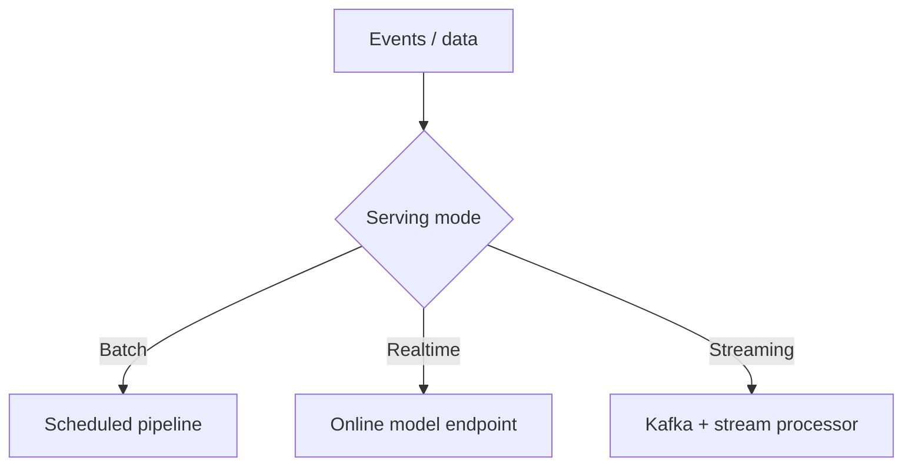

# Batch vs Real-Time Inference

## Batch inference
Asynchronous scoring over large datasets.
Best for nightly forecasts, periodic risk scoring, reporting.

## Real-time inference
Synchronous low-latency prediction (<100ms to few seconds depending use case).
Best for fraud checks, ETA at checkout, chatbot responses.

## Near-real-time streaming
Event-driven micro-batches using Kafka/Flink/Spark Streaming.

## Decision factors
- SLA latency
- request volume pattern
- cost constraints
- feature freshness requirements

## Serving stacks
- FastAPI/BentoML/TorchServe/Triton for online.
- Spark/Ray/SageMaker Batch Transform for batch.

## Autoscaling
- CPU/GPU autoscale by queue length and latency.
- warm pools to reduce cold-start overhead.

## Interview questions
1. How decide batch vs real-time?
2. How optimize p95 latency?
3. GPU vs CPU serving criteria?
