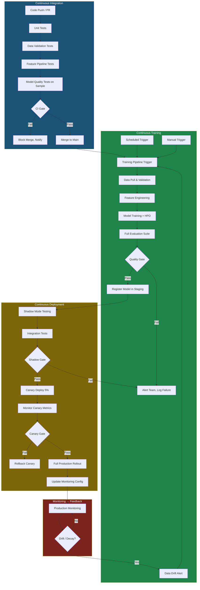

# CI/CD for Machine Learning

> ML-specific continuous integration and deployment: quality gates, pipeline automation, retraining triggers, deployment strategies, and the Google MLOps maturity model.

---

## Traditional CI/CD vs ML CI/CD

Traditional software CI/CD validates that code does what it is specified to do. ML CI/CD must also validate that models are of sufficient quality to serve production traffic — a fundamentally more complex and probabilistic problem.

| Dimension | Traditional CI/CD | ML CI/CD |
|-----------|------------------|----------|
| **What changes** | Code logic | Code + data + model weights |
| **Test outcome** | Pass/fail (deterministic) | Probabilistic (metric thresholds) |
| **Artifact** | Binary or container | Model binary + serving container |
| **Validation** | Unit/integration tests | Model quality tests + behavioral tests |
| **Deployment risk** | Breaking API changes | Silent quality degradation |
| **Rollback trigger** | Error rate spike | Accuracy drop, drift detection |
| **Pipeline duration** | Minutes | Hours to days (training) |
| **Test data** | Static fixtures | Versioned evaluation datasets |

---

## The Google MLOps Maturity Model

Google's MLOps whitepaper defines three maturity levels. This framework appears frequently in senior interviews.

### Level 0 — Manual Process

```
Data Scientist          → Jupyter Notebook
Manual steps            → Copy files manually
No versioning           → "model_final_v3_FINAL.pkl"
No testing              → "it worked on my machine"
Deployment: manual      → SSH + copy + restart
Monitoring: none or ad-hoc
```

Characteristics:
- All steps manual: data prep, training, evaluation, deployment
- Notebooks are the primary artifact
- Infrequent deployment (months between model updates)
- Disconnect between data scientists (who train) and engineers (who deploy)
- No experiment tracking, no reproducibility

Most companies start here. Many never leave.

### Level 1 — ML Pipeline Automation

```
Automated training pipeline:
Data → Feature Eng → Train → Evaluate → Register → (Manual trigger) → Deploy

Key additions:
  - Experiment tracking (MLflow, W&B)
  - Feature store (or documented feature pipeline)
  - Model registry with staging/production stages
  - Automated evaluation with quality gates
  - Data validation in pipeline
```

Characteristics:
- Training pipeline is automated but deployment may still be manual
- Model registry tracks versions and lifecycle
- CT (Continuous Training) possible: pipeline can be triggered, but trigger is often manual or scheduled
- No automated testing of model code changes

### Level 2 — CI/CD Pipeline Automation

```
Code change → CI tests → Training pipeline trigger → Automated evaluation
→ Quality gate → Staging deployment → Integration tests
→ Canary deployment → Production promotion → Monitoring
→ Auto-trigger retraining on drift → Loop back
```

Characteristics:
- Full CI pipeline for ML code changes: data validation, unit tests, integration tests
- Model training triggered automatically by: code change, data update, scheduled interval, drift alert
- Automated quality gates block bad models from production
- Canary/shadow deployments standard practice
- Monitoring triggers automated retraining
- Level 2 is the gold standard; most enterprise teams are between 1 and 2

---

## ML CI/CD Pipeline Architecture



---

## ML-Specific CI Checks

### 1. Data Validation

```python
# Using Great Expectations for CI data validation
import great_expectations as ge

def validate_training_data(data_path: str) -> bool:
    """Returns True if data passes all validation checks."""
    df = ge.read_csv(data_path)

    results = df.expect_column_values_to_not_be_null("tracking_id")
    assert results.success, "tracking_id has nulls"

    results = df.expect_column_values_to_be_between("weight_kg", 0.01, 1000)
    assert results.success, "weight_kg out of range"

    results = df.expect_column_values_to_be_in_set(
        "carrier_code", valid_carriers
    )
    assert results.success, "Unknown carrier codes found"

    results = df.expect_column_proportion_of_values_to_be_null(
        "weather_severity", max_proportion=0.05
    )
    assert results.success, "Too many nulls in weather_severity"

    # Check for distribution shift from reference
    reference_stats = load_reference_statistics("data/reference_stats.json")
    current_mean = df["delay_minutes"].mean()

    if abs(current_mean - reference_stats["delay_minutes_mean"]) > \
       3 * reference_stats["delay_minutes_std"]:
        raise ValueError(f"Delay minutes mean shifted significantly: "
                        f"{current_mean:.2f} vs reference {reference_stats['delay_minutes_mean']:.2f}")

    return True
```

### 2. Schema Checks

```python
# Pandera schema validation — fails CI if schema violated
import pandera as pa
from pandera.typing import DataFrame, Series

class DeliveryFeatureSchema(pa.SchemaModel):
    tracking_id: Series[str] = pa.Field(nullable=False, unique=True)
    carrier_code: Series[str] = pa.Field(isin=VALID_CARRIERS)
    weight_kg: Series[float] = pa.Field(gt=0, lt=1000, nullable=False)
    distance_km: Series[float] = pa.Field(ge=0, nullable=True)
    hour_of_day: Series[int] = pa.Field(ge=0, le=23, nullable=False)
    day_of_week: Series[int] = pa.Field(ge=0, le=6, nullable=False)
    weather_severity: Series[float] = pa.Field(ge=0, le=5, nullable=True)
    is_delayed: Series[int] = pa.Field(isin=[0, 1], nullable=False)

    class Config:
        name = "DeliveryFeatures"
        strict = True  # No extra columns allowed

@pa.check_types
def prepare_features(df: DataFrame) -> DataFrame[DeliveryFeatureSchema]:
    # ... feature preparation logic ...
    return processed_df
```

### 3. Model Quality Gates

```python
# quality_gate.py — fails CD pipeline if model doesn't meet thresholds

QUALITY_THRESHOLDS = {
    "test_auc_roc": {"min": 0.88, "baseline_comparison": True},
    "test_f1": {"min": 0.80},
    "test_precision": {"min": 0.78},
    "test_recall": {"min": 0.75},
    "calibration_ece": {"max": 0.05},
    "inference_p99_latency_ms": {"max": 50},
    "inference_memory_mb": {"max": 512},
}

def run_quality_gate(candidate_metrics: dict, production_metrics: dict) -> tuple[bool, list[str]]:
    failures = []

    for metric_name, thresholds in QUALITY_THRESHOLDS.items():
        value = candidate_metrics.get(metric_name)
        if value is None:
            failures.append(f"Missing metric: {metric_name}")
            continue

        if "min" in thresholds and value < thresholds["min"]:
            failures.append(f"{metric_name}={value:.4f} < required {thresholds['min']}")

        if "max" in thresholds and value > thresholds["max"]:
            failures.append(f"{metric_name}={value:.4f} > limit {thresholds['max']}")

        # Don't regress from production by more than 1%
        if thresholds.get("baseline_comparison") and production_metrics:
            prod_value = production_metrics.get(metric_name, 0)
            if value < prod_value * 0.99:
                failures.append(
                    f"REGRESSION: {metric_name}={value:.4f} < 99% of prod {prod_value:.4f}"
                )

    passed = len(failures) == 0
    return passed, failures
```

---

## ML Pipeline Tools

### Kubeflow Pipelines

Native Kubernetes orchestration for ML. Each step runs in its own container:

```python
import kfp
from kfp import dsl
from kfp.components import func_to_container_op

@func_to_container_op
def data_validation_op(data_path: str) -> bool:
    import great_expectations as ge
    # ... validation logic ...
    return True

@func_to_container_op
def feature_engineering_op(validated_data_path: str,
                            feature_set_version: str) -> str:
    # ... feature engineering ...
    return "s3://processed/features_v1.4.2.parquet"

@func_to_container_op
def train_op(features_path: str, model_config: dict) -> str:
    # ... training ...
    return "s3://models/model_v1.1.0.pkl"

@func_to_container_op
def evaluate_op(model_path: str, test_data_path: str) -> dict:
    # ... evaluation ...
    return {"auc": 0.892, "f1": 0.814}

@func_to_container_op
def quality_gate_op(metrics: dict) -> bool:
    passed, failures = run_quality_gate(metrics, get_production_metrics())
    if not passed:
        raise ValueError(f"Quality gate failed: {failures}")
    return True

@func_to_container_op
def register_model_op(model_path: str, metrics: dict) -> str:
    # ... register to MLflow model registry ...
    return "delivery-delay-classifier/version/7"

@dsl.pipeline(
    name="delivery-delay-prediction-pipeline",
    description="Train and evaluate delivery delay classifier"
)
def ml_pipeline(
    data_path: str = "s3://data-lake/deliveries",
    feature_set_version: str = "v2.3",
    model_config: dict = None
):
    # DAG definition — Kubeflow handles dependency resolution
    validate = data_validation_op(data_path)

    features = feature_engineering_op(
        validated_data_path=validate.output,
        feature_set_version=feature_set_version
    )

    model = train_op(
        features_path=features.output,
        model_config=model_config or DEFAULT_CONFIG
    )

    metrics = evaluate_op(
        model_path=model.output,
        test_data_path=f"{data_path}/test"
    )

    gate = quality_gate_op(metrics=metrics.output)

    # register_model only runs if quality_gate passes
    with dsl.Condition(gate.output == True):
        register_model_op(model_path=model.output, metrics=metrics.output)

# Compile and submit
kfp.compiler.Compiler().compile(ml_pipeline, "pipeline.yaml")
client = kfp.Client(host="http://kubeflow-pipelines:8888")
client.create_run_from_pipeline_func(ml_pipeline, arguments={
    "data_path": "s3://data-lake/deliveries/delta/v47",
    "feature_set_version": "v2.3"
})
```

### Prefect — Python-First Orchestration

```python
from prefect import flow, task
from prefect.task_runners import ConcurrentTaskRunner

@task(retries=3, retry_delay_seconds=60, tags=["data"])
def validate_data(data_path: str) -> str:
    result = run_great_expectations_suite(data_path)
    if not result.success:
        raise ValueError(f"Data validation failed: {result.statistics}")
    return data_path

@task(tags=["features"])
def compute_features(data_path: str, feature_version: str) -> str:
    output_path = f"s3://features/{feature_version}/train.parquet"
    run_feature_pipeline(data_path, output_path)
    return output_path

@task(tags=["training"], timeout_seconds=3600)
def train_model(features_path: str, config: dict) -> tuple[str, dict]:
    model_path, metrics = run_training_job(features_path, config)
    return model_path, metrics

@task(tags=["evaluation"])
def run_quality_gate(metrics: dict) -> bool:
    passed, failures = check_quality_thresholds(metrics)
    if not passed:
        raise ValueError(f"Quality gate failed: {failures}")
    return True

@task(tags=["deployment"])
def deploy_to_staging(model_path: str, metrics: dict) -> str:
    version = register_model(model_path, metrics, stage="Staging")
    deploy_shadow_mode(version)
    return version

@flow(
    name="delivery-delay-retraining",
    task_runner=ConcurrentTaskRunner()
)
def retraining_pipeline(
    trigger_reason: str = "scheduled",
    data_version: str = "latest"
):
    """Full retraining pipeline with quality gate and staging deploy."""
    data_path = resolve_data_version(data_version)

    # Sequential with error handling
    validated_path = validate_data(data_path)
    features_path = compute_features(validated_path, feature_version="v2.3")
    model_path, metrics = train_model(features_path, DEFAULT_CONFIG)
    gate_passed = run_quality_gate(metrics)
    model_version = deploy_to_staging(model_path, metrics)

    return {
        "status": "success",
        "model_version": model_version,
        "metrics": metrics,
        "trigger_reason": trigger_reason
    }

# Schedule: run every day at 2 AM
from prefect.schedules import CronSchedule
retraining_pipeline.serve(
    name="daily-retraining",
    cron="0 2 * * *"
)
```

### Comparison: ML Pipeline Tools

| Tool | Kubernetes Native | Language | UI | Scalability | Best For |
|------|------------------|----------|----|-------------|----------|
| **Kubeflow Pipelines** | Yes | Python (DSL) | Good | Excellent | K8s shops, Google Cloud |
| **Vertex AI Pipelines** | Yes (managed) | Python (KFP SDK) | Good | Excellent | GCP-first |
| **SageMaker Pipelines** | Yes (managed) | Python SDK | Good | Excellent | AWS-first |
| **Prefect** | No | Python | Excellent | Good | Python teams, general ML |
| **Airflow** | Optional | Python (DAGs) | Good | Good | Data engineering teams |
| **Dagster** | Optional | Python | Excellent | Good | Data-aware orchestration |
| **MLflow Pipelines** | No | YAML + Python | Basic | Limited | MLflow-native teams |

---

## Retraining Triggers

### 1. Scheduled Retraining

Simplest approach. Works well when data volume grows predictably and drift is slow:

```python
# Prefect schedule
from prefect.schedules import CronSchedule

# Retrain daily at 2 AM UTC
schedule = CronSchedule(cron="0 2 * * *", timezone="UTC")

# Or weekly on Sunday night
schedule = CronSchedule(cron="0 1 * * 0", timezone="UTC")
```

**When to use**: Demand forecasting, weekly reports, models with slow drift.

### 2. Data-Drift-Triggered Retraining

More efficient: only retrain when the data distribution has changed enough:

```python
# monitoring/drift_monitor.py
from evidently.report import Report
from evidently.metrics import DataDriftPreset
import pandas as pd

def check_and_trigger_retraining(
    reference_data: pd.DataFrame,
    current_data: pd.DataFrame,
    psi_threshold: float = 0.20
) -> bool:
    """Returns True if retraining should be triggered."""

    report = Report(metrics=[DataDriftPreset()])
    report.run(reference_data=reference_data, current_data=current_data)
    results = report.as_dict()

    # Check PSI for each feature
    feature_drifts = results["metrics"][0]["result"]["drift_by_columns"]

    significant_drifts = {
        feature: stats["drift_score"]
        for feature, stats in feature_drifts.items()
        if stats["drift_score"] > psi_threshold
    }

    if significant_drifts:
        print(f"Significant drift detected in {len(significant_drifts)} features: {significant_drifts}")
        trigger_retraining_pipeline(reason="data_drift", affected_features=significant_drifts)
        return True

    return False
```

### 3. Performance-Decay-Triggered Retraining

Requires ground truth labels. Works well when labels arrive within a reasonable window:

```python
# Performance monitoring — check every day as labels settle
def check_performance_and_trigger(
    model_version: str,
    evaluation_window_days: int = 7,
    min_auc_threshold: float = 0.88,
    decay_threshold: float = 0.02
):
    """Trigger retraining if model performance decays below threshold."""

    current_auc = compute_recent_auc(model_version, days=evaluation_window_days)
    baseline_auc = get_model_training_auc(model_version)

    if current_auc < min_auc_threshold:
        trigger_retraining_pipeline(reason="absolute_performance_threshold",
                                    current_auc=current_auc)
    elif baseline_auc - current_auc > decay_threshold:
        trigger_retraining_pipeline(reason="performance_decay",
                                    decay=baseline_auc - current_auc)
```

---

## Deployment Strategies

### Shadow Deployment (Champion-Challenger)

Run the new model in parallel with the production model. New model's predictions are logged but not used for decisions. Compare distributions and quality metrics before switching:

```python
# shadow_serving.py
class ShadowModelServing:
    def __init__(self, production_model, shadow_model):
        self.production = production_model
        self.shadow = shadow_model

    def predict(self, features: dict) -> float:
        # Production prediction — this is what's actually used
        prod_prediction = self.production.predict(features)

        # Shadow prediction — logged but not returned to user
        try:
            shadow_prediction = self.shadow.predict(features)
            log_shadow_prediction({
                "tracking_id": features["tracking_id"],
                "production_score": prod_prediction,
                "shadow_score": shadow_prediction,
                "timestamp": datetime.utcnow().isoformat()
            })
        except Exception as e:
            log_shadow_error(e)  # Never let shadow failure affect production

        return prod_prediction  # Always return production result
```

**When to end shadow mode**: After 7–14 days with sufficient traffic volume, compare:
- Prediction distribution correlation between shadow and production
- Shadow model AUC (using the same ground truth labels)
- Shadow model latency (must meet SLA)

### Canary Deployment

Route a small percentage of traffic to the new model. Gradually increase if metrics are healthy:

```python
# nginx.conf / load balancer config
upstream model_backend {
    server production-model:8080 weight=95;  # 95% to production
    server canary-model:8080 weight=5;       # 5% to canary
}

# Or: Kubernetes traffic splitting with Istio
apiVersion: networking.istio.io/v1alpha3
kind: VirtualService
metadata:
  name: delay-prediction-vs
spec:
  hosts:
  - delay-prediction-service
  http:
  - route:
    - destination:
        host: delay-prediction-production
        port:
          number: 8080
      weight: 95
    - destination:
        host: delay-prediction-canary
        port:
          number: 8080
      weight: 5
```

**Canary rollout schedule**:
```
Day 1: 5% canary, monitor for 24h
Day 2: 15% canary, monitor for 24h
Day 3: 30% canary, monitor for 24h
Day 5: 100% canary (canary becomes production)
Archive previous production version
```

**Automated canary gate** (run every hour):
```python
def check_canary_health(canary_metrics, production_metrics) -> str:
    """Returns 'promote', 'hold', or 'rollback'."""
    if canary_metrics["error_rate"] > production_metrics["error_rate"] * 1.5:
        return "rollback"  # 50% more errors: immediate rollback

    if canary_metrics["p99_latency"] > 200:
        return "rollback"  # SLA breach: rollback

    if canary_metrics["prediction_drift_psi"] > 0.25:
        return "hold"  # Unexpected distribution: hold, investigate

    if canary_metrics["auc"] < production_metrics["auc"] - 0.01:
        return "rollback"  # Accuracy regression: rollback

    return "promote"  # All checks passing
```

### A/B Deployment

Route different user segments to different model versions. Used for controlled experiments:

```python
# Segment users deterministically (same user always gets same model)
def get_model_version_for_user(user_id: str, experiment_config: dict) -> str:
    """Stable user assignment to A/B groups."""
    import hashlib

    hash_value = int(hashlib.md5(
        f"{user_id}{experiment_config['salt']}".encode()
    ).hexdigest(), 16)

    bucket = hash_value % 100  # 0-99

    if bucket < experiment_config["control_percent"]:
        return "production"  # Control group
    elif bucket < experiment_config["control_percent"] + experiment_config["treatment_percent"]:
        return "canary"  # Treatment group
    else:
        return "production"  # Remainder gets production
```

---

## Automated Rollback

```python
# Rollback conditions (checked every 5 minutes)
ROLLBACK_CONDITIONS = {
    "error_rate": {"threshold": 0.05, "operator": ">", "window_minutes": 10},
    "p99_latency_ms": {"threshold": 500, "operator": ">", "window_minutes": 5},
    "prediction_null_rate": {"threshold": 0.01, "operator": ">", "window_minutes": 5},
    "input_psi_score": {"threshold": 0.30, "operator": ">", "window_minutes": 30},
}

def automated_rollback_check(current_version: str, previous_version: str):
    for condition_name, config in ROLLBACK_CONDITIONS.items():
        current_value = get_metric(condition_name, config["window_minutes"])

        should_rollback = (
            config["operator"] == ">" and current_value > config["threshold"]
        ) or (
            config["operator"] == "<" and current_value < config["threshold"]
        )

        if should_rollback:
            execute_rollback(
                current=current_version,
                target=previous_version,
                reason=f"{condition_name}={current_value:.4f} exceeded threshold {config['threshold']}"
            )
            send_pagerduty_alert(severity="P1",
                                  message=f"Model auto-rollback triggered: {condition_name}")
            return
```

---

## Interview Questions

### "How would you implement automated model retraining?"

**Senior answer**:
"I implement automated retraining with three trigger types, each appropriate for different scenarios. For time-sensitive models like fraud detection, I use drift-triggered retraining: a monitoring job runs hourly, computes PSI for key features against a reference window, and triggers the training pipeline if PSI exceeds 0.20 on critical features or 0.10 on the model output distribution. For more stable models like weekly demand forecasting, scheduled retraining at a fixed cadence (Sunday night) is simpler and more predictable. For models with quickly available ground truth, I implement performance-decay triggers: once AUC on recent predictions with settled labels drops below a threshold, retraining is triggered.

The training pipeline itself is a DAG in Kubeflow or Prefect: data validation → feature engineering → training → evaluation → quality gate → staging register. The quality gate blocks automated promotion — a human reviews before going to production, or the gate is fully automated if the team trusts the evaluation suite. I never auto-promote directly to 100% production; the path is always staging → shadow/canary → full rollout, with automated health checks at each stage."

### "What is shadow deployment and when would you use it?"

**Senior answer**:
"Shadow deployment runs a new model in parallel with the production model, logging its predictions but not using them for actual decisions. It's useful in three specific scenarios: first, when the new model has a meaningfully different architecture or feature set and you want confidence in its behavior on real traffic before any business exposure. Second, when the new model's output will be the input to a downstream model or business logic — you need to verify the distribution of predictions matches expectations before the downstream system has to handle them. Third, for compliance or audit-sensitive use cases where you want a track record before promoting.

Shadow mode has a cost: you run twice the inference compute. For high-throughput systems, this doubles serving costs during the shadow period. I mitigate this by running shadow on a random sample (10–20%) rather than 100% of traffic, which gives statistically sufficient data at lower cost. The shadow period typically runs 7–14 days to capture weekly seasonality patterns before drawing conclusions."

---

*Next: See `monitoring_and_drift.md` for the complete treatment of model monitoring, drift detection, and alerting.*
