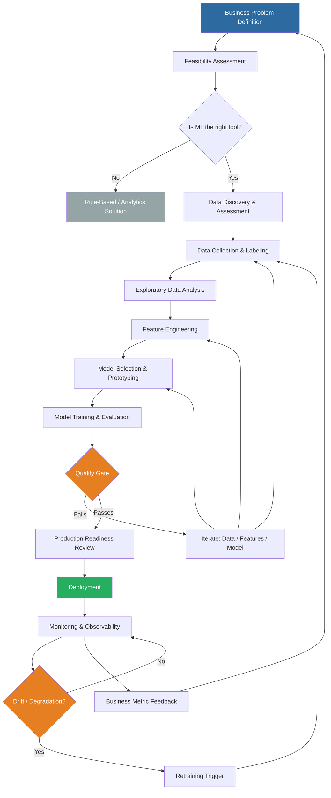
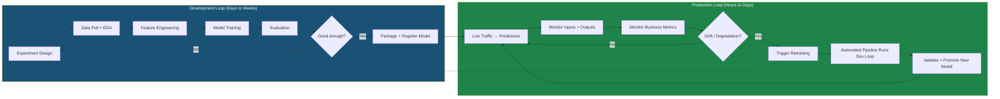

# ML Lifecycle — From Problem Definition to Production Iteration

> The full lifecycle of a machine learning system, where projects fail, team dynamics, hidden technical debt, and the two-loop model of ML development.

---

## The Full ML Lifecycle

Machine learning projects are not linear. They look linear in textbooks (collect data → train model → deploy) but behave as interconnected feedback loops in practice. Understanding this non-linearity is the first mark of a senior ML engineer.



---

## Phase-by-Phase Breakdown

### Phase 1: Problem Definition

**What happens here:**
- Translate a business objective into an ML problem statement
- Decide if ML is even appropriate
- Define success metrics at the business level, not just model level

**Key activities:**
- Stakeholder interviews: what decision does this model inform or automate?
- Baseline analysis: what does the current (non-ML) solution achieve?
- Cost-benefit: what is the value of a correct prediction vs cost of an incorrect one?
- Feasibility check: do we have (or can we obtain) the data needed?

**Deliverables:**
- ML problem charter: task type, input/output specification, success criteria
- Label definition document: what exactly constitutes "delayed"? "fraudulent"?
- Business metric alignment: how does model F1 translate to revenue or cost savings?

**Where projects fail here:**
- Vague problem definition ("make the customer experience better")
- Conflating business metric (revenue) with ML metric (accuracy)
- Underestimating labeling cost and label quality issues
- Assuming ML is needed when a threshold rule would suffice

**Interview answer pattern**: When asked "how do you start an ML project?", always begin with the business problem, not the data or model. Senior engineers are distinguished by this framing.

---

### Phase 2: Data Discovery and Assessment

**What happens here:**
- Inventory available data sources
- Assess data quality, volume, recency, coverage
- Identify data access and compliance constraints
- Determine if external data is needed

**Key questions:**
- How much labeled data exists? Is it representative of production distribution?
- What is the data freshness? Is historical data still representative?
- Are there systematic biases in the data collection process?
- What are the join keys between data sources? What is the join quality?
- What privacy/PII constraints apply?

**Logistics example — delivery delay prediction:**
- Historical delivery records: 3 years, 500M rows — but only last 6 months post-COVID are representative
- Weather data: available via API, historical available, real-time requires subscription
- Route data: available in-house, GPS trace is 30-day rolling window only
- Carrier SLA data: exists in PDF contracts, requires manual extraction
- Label quality issue: "delayed" flag is set by downstream system with 2-hour lag

**Deliverables:**
- Data dictionary with source, owner, refresh frequency, quality assessment
- Data availability matrix: which features are available at prediction time?
- Privacy impact assessment

---

### Phase 3: Data Collection, Labeling, and Preparation

**What happens here:**
- Build data pipelines to collect and consolidate training data
- Define and execute labeling process
- Handle class imbalance, missing values, outliers

**Critical concept — Label Definition Precision:**

The label definition must match the exact prediction target in production. For delivery delay prediction:

```
BAD label:  is_delayed = (actual_delivery > scheduled_delivery)
GOOD label: is_delayed_at_creation = (actual_delivery > scheduled_delivery
                                       AND delay_reason != 'customer_request'
                                       AND delay_reason != 'weather_exception')
```

The bad label includes delays that could not have been predicted at package creation time, leading to an optimistically biased evaluation.

**Labeling costs:**
- Manual labeling: $0.01–$5 per label depending on complexity
- Active learning: use model confidence to prioritize labeling
- Weak supervision (Snorkel): programmatic label generation
- Self-supervised: derive labels from data structure

**Deliverables:**
- Labeled dataset with version tag
- Label quality report (inter-annotator agreement, edge case analysis)
- Data split strategy (temporal split for time-series data, not random split)

---

### Phase 4: Exploratory Data Analysis (EDA)

**What happens here:**
- Understand feature distributions, correlations, outliers
- Validate assumptions from Phase 1
- Discover feature engineering opportunities
- Identify data quality issues that slipped through

**Key EDA outputs for ML:**
- Feature importance rankings (even before modeling: mutual information, ANOVA)
- Temporal patterns: weekly seasonality? holiday effects? COVID regime change?
- Missing value analysis: MCAR, MAR, or MNAR? (Missing Completely at Random, Missing at Random, Missing Not at Random)
- Correlation matrix: collinearity between features
- Target distribution: class balance, regression target skewness

**EDA anti-patterns:**
- Doing EDA on the test set (data leakage in understanding)
- Fitting transformations on all data then splitting (standard leakage)
- Ignoring temporal structure when doing analysis

---

### Phase 5: Feature Engineering

**What happens here:**
- Transform raw data into features suitable for ML models
- Encode categorical variables
- Create interaction features, temporal features, aggregation features
- Normalize/standardize numerical features

**Feature engineering taxonomy:**

| Category | Examples | Notes |
|----------|----------|-------|
| Temporal | hour of day, day of week, is_holiday, days_since_last_event | Critical for logistics |
| Aggregation | avg_delay_last_30d by carrier, package count by zone | Window functions, point-in-time critical |
| Entity encoding | carrier embedding, zone embedding | For high-cardinality categoricals |
| Interaction | weight × distance, carrier × route_type | Domain knowledge required |
| External | weather_severity, fuel_price_index | Requires reliable data pipeline |
| Lag features | yesterday_delay_rate, last_week_volume | Time series specific |

**The training-serving skew problem** begins here. Features must be computed identically in training and serving. See `feature_stores.md` for deep treatment.

**Deliverables:**
- Feature pipeline code (reproducible, tested)
- Feature documentation (business meaning, computation logic, refresh frequency)
- Feature set versioned with data and code

---

### Phase 6: Model Selection and Prototyping

**What happens here:**
- Select candidate algorithms based on problem type, data size, latency requirements
- Rapid experimentation with different architectures
- Establish baseline (most frequent class, linear model, rule-based)

**Model selection framework:**

```
Decision tree for model selection:

Is data tabular?
  ├── Yes + < 100K rows → Linear models, random forest, XGBoost
  ├── Yes + > 100K rows → XGBoost, LightGBM, CatBoost
  └── No (image/text/sequence) → Neural networks

Is latency < 10ms?
  ├── Yes → Linear model, quantized tree ensemble, pre-computed lookup
  └── No → Any model, optimize after prototyping

Is interpretability required?
  ├── Yes → Linear/logistic regression, decision tree, SHAP on tree models
  └── No → Best accuracy wins

Is online learning needed?
  ├── Yes → Online linear models (Vowpal Wabbit), streaming XGBoost
  └── No → Batch training
```

**Baseline establishment:**
Always report model performance relative to a meaningful baseline:
- Random baseline (class distribution)
- Majority class baseline
- Simple heuristic (current rule-based system)
- Linear model baseline

If the complex model doesn't significantly beat a logistic regression, the marginal complexity cost may not be justified.

---

### Phase 7: Model Training and Evaluation

**What happens here:**
- Hyperparameter optimization (grid search, random search, Bayesian optimization)
- Cross-validation strategy (K-fold, time-series CV, stratified CV)
- Model evaluation on held-out test set
- Error analysis: where does the model fail?

**Temporal data splitting — critical for logistics:**

```python
# WRONG: random split ignores temporal structure
from sklearn.model_selection import train_test_split
X_train, X_test, y_train, y_test = train_test_split(X, y, test_size=0.2)

# RIGHT: temporal split respects time
cutoff_date = df['event_date'].quantile(0.8)
X_train = df[df['event_date'] < cutoff_date]
X_test  = df[df['event_date'] >= cutoff_date]

# BETTER: temporal split with gap to prevent leakage
train_end  = '2024-06-30'
gap_end    = '2024-07-14'  # 2-week gap for label settlement
test_start = '2024-07-14'
X_train = df[df['event_date'] <= train_end]
X_test  = df[df['event_date'] >= test_start]
```

**Evaluation metrics by business context:**

| Metric | Use Case | Logistics Example |
|--------|----------|-------------------|
| F1 Score | Balanced precision/recall | Delay prediction (both FP and FN costly) |
| Precision@K | Top-K most likely | Route risk ranking |
| AUC-ROC | Threshold-independent ranking | Fraud scoring |
| MAE/RMSE | Regression accuracy | ETA prediction (minutes) |
| MAPE | Relative regression error | Demand forecasting |
| Calibration | Probability reliability | Risk scores requiring trust |

**Deliverables:**
- Trained model artifact with lineage metadata
- Evaluation report with confusion matrix, error analysis
- Calibration plot
- Feature importance (SHAP values for tree models)
- Experiment comparison in MLflow/W&B

---

### Phase 8: Deployment

**What happens here:**
- Package model as a service or batch job
- Integrate with upstream data pipelines and downstream consumers
- Canary deployment: route small % of traffic to new model
- Shadow deployment: run new model in parallel without affecting decisions

**Deployment checklist:**
- [ ] Model passes quality gate (F1 > threshold, AUC > threshold)
- [ ] Latency SLA verified (p99 < 100ms under load test)
- [ ] Monitoring dashboards set up before launch
- [ ] Rollback mechanism tested
- [ ] Serving infra load tested at 2× peak traffic
- [ ] Feature pipeline verified end-to-end in production
- [ ] Data lineage documented in model registry

**Deliverables:**
- Deployed model endpoint or batch job
- Runbook for common failure scenarios
- Monitoring dashboard link
- Canary rollout plan

---

### Phase 9: Monitoring and Observability

**What happens here:**
- Continuous monitoring of data quality, prediction quality, business impact
- Alerting when drift or degradation is detected
- Regular model performance reports

See `monitoring_and_drift.md` for complete treatment.

---

### Phase 10: Iteration

**What happens here:**
- Analysis of monitoring data to diagnose model issues
- Data refresh and retraining
- Feature improvement based on error analysis
- Model architecture iteration for performance gains

**The iteration cadence:**

| Model Type | Typical Retraining Frequency | Trigger |
|------------|------------------------------|---------|
| Demand forecast | Weekly | Scheduled |
| Fraud detection | Daily | PSI > 0.2 |
| Delivery ETA | Daily | Business hours drift |
| Document extraction | Monthly | Label distribution shift |
| Recommendation | Continuous / A/B | Business metric decay |

---

## The Two-Loop Model

The most important conceptual model for understanding ML system dynamics:



**Development loop**: Driven by data scientists and ML engineers. Focused on model quality. Time scale: days to weeks. Output: registered model artifact.

**Production loop**: Driven by the ML platform and automated systems. Focused on reliability and freshness. Time scale: hours to days. Output: promoted model serving live traffic.

**The transition between loops is where most enterprise teams struggle.** Manual handoff between these loops creates bottlenecks, reproducibility issues, and deployment delays.

---

## Where ML Projects Fail

### Failure Mode 1: Data Quality Problems (40% of failures)

The most common failure mode. Manifests as:
- Training data not representative of production distribution
- Labels systematically biased (collected only when human review was triggered)
- Missing data not-at-random (missingness correlated with target)
- Data freshness issues (training on stale data for a fast-changing domain)
- Silent upstream data pipeline changes breaking feature computation

**The production data surprise**: A model trained on warehouse-collected data fails in production because production data has different null patterns, different categorical value distributions, or different numerical ranges. The model was never tested on production-distribution data.

### Failure Mode 2: Productionization Gap (30% of failures)

The gap between a successful experiment and a reliable production system:
- Feature engineering logic implemented differently in serving vs training
- Model not tested under production traffic patterns
- No monitoring set up before launch
- No rollback mechanism
- Infrastructure can't handle peak load

**The notebook-to-production gap**: A data scientist achieves 94% accuracy in a notebook. Handing it to engineering reveals that 40% of the features are not available at prediction time, one feature requires a 2-hour data processing job, and the model inference takes 2 seconds when the SLA is 100ms.

### Failure Mode 3: Concept Drift (20% of failures)

The world changes; the model doesn't know. Common in:
- Logistics: COVID disrupted carrier behavior, route patterns, delay distributions
- Finance: economic shocks change fraud patterns
- E-commerce: seasonal shopping patterns that vary year-over-year
- Any domain with regulatory changes

Models trained on pre-COVID data applied to post-COVID logistics scenarios are systematically wrong. The solution is monitoring + retraining cadence.

### Failure Mode 4: Metric Misalignment (10% of failures)

The model optimizes what it can measure, not what the business cares about:
- Optimizing RMSE for ETA, but the business cares about P(late by > 1 day)
- Optimizing AUC for fraud, but the business cares about $ value of fraud caught
- Optimizing precision, but the customer impact is determined by recall

---

## Team Structure and Roles

### Modern ML Team Composition

```
┌─────────────────────────────────────────────────────┐
│                   ML Team                            │
│                                                      │
│  ┌──────────────────┐  ┌───────────────────────┐    │
│  │ Data Scientists  │  │   ML Engineers         │    │
│  │                  │  │                        │    │
│  │ • Problem framing│  │ • Training pipelines   │    │
│  │ • EDA            │  │ • Serving infrastructure│   │
│  │ • Modeling       │  │ • Feature engineering  │    │
│  │ • Evaluation     │  │ • CI/CD for ML         │    │
│  └──────────────────┘  └───────────────────────┘    │
│                                                      │
│  ┌──────────────────┐  ┌───────────────────────┐    │
│  │ Data Engineers   │  │ ML Platform Engineers  │    │
│  │                  │  │                        │    │
│  │ • Data pipelines │  │ • Feature store        │    │
│  │ • Data quality   │  │ • Model registry       │    │
│  │ • Data warehouse │  │ • Experiment tracking  │    │
│  │ • ETL/ELT        │  │ • Cluster management   │    │
│  └──────────────────┘  └───────────────────────┘    │
└─────────────────────────────────────────────────────┘
```

**Data Scientist**: Responsible for model quality and business problem translation. Strong statistics, domain knowledge, Python/R, experimentation design.

**ML Engineer**: Responsible for taking prototypes to production. Strong software engineering, distributed systems, MLOps tooling, performance optimization.

**Data Engineer**: Responsible for reliable data pipelines. Strong Spark, SQL, streaming, data warehousing, orchestration.

**ML Platform Engineer**: Builds the internal platform that all teams use — feature store, model registry, training infrastructure, monitoring framework.

**Confusion between roles** is the most common source of organizational friction in ML teams. Data scientists should not be responsible for production reliability; ML engineers should not be responsible for model quality decisions.

---

## Hidden Technical Debt in ML Systems

From Sculley et al. (2015), "Hidden Technical Debt in Machine Learning Systems" — one of the most cited papers in MLOps:

### The Abstraction Anti-Pattern

Traditional software engineering uses clean abstractions. ML systems tend to have deeply entangled components:

```
┌──────────────────────────────────────────────────────┐
│                   ML System                           │
│                                                       │
│  ┌─────────┐  ┌──────────┐  ┌─────────┐             │
│  │ Data    │  │ Feature  │  │  Model  │             │
│  │ Sources ├──► Pipeline ├──► Code    │             │
│  └────┬────┘  └────┬─────┘  └────┬───┘             │
│       │             │              │                  │
│       └─────────────┴──────────────┘                 │
│              Entangled dependencies                   │
│                                                       │
│  Changing one requires changes to all others          │
└──────────────────────────────────────────────────────┘
```

### Types of ML Technical Debt

**1. Entanglement (CACE Principle)**
Changing Anything Changes Everything. In ML, adding a new feature changes the model's behavior in ways that may not be visible until a correlation shifts.

**2. Hidden Feedback Loops**
A model influences the data that trains its next version. Example: a fraud detection model that flags certain geographies → humans review those geographies more → more fraud labels from those geographies → model reinforces geographic bias.

**3. Undeclared Consumers**
A model output used as a feature in another model creates an undeclared dependency. Updating the first model silently changes the second.

**4. Data Dependencies**
- Unstable data dependencies: data from external sources may change schema or semantics
- Underutilized data dependencies: features that barely contribute but must be maintained
- Legacy features: features kept because removing them might break something

**5. Configuration Debt**
ML systems have extensive configuration: hyperparameters, preprocessing choices, serving configuration, monitoring thresholds. These are often hardcoded or stored inconsistently.

**6. Pipeline Jungles**
Bespoke data preparation scripts that grew organically. No tests, no documentation, brittle.

**7. Dead Experimental Codepaths**
Flags and branches added for experiments that are never cleaned up. The production system carries the weight of all past experiments.

**8. Abstraction Debt**
No standard interfaces between components. Each model has bespoke serving code, bespoke monitoring, bespoke training scripts.

### Measuring ML Technical Debt — The ML Test Score

Breck et al. (2017) proposed 28 tests across four categories:

| Category | Tests | Example |
|----------|-------|---------|
| Data tests | 9 | Schema validation, distribution checks, feature coverage |
| Model tests | 5 | Invariance, performance thresholds, calibration |
| Infrastructure tests | 6 | Training reproducibility, API load test |
| Monitoring tests | 8 | Drift alerts, staleness alerts, performance alerts |

Score: number of passing tests / 28 × 100%. Teams with < 50% are in high technical debt territory.

---

## ML Project Phases and Deliverables Summary

| Phase | Key Activities | Deliverables | Time Estimate |
|-------|---------------|--------------|---------------|
| Problem Definition | Stakeholder interviews, feasibility | Problem charter, success metrics | 1–2 weeks |
| Data Discovery | Source inventory, quality assessment | Data dictionary, availability matrix | 1–3 weeks |
| Data Preparation | Pipeline build, labeling | Versioned dataset, label spec | 2–8 weeks |
| EDA | Distribution analysis, correlation | EDA report, feature hypotheses | 1–2 weeks |
| Feature Engineering | Pipeline build, validation | Feature pipeline code, docs | 2–4 weeks |
| Prototyping | Baseline + candidate models | Experiment comparison in tracker | 1–3 weeks |
| Training/Evaluation | HPO, error analysis | Evaluation report, SHAP analysis | 1–2 weeks |
| Deployment | Serving infra, canary | Deployed endpoint, runbook | 2–4 weeks |
| Monitoring Setup | Dashboards, alerts | Monitoring dashboard, alert config | 1–2 weeks |
| Iteration | Retraining, improvement | Updated model, performance report | Ongoing |

Total for first deployment of a new model: **12–30 weeks** for a production-quality system. Projects scoped for 4 weeks almost always fail or skip critical steps.

---

## Interview Questions and Senior Answers

### "What is the most common reason ML projects fail?"

**Junior answer**: "Not enough data" or "the model wasn't accurate enough."

**Senior answer**:
"The most common failure mode I've seen is the productionization gap — a model that performs well in evaluation but fails in production because the feature pipeline computes features differently in serving than in training (training-serving skew), or because the evaluation data didn't match the production data distribution. A close second is metric misalignment: the team optimized for a metric (like RMSE) that doesn't reflect what the business actually cares about. Both failures share a root cause: insufficient collaboration between data scientists and engineers early in the project, leading to assumptions that don't hold when the system meets real data and real infrastructure."

### "What is ML technical debt?"

**Senior answer**:
"Sculley et al. defined ML technical debt as the extra cost of changes induced by past ML system decisions. It differs from traditional technical debt in several important ways. First, the CACE principle — Changing Anything Changes Everything — means that adding a single feature can unexpectedly change model behavior throughout the system. Second, hidden feedback loops occur when a model's outputs influence future training data, potentially reinforcing biases or creating distribution shift. Third, ML systems tend to accumulate pipeline jungles — bespoke preprocessing scripts that grew organically, with no tests and no documentation, which become load-bearing infrastructure over time. In practice, I address technical debt through: standardized feature engineering in a feature store (reducing skew), model registry with lineage tracking (reducing undeclared dependencies), and scheduled 'debt sprints' where we clean up dead codepaths and improve test coverage."

### "How do you decide when a model is ready for production?"

**Senior answer**:
"I use a production readiness checklist that covers four dimensions. Model quality: performance exceeds baseline by a meaningful margin on held-out data that reflects production distribution, and the model passes behavioral tests (invariance, directional, minimum functionality). Infrastructure: end-to-end latency under load meets the SLA at p99, and rollback has been tested. Observability: monitoring dashboards are live before the model goes live — not after. Process: there's a documented runbook for failure scenarios, and stakeholders have signed off on the metric thresholds that constitute 'acceptable performance.' The order matters: I insist on monitoring setup before launch, not as a follow-up task."

---

*Next: See `experiment_tracking.md` for reproducibility infrastructure, and `monitoring_and_drift.md` for production monitoring.*
