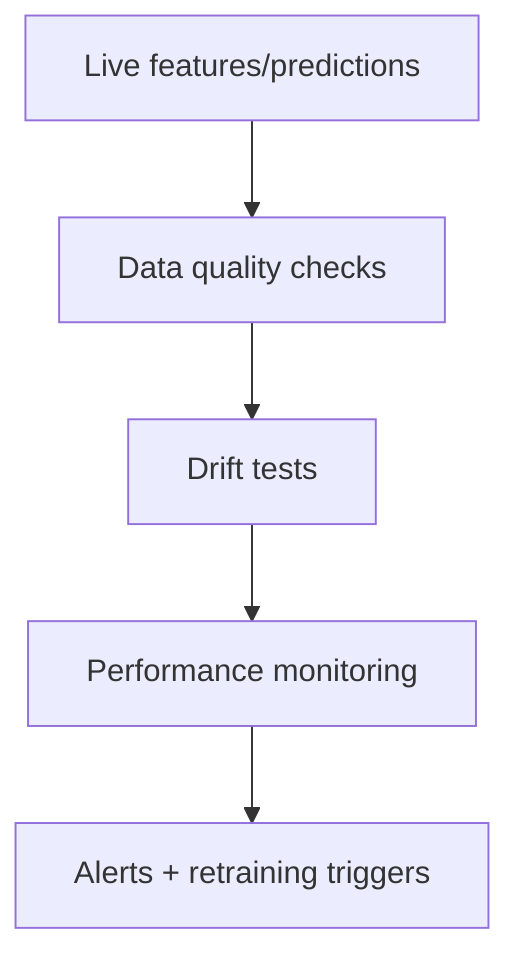

# Monitoring and Drift Detection for Production ML

## Why monitoring differs from regular software
Traditional services fail deterministically; ML systems degrade statistically over time.

## Drift taxonomy
- Data drift (covariate shift): `P(X)` changes.
- Label/prior drift: `P(y)` changes.
- Concept drift: `P(y|X)` changes.



## Statistical drift tests
- KS test for continuous distributions.
- Chi-squared for categorical distributions.
- PSI (Population Stability Index):
  - `<0.1` small
  - `0.1-0.2` moderate
  - `>0.2` significant
- JS divergence, Wasserstein distance.

## Delayed labels challenge
For many logistics tasks true outcomes arrive hours/days later.
Interim monitoring:
- input drift
- prediction distribution drift
- proxy metrics

## Monitoring layers
1. Data quality: nulls, schema, ranges.
2. Feature drift: per-feature distribution shift.
3. Prediction drift: score histogram movement.
4. Performance drift: when labels arrive.
5. Business KPI drift: SLA/NPS/cost impact.

## Alerting strategy
- hard thresholds for severe failures.
- trend-based alerts for gradual drift.
- slice-aware alerts (carrier, region, service type).

## Tooling
- Evidently
- WhyLabs/whylogs
- Arize
- Fiddler

## Logistics example
Delivery ETA model drifts every holiday season due to route congestion changes.
Mitigation:
- season-aware retraining schedule
- dynamic recalibration
- additional features (holiday intensity)

## Interview questions
1. Data drift vs concept drift?
2. How monitor when labels are delayed?
3. What is PSI and how interpret it?

## PSI snippet
```python
import numpy as np

def psi(expected, actual, bins=10):
    cuts = np.quantile(expected, np.linspace(0, 1, bins + 1))
    e_hist, _ = np.histogram(expected, bins=cuts)
    a_hist, _ = np.histogram(actual, bins=cuts)
    e = np.clip(e_hist / max(e_hist.sum(), 1), 1e-6, None)
    a = np.clip(a_hist / max(a_hist.sum(), 1), 1e-6, None)
    return np.sum((a - e) * np.log(a / e))
```
