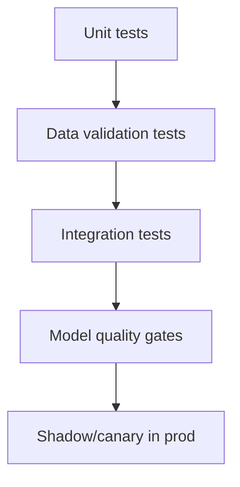

# Testing Strategies for ML Systems

## ML testing pyramid
1. Unit tests (transforms, feature logic, custom losses)
2. Data tests (schema, nulls, ranges)
3. Integration tests (pipeline + model serving)
4. Model quality tests (threshold gates)
5. Production shadow tests



## Data validation
- Great Expectations / Pandera for schema and quality assertions.
- Fail pipeline early on upstream schema drift.

## Behavioral model tests
- Invariance checks (small perturbation stability).
- Directional checks (feature monotonic expectations).
- Minimum functionality tests with known examples.

## Regression tests
New candidate model must beat champion on fixed benchmark slices.

## Example pytest sketch
```python
def test_eta_feature_non_negative(df):
    assert (df['distance_km'] >= 0).all()

def test_model_quality_gate(val_metrics):
    assert val_metrics['pr_auc'] >= 0.42
```

## Interview questions
1. Why classic unit tests are insufficient for ML?
2. How enforce quality gates in CI/CD?
3. What is shadow deployment and why useful?
