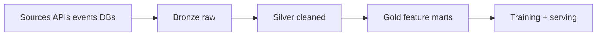

# Data Architecture Patterns for ML

## Architectural styles
- Lambda: batch + speed layers.
- Kappa: streaming-only reprocessing.
- Lakehouse: unified storage + ACID table format.

## Medallion pattern
- Bronze: raw ingested data
- Silver: cleaned/validated
- Gold: curated features and metrics

## Streaming + batch feature computation
- Batch for long-window aggregates.
- Streaming for freshness-critical signals.
- Merge in feature store with point-in-time semantics.

## Data contracts and schema evolution
- versioned schemas
- backward compatibility checks
- producer/consumer ownership and alerting

## Privacy/compliance
- PII classification and masking
- retention policies
- audit logs for data access

## Interview questions
1. Lambda vs Kappa tradeoffs?
2. How handle schema evolution safely?
3. Why lakehouse for ML workloads?
