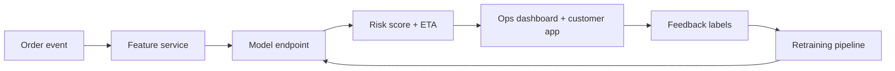

# End-to-End ML System Design (Interview Walkthrough)

## Answering framework
1. Clarify product and constraints.
2. Translate to ML problem and metrics.
3. Design data pipelines and features.
4. Select model and training strategy.
5. Design serving layer.
6. Add monitoring and feedback loops.
7. Cover reliability, security, cost.

## Worked example: DHL delivery delay prediction

### Requirements
- 10M packages/day
- prediction at shipment creation in <150ms
- high recall on delayed parcels with manageable false positives

### ML formulation
- Binary classification: delayed vs on-time.
- Secondary regression: expected delay minutes.

### Data sources
- shipment attributes
- origin/destination and distance
- weather forecasts
- depot load and route congestion
- historical carrier reliability

### Candidate models
- LightGBM (fast/tabular strong baseline)
- XGBoost for quality comparison
- online calibration layer for drift adjustments

### Serving design
- Feature API + cache
- Model inference service
- synchronous API for single package
- async batch for bulk operations

### Monitoring
- feature drift (PSI)
- score drift
- delayed-label performance tracking
- business KPI: SLA misses reduced

### Tradeoffs
- latency vs richer features
- interpretability vs marginal accuracy
- retraining frequency vs cost

## Interview follow-ups
1. How handle cold start for new routes?
2. How design fallback during model outage?
3. How prevent leakage in training data generation?
