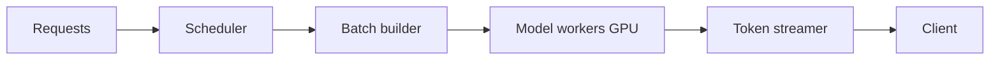

# High-Throughput Inference System Design

## Throughput vs latency
- Throughput: requests/tokens per second.
- Latency: response time per request.
Need both by SLA tier.

## Design levers
- continuous batching
- KV-cache management
- model quantization
- multi-model routing
- request prioritization

## Hardware choices
- A100/H100 for high-end low-latency workloads.
- L4/T4 for cost-efficient medium throughput.
- CPU quantized endpoints for low-criticality traffic.

## Capacity planning
- estimate tokens/sec demand
- size for p95 load + headroom
- autoscale on queue depth and GPU utilization

## Interview questions
1. How serve 1000 concurrent LLM requests?
2. How do you balance throughput and tail latency?
3. Where does KV cache become bottleneck?
