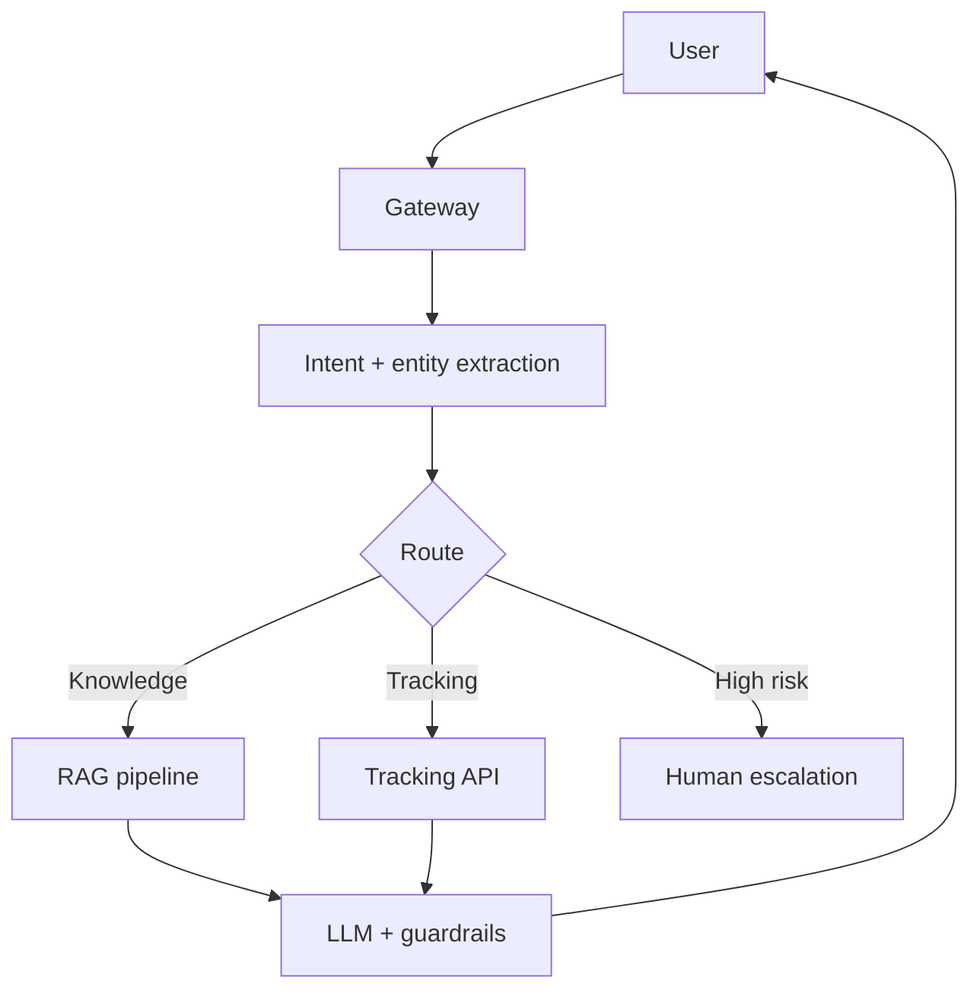

# LLM Application System Design

## Example 1: Logistics customer support bot

### Requirements
- 50K tickets/day
- multilingual support
- p95 < 3s
- escalation to humans on low confidence

### Architecture
- channel adapters (web/app/WhatsApp)
- API gateway + auth/rate limits
- intent router
- RAG retrieval layer (vector + lexical)
- LLM generation layer
- guardrails and escalation

### Key design decisions
- hybrid retrieval with reranking
- confidence score for escalation
- per-tenant and per-language observability

## Example 2: Document extraction system
- Ingestion queue for PDFs/images
- OCR + layout parsing
- LLM extraction with schema-constrained output
- validation and human review loop

## Interview questions
1. How decide escalation threshold?
2. How defend against prompt injection?
3. How manage cost with high volume queries?
