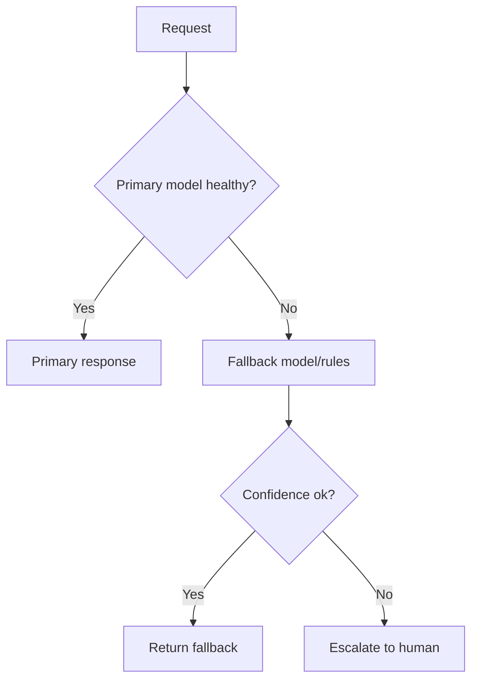

# Reliability and Cost Engineering for AI Systems

## Reliability targets
- Availability SLA (e.g., 99.9%)
- Latency SLO (p95/p99)
- Quality SLO (minimum groundedness/accuracy)

## Failure modes
- model endpoint outage
- data pipeline delay
- retrieval index corruption
- external API failure

## Resilience patterns
- circuit breakers
- retries with backoff
- fallback model/rules
- cached response fallback
- graceful degradation and human escalation

## Cost components
- training compute
- inference compute
- storage/indexing
- labeling/human review
- observability tooling

## Cost levers
- quantization
- distillation
- caching
- dynamic routing by query complexity
- batch processing where possible

## ROI framing
- baseline operational cost
- expected savings from automation
- failure risk and mitigation cost
- payback period and sensitivity analysis

## Interview questions
1. How design for 99.9% uptime?
2. How choose between quality and cost under budget cap?
3. What fallback strategy for LLM outages?
