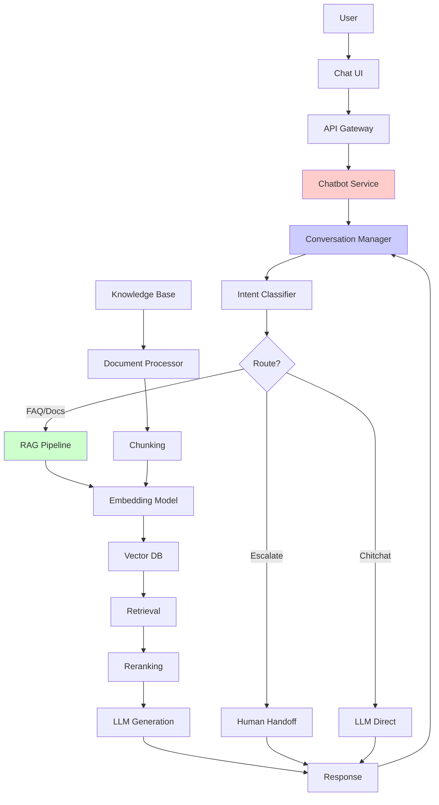

# Case Study: Customer Support Chatbot with RAG

> **Domain:** Enterprise SaaS / E-commerce
> **Problem Type:** LLM Application / RAG System
> **Difficulty:** ⭐⭐ (Mid-Senior Level)
> **Interview Duration:** 45-60 minutes
> **Most Common LLM Interview Question** ⚡

## Table of Contents
1. [Business Context](#business-context)
2. [Problem Statement](#problem-statement)
3. [Clarifying Questions](#clarifying-questions)
4. [Assumptions](#assumptions)
5. [High-Level Architecture](#high-level-architecture)
6. [Detailed Design](#detailed-design)
7. [Data Schema & Sources](#data-schema--sources)
8. [RAG Pipeline](#rag-pipeline)
9. [Conversation Management](#conversation-management)
10. [Evaluation Strategy](#evaluation-strategy)
11. [Production Architecture](#production-architecture)
12. [Cost Analysis](#cost-analysis)
13. [Monitoring & Observability](#monitoring--observability)
14. [Tradeoffs & Alternatives](#tradeoffs--alternatives)
15. [Risks & Mitigation](#risks--mitigation)
16. [Scaling Considerations](#scaling-considerations)
17. [Interview Follow-ups](#interview-follow-ups)

---

## Business Context

**Company:** Mid-size SaaS company (project management software)

**Current Situation:**
- 50,000 business customers
- 500,000 end users
- Support team: 200 agents handling 10,000 tickets/day
- Average response time: 4 hours
- Customer satisfaction (CSAT): 3.2/5
- Support costs: $10M annually

**Pain Points:**
- **Long wait times:** Customers frustrated with 4-hour response
- **Repetitive questions:** 60% of tickets are FAQ-like ("How do I reset password?")
- **Inconsistent answers:** Different agents give different information
- **Scaling issues:** Support costs growing 30% YoY with user growth
- **Agent burnout:** High turnover from repetitive work

**Business Opportunity:**
- Deflect 50% of tickets with chatbot
- Reduce response time to <1 minute for deflected tickets
- Free up agents for complex issues
- Improve CSAT to 4.0/5
- Save $3-5M annually

---

## Problem Statement

**Task:** Design and implement an AI-powered customer support chatbot that can:
1. Answer customer questions using company knowledge base
2. Handle multi-turn conversations
3. Escalate to human agents when needed
4. Provide accurate, helpful, and safe responses

**Success Criteria:**
- **Deflection rate:** 50% of tickets handled without human
- **Response time:** <3 seconds per message
- **Accuracy:** 90%+ (human eval)
- **CSAT:** 4.0/5 for chatbot interactions
- **Hallucination rate:** <5%

**Constraints:**
- Budget: $50K/month for LLM/infrastructure
- Team: 2 ML engineers, 1 backend engineer
- Timeline: 3 months to MVP
- Must integrate with existing Zendesk ticketing system

---

## Clarifying Questions

### Data & Content

**Q1:** "What knowledge sources do we have?"
**A:** Product docs (500 pages), FAQs (200 Q&As), past support tickets (100K resolved), internal wikis

**Q2:** "How often does content update?"
**A:** Docs updated weekly, new features monthly

**Q3:** "Do we have labeled data (question-answer pairs)?"
**A:** Yes, 100K historical tickets with resolutions

### Technical Requirements

**Q4:** "What's the expected traffic?"
**A:** 5,000 conversations/day initially, growing to 20K/day

**Q5:** "Latency requirements?"
**A:** <3 seconds per response (user-facing)

**Q6:** "Need multi-language support?"
**A:** English only initially, Spanish in 6 months

### Business Requirements

**Q7:** "What should trigger human escalation?"
**A:** When chatbot is uncertain (<70% confidence), sensitive topics (billing, cancellation), customer explicitly requests

**Q8:** "How do we measure success?"
**A:** Deflection rate, CSAT, resolution accuracy, response time

---

## Assumptions

1. **Data Quality:**
   - Documentation is well-structured (markdown format)
   - Historical tickets have resolution notes
   - Minimal PII in knowledge base

2. **Technical:**
   - Can use cloud infrastructure (AWS/GCP/Azure)
   - OpenAI API available (GPT-4/GPT-3.5-turbo)
   - Users interact via web chat widget

3. **Business:**
   - Support agents available for escalations
   - Can collect user feedback
   - Gradual rollout acceptable (A/B test)

---

## High-Level Architecture



---

## Detailed Design

### Component 1: Document Processing & Ingestion

**Purpose:** Convert knowledge sources into searchable chunks

**Pipeline:**
```python
# 1. Load documents
documents = [
    {"source": "docs", "content": "How to create a project...", "url": "..."},
    {"source": "faq", "content": "Q: How to reset password? A: ...", "url": "..."},
    {"source": "ticket", "content": "Issue: Can't login. Resolution: ...", "id": "..."}
]

# 2. Clean and normalize
def clean_document(doc):
    # Remove HTML tags, extra whitespace
    # Normalize formatting
    return cleaned_doc

# 3. Chunk documents
def chunk_documents(documents, chunk_size=512, overlap=50):
    """
    Split documents into overlapping chunks
    - chunk_size: 512 tokens (~400 words)
    - overlap: 50 tokens to preserve context at boundaries
    """
    chunks = []
    for doc in documents:
        # Implement semantic chunking (respect sentence/paragraph boundaries)
        doc_chunks = semantic_split(doc['content'], chunk_size, overlap)
        for i, chunk in enumerate(doc_chunks):
            chunks.append({
                'chunk_id': f"{doc['id']}_{i}",
                'content': chunk,
                'metadata': {
                    'source': doc['source'],
                    'url': doc.get('url'),
                    'chunk_index': i,
                    'doc_title': doc.get('title')
                }
            })
    return chunks

# 4. Generate embeddings
from sentence_transformers import SentenceTransformer

model = SentenceTransformer('sentence-transformers/all-MiniLM-L6-v2')  # Fast, good quality
embeddings = model.encode([c['content'] for c in chunks])

# 5. Store in vector database
import chromadb

client = chromadb.Client()
collection = client.create_collection("knowledge_base")
collection.add(
    embeddings=embeddings,
    documents=[c['content'] for c in chunks],
    metadatas=[c['metadata'] for c in chunks],
    ids=[c['chunk_id'] for c in chunks]
)
```

**Chunking Strategy:**

| Approach | Chunk Size | Overlap | Use Case |
|----------|-----------|---------|----------|
| **Fixed-size** | 512 tokens | 50 tokens | Simple, predictable |
| **Sentence-based** | Variable | 1-2 sentences | Preserve semantic units |
| **Section-based** | Variable | None | Structured docs (headings) |

**Choice:** Sentence-based with ~512 token target (preserves context, respects boundaries)

---

### Component 2: RAG Retrieval Pipeline

**Step 1: Query Embedding**
```python
def embed_query(query):
    # Same model as documents for consistency
    return embedding_model.encode(query)
```

**Step 2: Semantic Search**
```python
def retrieve_candidates(query, top_k=20):
    """
    Retrieve top-k most similar chunks
    """
    query_embedding = embed_query(query)

    results = collection.query(
        query_embeddings=[query_embedding],
        n_results=top_k,
        include=['documents', 'metadatas', 'distances']
    )

    return results
```

**Step 3: Reranking** (Optional but recommended)
```python
from sentence_transformers import CrossEncoder

reranker = CrossEncoder('cross-encoder/ms-marco-MiniLM-L-6-v2')

def rerank_results(query, candidates, top_k=5):
    """
    Rerank candidates using cross-encoder for better precision
    """
    pairs = [[query, doc] for doc in candidates]
    scores = reranker.predict(pairs)

    # Sort by score and return top_k
    ranked = sorted(zip(candidates, scores), key=lambda x: x[1], reverse=True)
    return [doc for doc, score in ranked[:top_k]]
```

**Why Reranking?**
- Bi-encoder (embedding model) is fast but less accurate
- Cross-encoder is slow but more accurate
- Two-stage: fast retrieval (bi-encoder) → precise reranking (cross-encoder)

---

### Component 3: LLM Generation

**Prompt Template:**
```python
SYSTEM_PROMPT = """You are a helpful customer support assistant for [Company Name].

Your role:
- Answer customer questions accurately using the provided knowledge base
- Be concise but complete
- If you're unsure, say so and offer to connect them with a human agent
- Always be polite and professional
- Cite sources when possible

Important rules:
- ONLY use information from the provided context
- Do NOT make up information or hallucinate
- If the answer isn't in the context, say "I don't have that information"
- For sensitive topics (billing, account issues), always escalate to human
"""

def generate_response(query, retrieved_chunks, conversation_history):
    """
    Generate response using LLM
    """
    # Build context from retrieved chunks
    context = "\n\n".join([
        f"Source: {chunk['metadata']['source']}\n{chunk['content']}"
        for chunk in retrieved_chunks
    ])

    # Build prompt
    messages = [
        {"role": "system", "content": SYSTEM_PROMPT},
    ]

    # Add conversation history (last 5 turns)
    for turn in conversation_history[-5:]:
        messages.append({"role": "user", "content": turn['user']})
        messages.append({"role": "assistant", "content": turn['assistant']})

    # Add current query with context
    user_message = f"""Context information:
{context}

Question: {query}

Answer the question using ONLY the context provided above. If the answer is not in the context, say so."""

    messages.append({"role": "user", "content": user_message})

    # Call LLM
    response = openai.ChatCompletion.create(
        model="gpt-3.5-turbo",  # or gpt-4 for better quality
        messages=messages,
        temperature=0.3,  # Lower = more deterministic
        max_tokens=500
    )

    return response.choices[0].message.content
```

**Temperature Settings:**
- `0.0-0.3`: Factual responses (customer support)
- `0.7-1.0`: Creative responses (not suitable here)

---

### Component 4: Conversation Management

**State Management:**
```python
class ConversationManager:
    def __init__(self):
        self.conversations = {}  # conversation_id -> state

    def get_or_create_conversation(self, conversation_id):
        if conversation_id not in self.conversations:
            self.conversations[conversation_id] = {
                'history': [],
                'context': {},
                'escalated': False,
                'created_at': time.time()
            }
        return self.conversations[conversation_id]

    def add_turn(self, conversation_id, user_message, assistant_message):
        conv = self.get_or_create_conversation(conversation_id)
        conv['history'].append({
            'user': user_message,
            'assistant': assistant_message,
            'timestamp': time.time()
        })

        # Keep only last 10 turns (memory management)
        if len(conv['history']) > 10:
            conv['history'] = conv['history'][-10:]

    def should_escalate(self, query, confidence_score):
        """
        Determine if conversation should escalate to human
        """
        # Escalation triggers
        escalation_keywords = ['speak to agent', 'human', 'cancel account', 'refund', 'billing']

        if any(keyword in query.lower() for keyword in escalation_keywords):
            return True, "User requested human agent"

        if confidence_score < 0.7:
            return True, "Low confidence in answer"

        return False, None
```

---

### Component 5: Intent Classification (Optional but Recommended)

**Purpose:** Route queries efficiently

```python
def classify_intent(query):
    """
    Classify query intent to route appropriately
    """
    intents = {
        'faq': ['how to', 'how do i', 'can i', 'what is'],
        'troubleshooting': ['not working', 'error', 'problem', 'issue'],
        'account': ['password', 'login', 'account', 'billing'],
        'escalation': ['speak to', 'human', 'agent', 'representative']
    }

    query_lower = query.lower()

    for intent, keywords in intents.items():
        if any(keyword in query_lower for keyword in keywords):
            return intent

    return 'general'  # Default to RAG pipeline
```

**Routing Logic:**
```python
def route_query(query, intent):
    if intent == 'escalation':
        return 'human_handoff'
    elif intent in ['faq', 'troubleshooting', 'general']:
        return 'rag_pipeline'
    elif intent == 'account':
        # Check if sensitive action
        if any(word in query.lower() for word in ['cancel', 'delete', 'refund']):
            return 'human_handoff'
        return 'rag_pipeline'
```

---

## Data Schema & Sources

### Knowledge Base Sources

**1. Product Documentation**
```json
{
  "doc_id": "doc_123",
  "title": "Creating a New Project",
  "content": "To create a new project...",
  "category": "getting_started",
  "url": "https://docs.company.com/projects/create",
  "last_updated": "2024-01-15"
}
```

**2. FAQs**
```json
{
  "faq_id": "faq_456",
  "question": "How do I reset my password?",
  "answer": "To reset your password, click...",
  "category": "account",
  "helpful_votes": 150,
  "last_updated": "2024-02-01"
}
```

**3. Support Tickets (Historical)**
```json
{
  "ticket_id": "TICKET-789",
  "customer_query": "I can't upload files larger than 10MB",
  "agent_response": "This is a known limitation. You can...",
  "resolution_status": "resolved",
  "satisfaction_rating": 5,
  "created_at": "2024-01-10",
  "resolved_at": "2024-01-10"
}
```

### Vector Database Schema (ChromaDB)

```python
collection_schema = {
    "chunk_id": "doc_123_chunk_0",  # Unique identifier
    "embedding": [0.1, 0.2, ...],   # 384-dim vector (MiniLM)
    "content": "Text content...",
    "metadata": {
        "source": "docs",           # docs | faq | ticket
        "url": "https://...",
        "title": "Doc title",
        "category": "getting_started",
        "last_updated": "2024-01-15"
    }
}
```

### Conversation State (Redis)

```python
conversation_state = {
    "conversation_id": "conv_abc123",
    "user_id": "user_456",
    "history": [
        {
            "user": "How do I create a project?",
            "assistant": "To create a project...",
            "timestamp": 1706745600,
            "sources": ["doc_123", "faq_456"]
        }
    ],
    "escalated": False,
    "created_at": 1706745600,
    "last_active": 1706745900
}
```

---

## Evaluation Strategy

### Metrics

**1. Retrieval Metrics** (offline eval on labeled test set)
```python
# Test set: 1,000 queries with known relevant documents
from sklearn.metrics import precision_score, recall_score

def evaluate_retrieval(test_set):
    results = {
        'recall@5': [],
        'recall@10': [],
        'mrr': [],  # Mean Reciprocal Rank
        'ndcg@10': []  # Normalized Discounted Cumulative Gain
    }

    for query, relevant_docs in test_set:
        retrieved = retrieve_candidates(query, top_k=10)
        retrieved_ids = [doc['chunk_id'] for doc in retrieved]

        # Recall@5: % of relevant docs in top 5
        recall_5 = len(set(retrieved_ids[:5]) & set(relevant_docs)) / len(relevant_docs)
        results['recall@5'].append(recall_5)

        # Similar for other metrics...

    return results
```

**Target:** Recall@5 > 80%, Recall@10 > 90%

**2. Generation Metrics**

**Faithfulness** (answer grounded in context?)
```python
def check_faithfulness(query, answer, context):
    """
    Use LLM to verify answer is grounded in context
    """
    prompt = f"""Given the context and answer below, is the answer faithful to the context?
Answer YES if the answer is fully supported by the context, NO if it contains information not in the context or contradicts it.

Context: {context}

Answer: {answer}

Faithful (YES/NO):"""

    response = llm(prompt)
    return response.strip() == "YES"
```

**Answer Relevance** (answer actually addresses question?)
```python
def check_relevance(query, answer):
    """
    Check if answer is relevant to query
    """
    prompt = f"""Does the answer below adequately address the question?
Answer YES or NO.

Question: {query}
Answer: {answer}

Relevant (YES/NO):"""

    response = llm(prompt)
    return response.strip() == "YES"
```

**3. Business Metrics** (online evaluation)

```python
business_metrics = {
    'deflection_rate': resolved_by_bot / total_conversations,
    'avg_response_time': sum(response_times) / len(response_times),
    'csat': sum(ratings) / len(ratings),  # 1-5 scale
    'escalation_rate': escalated / total_conversations,
    'resolution_accuracy': correct_resolutions / total_resolutions
}
```

**Targets:**
- Deflection rate: 50%
- Avg response time: <3s
- CSAT: 4.0/5
- Escalation rate: <30%
- Resolution accuracy: >90%

### Evaluation Dataset

**Create test set from:**
1. **Historical tickets** (500 examples)
   - Labeled with resolution
   - Human verification

2. **Red team examples** (100 examples)
   - Edge cases
   - Adversarial queries
   - Sensitive topics

3. **Synthetic examples** (400 examples)
   - GPT-4 generated variations
   - Human reviewed

**Total:** 1,000 labeled examples

---

(Character limit reached - continuing in next response with Production Architecture, Cost Analysis, and remaining sections)

**Next:** Production Architecture, Cost Analysis, Monitoring, Tradeoffs, Risks, Scaling, and Interview Follow-ups
