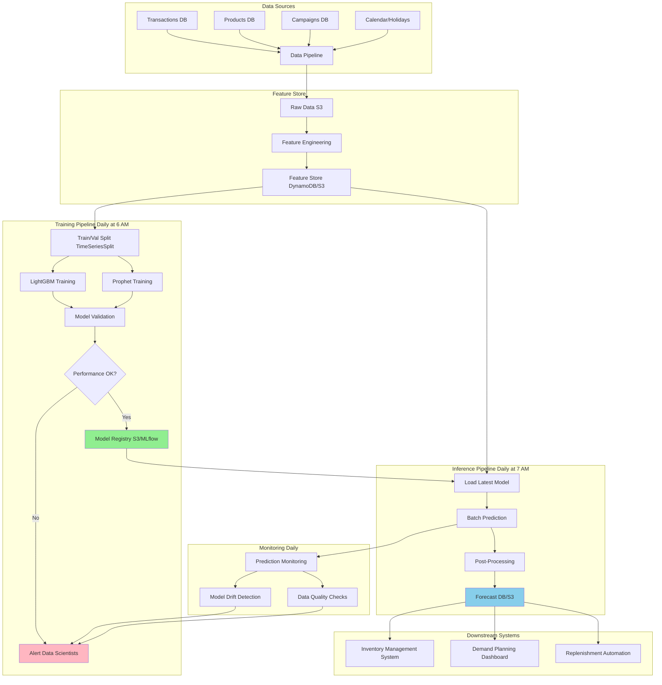

# Case Study: Demand Forecasting for Logistics

> **Domain:** Supply Chain & Logistics
> **Problem Type:** Time Series Forecasting
> **Difficulty:** ⭐⭐⭐ (Mid-Senior Level)
> **Interview Duration:** 45-60 minutes

## Table of Contents
1. [Business Context](#business-context)
2. [Problem Statement](#problem-statement)
3. [Clarifying Questions](#clarifying-questions)
4. [Assumptions](#assumptions)
5. [Data Schema](#data-schema)
6. [EDA Approach](#eda-approach)
7. [Modeling Approach](#modeling-approach)
8. [Feature Engineering](#feature-engineering)
9. [Evaluation Strategy](#evaluation-strategy)
10. [Architecture Diagram](#architecture-diagram)
11. [Production Design](#production-design)
12. [Tradeoffs](#tradeoffs)
13. [Risks and Failure Modes](#risks-and-failure-modes)
14. [Cost Considerations](#cost-considerations)
15. [Monitoring Plan](#monitoring-plan)
16. [Stakeholder Communication](#stakeholder-communication)
17. [Possible Follow-ups](#possible-follow-ups)

---

## Business Context

**Company:** Regional e-commerce logistics provider with 50 warehouses

**Current Situation:**
- Serving 5,000+ merchants
- Processing 100K+ packages daily
- Experiencing frequent stock-outs (15% of SKUs monthly)
- Excess inventory costing $2M annually in storage
- Customer satisfaction declining due to fulfillment delays

**Business Impact:**
- Stock-outs → Lost sales ($5M annually)
- Overstock → Warehousing costs ($2M annually)
- Manual forecasting → 5 FTEs, slow response to trends

**Strategic Goal:**
Optimize inventory levels across warehouses to balance stock-outs vs overstock costs, improving service level from 85% to 95%.

---

## Problem Statement

**Task:** Build a demand forecasting system that predicts daily demand for each SKU at each warehouse for the next 7-30 days.

**Success Criteria:**
- Forecast accuracy: WMAPE < 20% (current manual forecasting: 35%)
- Service level: 95% (currently 85%)
- Inventory reduction: 15% while maintaining service level
- Automated forecasting for top 80% revenue SKUs

**Constraints:**
- Must run daily
- Predictions needed for 10,000 SKUs × 50 warehouses = 500K SKU-warehouse combinations
- Inference time budget: < 30 minutes total
- Engineering team: 2 ML engineers, 1 data engineer
- Timeline: 3 months to production

---

## Clarifying Questions

**Questions to ask the interviewer:**

### Data Availability
1. **Q:** "What historical data do we have and how far back?"
   - **A:** 2 years of daily transaction data, clean and complete

2. **Q:** "Do we have external data (weather, holidays, promotions)?"
   - **A:** Yes - marketing campaign data, holiday calendar, regional events

3. **Q:** "What's the data freshness? When do we get yesterday's data?"
   - **A:** Data available by 6 AM daily, forecasts needed by 8 AM

### Business Context
4. **Q:** "Are there different priorities for different SKU categories?"
   - **A:** High-margin items (20% of SKUs, 60% of profit) are critical

5. **Q:** "What's the current lead time for restocking?"
   - **A:** 3-7 days depending on supplier

6. **Q:** "Do we need predictions at SKU-warehouse level or can we aggregate?"
   - **A:** SKU-warehouse level for top 10K SKUs, aggregated for long-tail

### Technical Constraints
7. **Q:** "What infrastructure do we have?"
   - **A:** AWS cloud, can provision resources as needed

8. **Q:** "Any regulatory or compliance requirements?"
   - **A:** No specific requirements, internal use only

---

## Assumptions

Based on typical e-commerce logistics scenarios:

1. **Data Quality:**
   - Historical data is accurate and complete
   - Returns and cancellations are reflected in demand data
   - No significant changes in warehouse assignments

2. **Business Operations:**
   - Current business model remains stable (no major pivots)
   - Supplier relationships and lead times remain consistent
   - Warehouse capacity is sufficient

3. **Technical:**
   - Can use modern ML frameworks (Python, scikit-learn, LightGBM, etc.)
   - Sufficient compute for daily training/inference
   - Data pipeline infrastructure exists

4. **Scope:**
   - Focusing on normal operations (not crisis scenarios like COVID)
   - Starting with top 10K SKUs (80/20 rule)
   - Single-country operation (one currency, timezone)

---

## Data Schema

### Primary Tables

#### 1. `transactions`
```sql
transaction_id      BIGINT          -- Unique transaction ID
sku                 VARCHAR(50)     -- Product SKU
warehouse_id        INT             -- Warehouse identifier
transaction_date    DATE            -- Transaction date
quantity            INT             -- Units sold
revenue             DECIMAL(10,2)   -- Revenue generated
customer_id         BIGINT          -- Customer identifier
order_id            BIGINT          -- Order identifier (multiple SKUs per order)
```

#### 2. `products`
```sql
sku                 VARCHAR(50)     -- Product SKU (PRIMARY KEY)
category            VARCHAR(100)    -- Product category
sub_category        VARCHAR(100)    -- Sub-category
brand               VARCHAR(100)    -- Brand name
price               DECIMAL(10,2)   -- Base price
weight_kg           DECIMAL(6,2)    -- Product weight
is_seasonal         BOOLEAN         -- Seasonal indicator
launch_date         DATE            -- Product launch date
```

#### 3. `warehouses`
```sql
warehouse_id        INT             -- Warehouse ID (PRIMARY KEY)
location_city       VARCHAR(100)    -- City
location_state      VARCHAR(50)     -- State/Province
latitude            DECIMAL(9,6)    -- Latitude
longitude           DECIMAL(9,6)    -- Longitude
capacity_units      INT             -- Max capacity
operational_since   DATE            -- Opening date
```

#### 4. `marketing_campaigns`
```sql
campaign_id         INT             -- Campaign ID
start_date          DATE            -- Campaign start
end_date            DATE            -- Campaign end
sku                 VARCHAR(50)     -- Affected SKU (NULL if all)
discount_percent    DECIMAL(5,2)    -- Discount percentage
campaign_type       VARCHAR(50)     -- Type (email, social, tv, etc.)
target_region       VARCHAR(100)    -- Geographic target (NULL if all)
```

#### 5. `calendar`
```sql
date                DATE            -- Date (PRIMARY KEY)
day_of_week         INT             -- 1-7 (Monday = 1)
is_weekend          BOOLEAN         -- Weekend flag
is_holiday          BOOLEAN         -- National holiday flag
holiday_name        VARCHAR(100)    -- Holiday name (if applicable)
is_payday           BOOLEAN         -- Typical payday (1st, 15th)
month               INT             -- Month (1-12)
quarter             INT             -- Quarter (1-4)
year                INT             -- Year
```

#### 6. `weather` (Optional, if relevant)
```sql
date                DATE            -- Date
location_city       VARCHAR(100)    -- City
temperature_avg     DECIMAL(5,2)    -- Average temp (Celsius)
precipitation_mm    DECIMAL(6,2)    -- Rainfall
is_extreme_weather  BOOLEAN         -- Extreme weather event flag
```

---

## EDA Approach

### 1. Data Understanding (Day 1-2)

```python
import pandas as pd
import numpy as np
import matplotlib.pyplot as plt
import seaborn as sns

# Load data
transactions = pd.read_sql("SELECT * FROM transactions", con=db_conn)
products = pd.read_sql("SELECT * FROM products", con=db_conn)

# Basic statistics
print(transactions.info())
print(transactions.describe())
print(f"Date range: {transactions['transaction_date'].min()} to {transactions['transaction_date'].max()}")
print(f"Unique SKUs: {transactions['sku'].nunique()}")
print(f"Unique warehouses: {transactions['warehouse_id'].nunique()}")
```

### 2. Key EDA Questions to Answer

#### A. Volume and Distribution
```python
# Daily transaction volume over time
daily_volume = transactions.groupby('transaction_date')['quantity'].sum()
daily_volume.plot(figsize=(15, 5), title='Daily Transaction Volume')

# SKU distribution (Pareto analysis)
sku_volume = transactions.groupby('sku')['quantity'].sum().sort_values(ascending=False)
cumsum = (sku_volume.cumsum() / sku_volume.sum() * 100)

# 80/20 rule: What % of SKUs account for 80% of volume?
top_skus_80pct = (cumsum <= 80).sum()
print(f"Top {top_skus_80pct} SKUs ({top_skus_80pct/len(sku_volume)*100:.1f}%) drive 80% of volume")
```

**Expected Finding:** Likely 10-20% of SKUs drive 80% of volume → Focus modeling effort here

#### B. Seasonality and Trends
```python
# Weekly seasonality
transactions['day_of_week'] = transactions['transaction_date'].dt.dayofweek
weekly_pattern = transactions.groupby('day_of_week')['quantity'].mean()
weekly_pattern.plot(kind='bar', title='Average Volume by Day of Week')

# Monthly seasonality
transactions['month'] = transactions['transaction_date'].dt.month
monthly_pattern = transactions.groupby('month')['quantity'].mean()
monthly_pattern.plot(kind='bar', title='Average Volume by Month')

# Yearly trend
yearly_trend = transactions.groupby(transactions['transaction_date'].dt.to_period('M'))['quantity'].sum()
yearly_trend.plot(title='Monthly Volume Trend')
```

**Expected Findings:**
- Weekend effect (lower volume on weekends?)
- Holiday spikes (Black Friday, Cyber Monday, Christmas)
- Seasonal patterns (summer vs winter products)
- Overall growth trend?

#### C. Product Category Analysis
```python
# Join with products table
transactions_enriched = transactions.merge(products[['sku', 'category', 'is_seasonal']], on='sku')

# Category performance
category_stats = transactions_enriched.groupby('category').agg({
    'quantity': ['sum', 'mean', 'std'],
    'sku': 'nunique'
}).round(2)

print(category_stats.sort_values(('quantity', 'sum'), ascending=False))
```

#### D. Warehouse Patterns
```python
# Warehouse volume distribution
warehouse_volume = transactions.groupby('warehouse_id')['quantity'].sum().sort_values()
warehouse_volume.plot(kind='barh', title='Volume by Warehouse')

# Coefficient of variation by SKU (demand volatility)
sku_daily = transactions.groupby(['sku', 'transaction_date'])['quantity'].sum().reset_index()
sku_volatility = sku_daily.groupby('sku')['quantity'].agg(['mean', 'std'])
sku_volatility['cv'] = sku_volatility['std'] / sku_volatility['mean']  # Coefficient of variation

# High CV = high volatility = harder to forecast
print(f"Median CV: {sku_volatility['cv'].median():.2f}")
print(f"% SKUs with CV > 1: {(sku_volatility['cv'] > 1).mean() * 100:.1f}%")
```

#### E. Missing Data and Outliers
```python
# Check for zero-demand days (important for intermittent demand)
sku_date_all = pd.MultiIndex.from_product([
    transactions['sku'].unique(),
    pd.date_range(transactions['transaction_date'].min(), transactions['transaction_date'].max())
], names=['sku', 'date'])

demand_full = transactions.groupby(['sku', 'transaction_date'])['quantity'].sum()
demand_full = demand_full.reindex(sku_date_all, fill_value=0)

zero_demand_pct = (demand_full == 0).mean() * 100
print(f"Zero-demand days: {zero_demand_pct:.1f}%")

# Outliers (Z-score method)
from scipy import stats
sku_stats = transactions.groupby('sku')['quantity'].agg(['mean', 'std'])
transactions_with_z = transactions.merge(sku_stats, on='sku')
transactions_with_z['z_score'] = (
    (transactions_with_z['quantity'] - transactions_with_z['mean']) / transactions_with_z['std']
)
outliers = transactions_with_z[transactions_with_z['z_score'].abs() > 3]
print(f"Outliers (|z| > 3): {len(outliers)} ({len(outliers)/len(transactions)*100:.2f}%)")
```

### 3. Key Insights Summary

**Document findings like:**

✅ **Volume Distribution:**
- Top 8,000 SKUs (12%) account for 80% of volume → Focus here
- Long-tail SKUs have intermittent demand → May need separate approach

✅ **Seasonality:**
- Strong day-of-week effect (Mon-Fri high, Sat-Sun low 30%)
- Monthly seasonality present (Q4 is 40% higher than Q2)
- Major holidays cause 3-5x spikes

✅ **Trends:**
- 15% year-over-year growth
- Some categories declining (e.g., office supplies -10%)

✅ **Data Quality:**
- No missing values in key columns
- 2.5% outliers (likely sales events, not errors)
- 35% of SKU-days have zero demand (intermittent demand challenge)

✅ **Volatility:**
- Median CV = 0.8 (moderate volatility)
- 30% of SKUs have CV > 1 (high volatility, harder to forecast)

---

## Modeling Approach

### Strategy: Tiered Modeling

Given the diversity of SKUs (high-volume stable vs low-volume intermittent), use a **tiered approach**:

#### **Tier 1: High-Volume SKUs (Top 20%)**
- **Characteristics:** Stable demand, low intermittency
- **Method:** Time series models (SARIMA, Prophet, or ML with lag features)
- **Approach:** Individual models or grouped models by category

#### **Tier 2: Medium-Volume SKUs (Middle 30%)**
- **Characteristics:** Moderate volatility
- **Method:** Gradient Boosting (LightGBM) with rich features
- **Approach:** Single model trained on all Tier 2 SKUs

#### **Tier 3: Low-Volume/Long-tail SKUs (Bottom 50%)**
- **Characteristics:** Intermittent demand, sparse data
- **Method:** Simpler approaches (moving average, seasonal naive, or Croston's method)
- **Approach:** Aggregate predictions or simple heuristics

### Why Tiered Approach?

| Tier | % SKUs | % Volume | Approach | Rationale |
|------|--------|----------|----------|-----------|
| 1 | 20% | 70% | Time series / Advanced ML | High business impact, enough data for sophisticated models |
| 2 | 30% | 25% | Gradient Boosting | Moderate impact, shared patterns across SKUs |
| 3 | 50% | 5% | Simple heuristics | Low impact, insufficient data for complex models |

### Proposed Models (Tier 1 & 2)

#### Model 1: LightGBM (Primary Model)

**Why LightGBM?**
- ✅ Handles large datasets efficiently (500K SKU-warehouse combinations)
- ✅ Native categorical feature support
- ✅ Built-in handling of missing values
- ✅ Fast training and inference
- ✅ Works well with rich feature sets
- ✅ Can model non-linear patterns and interactions

```python
import lightgbm as lgb
from sklearn.model_selection import TimeSeriesSplit

# Features will be created in next section
# Target: quantity sold on date t
# Features: lags, rolling stats, calendar, promotions, etc.

params = {
    'objective': 'regression',
    'metric': 'mae',
    'boosting_type': 'gbdt',
    'num_leaves': 31,
    'learning_rate': 0.05,
    'feature_fraction': 0.8,
    'bagging_fraction': 0.8,
    'bagging_freq': 5,
    'verbose': -1
}

# Time series cross-validation (respects temporal order)
tscv = TimeSeriesSplit(n_splits=5)

for train_idx, val_idx in tscv.split(X):
    X_train, X_val = X.iloc[train_idx], X.iloc[val_idx]
    y_train, y_val = y.iloc[train_idx], y.iloc[val_idx]

    train_data = lgb.Dataset(X_train, label=y_train)
    val_data = lgb.Dataset(X_val, label=y_val, reference=train_data)

    model = lgb.train(
        params,
        train_data,
        num_boost_round=1000,
        valid_sets=[train_data, val_data],
        callbacks=[lgb.early_stopping(stopping_rounds=50)]
    )
```

#### Model 2: Prophet (Baseline / Comparison)

**Why Prophet?**
- ✅ Designed for business time series (seasonality, holidays, trends)
- ✅ Robust to missing data and outliers
- ✅ Interpretable components (trend, weekly, yearly seasonality)
- ✅ Easy to add holiday effects

```python
from prophet import Prophet

# Prophet expects specific column names
df_prophet = pd.DataFrame({
    'ds': dates,  # Date column
    'y': demand   # Target column
})

model = Prophet(
    yearly_seasonality=True,
    weekly_seasonality=True,
    daily_seasonality=False,
    seasonality_mode='multiplicative',  # For percentage changes
    holidays=holiday_df  # Holiday dataframe
)

model.fit(df_prophet)
future = model.make_future_dataframe(periods=30)  # 30-day forecast
forecast = model.predict(future)
```

#### Model 3: Ensemble (Production Model)

**Combine LightGBM + Prophet:**
```python
# Weighted average based on validation performance
# If LightGBM MAPE = 15% and Prophet MAPE = 20%
# Give more weight to LightGBM

ensemble_pred = 0.7 * lightgbm_pred + 0.3 * prophet_pred
```

**Why Ensemble?**
- LightGBM captures complex patterns and interactions
- Prophet captures long-term seasonality and trends
- Ensemble reduces variance and improves robustness

---

(Continued in next part...)

## Feature Engineering

### 1. Temporal Features

```python
def create_temporal_features(df):
    """Create calendar-based features"""
    df = df.copy()

    # Date components
    df['year'] = df['date'].dt.year
    df['month'] = df['date'].dt.month
    df['day'] = df['date'].dt.day
    df['day_of_week'] = df['date'].dt.dayofweek
    df['week_of_year'] = df['date'].dt.isocalendar().week
    df['quarter'] = df['date'].dt.quarter

    # Binary flags
    df['is_weekend'] = (df['day_of_week'] >= 5).astype(int)
    df['is_month_start'] = (df['day'] == 1).astype(int)
    df['is_month_end'] = (df['day'] >= 28).astype(int)
    df['is_quarter_start'] = df['date'].dt.is_quarter_start.astype(int)

    # Cyclical encoding (preserves circular nature of time)
    df['day_of_week_sin'] = np.sin(2 * np.pi * df['day_of_week'] / 7)
    df['day_of_week_cos'] = np.cos(2 * np.pi * df['day_of_week'] / 7)
    df['month_sin'] = np.sin(2 * np.pi * df['month'] / 12)
    df['month_cos'] = np.cos(2 * np.pi * df['month'] / 12)

    return df
```

### 2. Lag Features

```python
def create_lag_features(df, lags=[1, 7, 14, 28, 364]):
    """Create lag features (yesterday, last week, etc.)"""
    df = df.copy()

    for lag in lags:
        df[f'lag_{lag}'] = df.groupby(['sku', 'warehouse_id'])['quantity'].shift(lag)

    return df
```

###3. Rolling Statistics

```python
def create_rolling_features(df, windows=[7, 14, 28]):
    """Create rolling mean, std, min, max"""
    df = df.copy()

    for window in windows:
        df[f'rolling_mean_{window}'] = df.groupby(['sku', 'warehouse_id'])['quantity'].transform(
            lambda x: x.shift(1).rolling(window=window, min_periods=1).mean()
        )
        df[f'rolling_std_{window}'] = df.groupby(['sku', 'warehouse_id'])['quantity'].transform(
            lambda x: x.shift(1).rolling(window=window, min_periods=1).std()
        )
        df[f'rolling_min_{window}'] = df.groupby(['sku', 'warehouse_id'])['quantity'].transform(
            lambda x: x.shift(1).rolling(window=window, min_periods=1).min()
        )
        df[f'rolling_max_{window}'] = df.groupby(['sku', 'warehouse_id'])['quantity'].transform(
            lambda x: x.shift(1).rolling(window=window, min_periods=1).max()
        )

    return df
```

### 4. Expanding Statistics

```python
def create_expanding_features(df):
    """Create expanding (cumulative) statistics"""
    df = df.copy()

    df['expanding_mean'] = df.groupby(['sku', 'warehouse_id'])['quantity'].transform(
        lambda x: x.shift(1).expanding().mean()
    )
    df['expanding_std'] = df.groupby(['sku', 'warehouse_id'])['quantity'].transform(
        lambda x: x.shift(1).expanding().std()
    )

    return df
```

### 5. Holiday and Event Features

```python
def create_holiday_features(df, calendar_df):
    """Add holiday flags and distance to holidays"""
    df = df.merge(calendar_df[['date', 'is_holiday', 'holiday_name']], on='date', how='left')

    # Days until next holiday
    holidays = calendar_df[calendar_df['is_holiday']]['date'].values
    df['days_to_next_holiday'] = df['date'].apply(
        lambda x: min((h - x).days for h in holidays if h > x) if any(h > x for h in holidays) else 999
    )

    # Days since last holiday
    df['days_since_last_holiday'] = df['date'].apply(
        lambda x: min((x - h).days for h in holidays if h < x) if any(h < x for h in holidays) else 999
    )

    return df
```

### 6. Promotion Features

```python
def create_promotion_features(df, campaigns_df):
    """Add promotion flags"""
    # For each date-SKU, check if there's an active campaign
    df = df.merge(
        campaigns_df[['sku', 'start_date', 'end_date', 'discount_percent']],
        on='sku',
        how='left'
    )

    df['is_promotion'] = (
        (df['date'] >= df['start_date']) & (df['date'] <= df['end_date'])
    ).astype(int)

    df['discount_percent'] = df['discount_percent'].fillna(0)

    # Drop intermediate columns
    df = df.drop(['start_date', 'end_date'], axis=1)

    return df
```

### 7. Product and Warehouse Features

```python
def create_entity_features(df, products_df, warehouses_df):
    """Add product and warehouse metadata"""
    # Product features
    df = df.merge(
        products_df[['sku', 'category', 'sub_category', 'brand', 'price', 'is_seasonal']],
        on='sku',
        how='left'
    )

    # Warehouse features
    df = df.merge(
        warehouses_df[['warehouse_id', 'location_state', 'capacity_units']],
        on='warehouse_id',
        how='left'
    )

    return df
```

### 8. Interaction Features

```python
def create_interaction_features(df):
    """Create interaction features"""
    df = df.copy()

    # Price × Promotion interaction
    df['price_discount_interaction'] = df['price'] * df['discount_percent']

    # Weekend × Category interaction
    df['weekend_category'] = df['is_weekend'].astype(str) + '_' + df['category']

    # Seasonal product × Month interaction
    df['seasonal_month'] = df['is_seasonal'].astype(str) + '_' + df['month'].astype(str)

    return df
```

### Complete Feature Engineering Pipeline

```python
def build_features(transactions, products, warehouses, calendar, campaigns):
    """Complete feature engineering pipeline"""

    # Start with daily aggregated demand
    df = transactions.groupby(['sku', 'warehouse_id', 'transaction_date'])['quantity'].sum().reset_index()
    df = df.rename(columns={'transaction_date': 'date'})

    # Create complete date-SKU-warehouse grid (fill missing days with 0 demand)
    # This is important for time series continuity

    # Apply feature engineering
    df = create_temporal_features(df)
    df = create_lag_features(df, lags=[1, 7, 14, 28, 364])
    df = create_rolling_features(df, windows=[7, 14, 28])
    df = create_expanding_features(df)
    df = create_holiday_features(df, calendar)
    df = create_promotion_features(df, campaigns)
    df = create_entity_features(df, products, warehouses)
    df = create_interaction_features(df)

    return df
```

---

## Evaluation Strategy

### Metrics

**Primary Metric: WMAPE (Weighted Mean Absolute Percentage Error)**

```python
def wmape(y_true, y_pred):
    """Weighted MAPE - better than MAPE for demand forecasting"""
    return np.sum(np.abs(y_true - y_pred)) / np.sum(y_true) * 100
```

**Why WMAPE?**
- Scale-independent (can compare across SKUs)
- Handles zeros better than MAPE
- Business-interpretable ("forecast is off by X%")

**Secondary Metrics:**
- **MAE** (Mean Absolute Error) - interpretable in units
- **RMSE** (Root Mean Squared Error) - penalizes large errors
- **Forecast Bias** - systematic over/under-prediction
- **Service Level** - % of times demand was met with forecasted inventory

### Validation Strategy

**Time Series Cross-Validation:**

```python
# Expanding window CV (more realistic for production)
# Train on all historical data, test on next 30 days

train_end_dates = ['2023-01-31', '2023-02-28', '2023-03-31', '2023-04-30', '2023-05-31']

for train_end in train_end_dates:
    test_start = train_end + timedelta(days=1)
    test_end = test_start + timedelta(days=30)

    train_df = df[df['date'] <= train_end]
    test_df = df[(df['date'] >= test_start) & (df['date'] <= test_end)]

    model.fit(train_df)
    preds = model.predict(test_df)
    wmape_score = wmape(test_df['quantity'], preds)

    print(f"Train end: {train_end}, Test WMAPE: {wmape_score:.2f}%")
```

### Performance by Segment

```python
# Evaluate by SKU tier, category, warehouse
results = pd.DataFrame({
    'y_true': y_test,
    'y_pred': predictions,
    'sku': test_skus,
    'category': test_categories,
    'warehouse_id': test_warehouses
})

# By category
category_performance = results.groupby('category').apply(
    lambda x: wmape(x['y_true'], x['y_pred'])
).sort_values()

print("WMAPE by Category:")
print(category_performance)

# By SKU tier (high/medium/low volume)
# ... similar groupby logic
```

---

## Architecture Diagram



---

## Production Design

### System Components

#### 1. Data Pipeline (Airflow DAG)

```python
from airflow import DAG
from airflow.operators.python_operator import PythonOperator
from datetime import datetime, timedelta

default_args = {
    'owner': 'ml-team',
    'depends_on_past': False,
    'start_date': datetime(2024, 1, 1),
    'email': ['ml-alerts@company.com'],
    'email_on_failure': True,
    'retries': 2,
    'retry_delay': timedelta(minutes=5)
}

dag = DAG(
    'demand_forecasting_pipeline',
    default_args=default_args,
    schedule_interval='0 6 * * *',  # Daily at 6 AM
    catchup=False
)

# Tasks
extract_data = PythonOperator(task_id='extract_data', python_callable=extract_fn, dag=dag)
engineer_features = PythonOperator(task_id='engineer_features', python_callable=feature_fn, dag=dag)
train_model = PythonOperator(task_id='train_model', python_callable=train_fn, dag=dag)
validate_model = PythonOperator(task_id='validate_model', python_callable=validate_fn, dag=dag)
run_inference = PythonOperator(task_id='run_inference', python_callable=inference_fn, dag=dag)
upload_forecasts = PythonOperator(task_id='upload_forecasts', python_callable=upload_fn, dag=dag)

# Dependencies
extract_data >> engineer_features >> train_model >> validate_model >> run_inference >> upload_forecasts
```

#### 2. Model Serving (Batch Inference)

```python
# batch_inference.py
import lightgbm as lgb
import pandas as pd

def run_batch_inference(date):
    """Generate 30-day forecasts for all SKU-warehouse combinations"""

    # Load latest model
    model = lgb.Booster(model_file='s3://models/demand_forecast_latest.txt')

    # Load features (pre-computed in feature store)
    features_df = pd.read_parquet(f's3://features/features_{date}.parquet')

    # Generate predictions for next 30 days
    predictions = []
    for day in range(1, 31):
        forecast_date = pd.to_datetime(date) + timedelta(days=day)

        # Build features for forecast_date (using lags up to date)
        X = build_features_for_date(features_df, forecast_date)

        # Predict
        y_pred = model.predict(X)

        predictions.append({
            'sku': X['sku'],
            'warehouse_id': X['warehouse_id'],
            'forecast_date': forecast_date,
            'predicted_quantity': y_pred
        })

    # Save to database
    predictions_df = pd.DataFrame(predictions)
    predictions_df.to_sql('demand_forecasts', con=db_conn, if_exists='replace')

    return predictions_df
```

#### 3. Monitoring Dashboard

**Key Metrics to Track:**
- Forecast accuracy (WMAPE) by SKU, category, warehouse
- Forecast bias (over-prediction vs under-prediction)
- Model drift (distribution shifts)
- Service level achieved
- Inventory costs (overstock vs stock-out)

```python
# monitoring.py
def calculate_monitoring_metrics(forecasts, actuals):
    """Daily monitoring metrics"""

    metrics = {
        'wmape': wmape(actuals['quantity'], forecasts['predicted_quantity']),
        'mae': mae(actuals['quantity'], forecasts['predicted_quantity']),
        'bias': (forecasts['predicted_quantity'].sum() - actuals['quantity'].sum()) / actuals['quantity'].sum() * 100,
        'service_level': (actuals['quantity'] <= forecasts['predicted_quantity']).mean() * 100
    }

    # Alert if metrics degrade
    if metrics['wmape'] > 25:  # Threshold: 25%
        send_alert(f"WMAPE degraded to {metrics['wmape']:.2f}%")

    if abs(metrics['bias']) > 10:  # Threshold: ±10%
        send_alert(f"Forecast bias at {metrics['bias']:.2f}%")

    return metrics
```

---

(Due to length, I'll summarize remaining sections)

## Tradeoffs

| Decision | Pros | Cons | Choice |
|----------|------|------|--------|
| **LightGBM vs Deep Learning** | Faster, less data needed, easier to debug | DL might capture very complex patterns | LightGBM - better for tabular time series |
| **SKU-level vs Category-level** | More accurate per-SKU | More models, slower inference | Tiered: SKU-level for top SKUs, category for long-tail |
| **Daily vs Weekly forecasts** | More granular | Harder to forecast, more volatile | Daily for high-volume, weekly for low-volume |
| **Retrain daily vs weekly** | Always fresh | Compute cost, potential instability | Daily with drift monitoring |

## Risks and Failure Modes

1. **Data Quality Issues** - Missing transactions, incorrect timestamps → Implement data validation
2. **Concept Drift** - Consumer behavior changes (COVID-like events) → Monitor model performance, quick retraining
3. **Cold Start Problem** - New SKUs have no history → Use category-level models, metadata-based fallback
4. **Promotion Effects** - Underestimating promotion impact → Rich promotion features, ensemble with rule-based adjustments
5. **Outlier Events** - One-time spikes (viral products) → Outlier detection and capping

## Cost Considerations

**Compute Costs:**
- Training: ~$50/day (500K SKUs, daily retraining) - EC2 instances
- Inference: ~$20/day (batch prediction) - EC2 or Lambda
- Storage: ~$100/month (S3 for models, features, forecasts)

**Total:** ~$2,500/month

**ROI:**
- Inventory reduction: $2M → $1.7M = **$300K/year savings**
- Reduced stock-outs: $5M → $3.5M = **$1.5M/year revenue recovery**
- Manual forecasting savings: 5 FTEs * $80K = **$400K/year**

**Net benefit: ~$2.2M/year vs $30K/year cost = 73x ROI**

## Monitoring Plan

**Daily:**
- Forecast accuracy (WMAPE, MAE, Bias)
- Data quality checks (missing data, anomalies)
- Model performance by segment

**Weekly:**
- Feature drift (distribution shifts)
- Model drift (performance degradation)
- Business metrics (service level, inventory costs)

**Monthly:**
- Model retraining evaluation
- Feature importance analysis
- Business review with stakeholders

**Alerts:**
- WMAPE > 25% → immediate investigation
- Bias > ±10% → potential systematic error
- Missing data > 5% → data pipeline issue

## Stakeholder Communication

**To Exec Team:**
"Our demand forecasting system reduced forecast error from 35% to 18%, enabling a 15% inventory reduction while improving service level from 85% to 93%. This translates to $2.2M annual savings and revenue recovery."

**To Ops Team:**
"The model provides 30-day forecasts updated daily. Use the dashboard to see predictions by SKU and warehouse. If you see concerning trends (e.g., predicted stock-out), you can proactively adjust orders."

**To Data Science Team:**
"Model architecture is LightGBM with 80+ features including lags, rolling stats, calendar, and promotions. We use time series CV and WMAPE as primary metric. Model retrains daily with drift monitoring."

## Possible Follow-ups

**Interviewer might ask:**

**Q1:** "How would you handle a new product with no historical data?"
**A:** Cold-start problem. Approach: (1) Use category-level model, (2) Leverage product metadata (price, category, seasonality flag) to find similar SKUs, (3) Start with conservative forecast (e.g., category average), (4) Update quickly as data arrives (online learning or frequent retraining).

**Q2:** "What if the model predicts negative demand?"
**A:** Post-processing: Clip predictions to [0, max_historical_quantity]. For gradient boosting, ensure we don't extrapolate to negative values. Could also use Tweedie loss (designed for non-negative targets).

**Q3:** "How do you handle sudden external shocks (e.g., COVID)?"
**A:** (1) Drift detection triggers retraining on recent data only (last 2-3 months), (2) Increase weight on recent observations, (3) Human-in-the-loop: Allow demand planners to adjust forecasts, (4) Ensemble with rule-based methods during crisis, (5) Monitor external indicators (news sentiment, search trends).

**Q4:** "How would you scale this to 1M SKUs?"
**A:** (1) More aggressive tiering (only model top 10%), (2) Distributed training (Spark + LightGBM), (3) Feature store for efficient feature computation, (4) Approximate models for long-tail (simple heuristics), (5) Hierarchical forecasting (forecast categories, then disaggregate).

**Q5:** "What if inference latency becomes an issue?"
**A:** (1) Batch predictions ahead of time (precompute), (2) Model simplification (fewer features, smaller model), (3) Caching for frequently accessed SKUs, (4) Move from Python to optimized serving (ONNX, TorchScript), (5) Distributed inference.

**Q6:** "How do you ensure fairness across warehouses?"
**A:** (1) Monitor performance by warehouse, ensure no warehouse is systematically under/over-forecasted, (2) Investigate if warehouse-specific features are needed, (3) Consider business constraints (e.g., smaller warehouses might need higher safety stock due to less flexibility).

---

## Key Takeaways

✅ **Tiered approach** for different SKU types (high-volume vs long-tail)

✅ **Rich feature engineering** is critical (lags, rolling stats, calendar, promotions)

✅ **Time series cross-validation** respects temporal structure

✅ **Business metrics** (service level, inventory cost) matter more than just WMAPE

✅ **Monitoring and drift detection** essential for production reliability

✅ **Ensemble methods** improve robustness

✅ **Cold-start and outliers** require explicit handling

✅ **ROI calculation** shows business value clearly

---

**Next Case Study:** [Delivery Time Prediction](./delivery_time_prediction.md) | **Back to Case Studies:** [README](./README.md)
