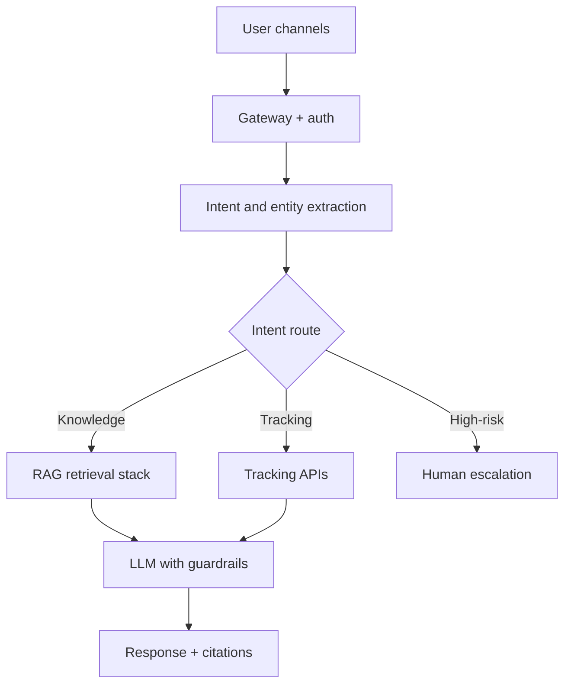

# Case Study: Customer Support Chatbot with RAG

## 1. Business problem
Automate high-volume logistics support while keeping fast responses and safe escalation paths.

## 2. Requirements
- multilingual support
- p95 < 3s
- high containment with safe escalation
- source citations for policy answers

## 3. Architecture

## 4. RAG design
- chunking with structure-aware splitter
- multilingual embeddings
- hybrid retrieval + cross-encoder reranking
- top-k context with freshness weighting

## 5. Conversation state
- maintain entity memory (tracking number)
- summarize long sessions
- route unresolved loops to agents

## 6. Guardrails
- prompt injection filters
- PII redaction in logs
- off-topic refusal
- confidence threshold for escalation

## 7. Evaluation
- RAGAS metrics
- human QA reviews
- business KPIs: containment rate, FCR, CSAT

## 8. Interview questions
1. How choose escalate-to-human threshold?
2. How evaluate without fully labeled ground truth?
3. How avoid stale policy responses?
