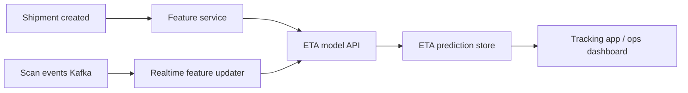

# Case Study: Real-Time Delivery ETA Prediction

## 1. Business problem
Predict ETA at shipment creation and continuously refine during transit scans.
Goals:
- improve customer trust
- reduce support contacts
- optimize downstream operations

## 2. Data assumptions
- Package features: dimensions, weight, service tier.
- Geography: origin/destination zones, distance.
- Network: depot load, carrier route capacity.
- Streaming events: scan timestamps, exception codes.
- Exogenous: weather, holidays.

## 3. Formulation options
- Regression for delay minutes.
- Classification for on-time probability.
- Quantile regression for P10/P50/P90 ETA ranges.

## 4. Modeling strategy
- Baseline: SLA table lookups by lane/service.
- Main model: LightGBM for tabular speed and strong quality.
- Optional deep model with categorical embeddings for large-scale nonlinearity.

## 5. Feature design
- route historical median transit time
- depot congestion index
- weather severity score
- scan velocity and stop dwell-time signals

## 6. Architecture

## 7. Evaluation
- MAE/RMSE for point ETA.
- Coverage for quantile intervals.
- Calibration for on-time probability.
- Business metrics: CSAT, reduction in WISMO contacts.

## 8. Production concerns
- concept drift during peak season
- cold start for new routes
- delayed/incorrect scan events
- fallback to rules when model unavailable

## 9. Failure modes
- network disruptions (strikes/weather)
- routing policy changes not reflected in features
- stale weather feed

## 10. Interview questions
1. How update ETA after each scan?
2. Why quantile ETA better than single-point ETA?
3. How detect and respond to seasonal drift?
