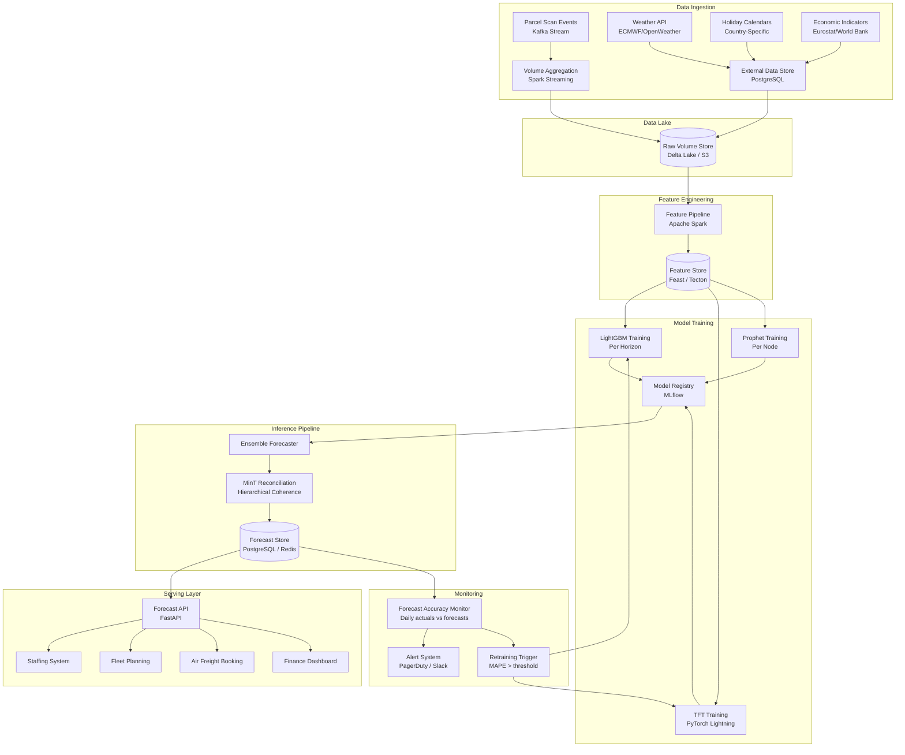

# Case Study: Demand Forecasting for a Global Logistics Network

**Domain**: Logistics / Supply Chain
**Scale**: DHL-level — 10M+ parcels/day, 220+ countries and territories
**ML Task**: Hierarchical time series forecasting
**Time Horizons**: 1-day, 7-day, 14-day, 30-day ahead
**Difficulty**: Senior / Staff MLE

---

## Table of Contents

1. [Business Problem](#1-business-problem)
2. [Data Description](#2-data-description)
3. [Problem Formulation](#3-problem-formulation)
4. [Modeling Approach](#4-modeling-approach)
5. [Feature Engineering](#5-feature-engineering)
6. [System Architecture](#6-system-architecture)
7. [Evaluation Strategy](#7-evaluation-strategy)
8. [Production Concerns](#8-production-concerns)
9. [Failure Modes and Mitigations](#9-failure-modes-and-mitigations)
10. [Interview Questions and Model Answers](#10-interview-questions-and-model-answers)

---

## 1. Business Problem

### Context

A global logistics carrier (think DHL Express, FedEx, UPS) processes over 10 million parcels per day across 220+ countries. The business depends critically on knowing — in advance — how many parcels will flow through each part of the network at each point in time.

This is not an academic forecasting exercise. The forecast drives:

- **Staffing decisions**: How many sort operators do we need at Frankfurt hub on December 22nd?
- **Vehicle fleet planning**: How many delivery vans to dispatch from the Hamburg depot on Monday morning?
- **Air freight capacity**: How many cargo positions to purchase on tomorrow's Frankfurt → Singapore flight?
- **Capital planning**: When do we need to invest in expanding a sorting facility?

### Scale of Operations

| Metric | Value |
|--------|-------|
| Daily parcel volume | 10M+ parcels |
| Countries served | 220+ |
| Sortation hubs | 500+ worldwide |
| Depots / service points | 5,000+ |
| Individual delivery routes | 100,000+ |
| Forecast granularity | Route-level, daily |

### Why Forecasting Quality Matters

**Understaffing scenario**: If the Frankfurt hub is understaffed by 20% on a peak day (e.g., post-Black Friday), throughput drops, SLAs are missed, and express shipments are delayed. At $15-50 per parcel in express fees, even a 1% SLA miss across 10M parcels is a $1.5M-$5M daily cost in service credits, refunds, and reputation damage.

**Overstaffing scenario**: Excess headcount is equally costly. A logistics network with 100,000 sorting employees globally where 10% of shifts are over-staffed by 15% wastes approximately $150M annually in unnecessary labor costs.

**Air freight over-purchasing**: Buying cargo positions on flights that end up half-empty wastes millions per week in committed capacity costs.

**The business case for a 5% improvement in forecast accuracy**: At scale, a 5% reduction in forecast MAPE translates to 5-8% reduction in buffer capacity, which at a global logistics network represents $200-500M in annual operational efficiency gains.

### Stakeholders

| Stakeholder | What they need from the forecast |
|-------------|----------------------------------|
| Network Operations | 7-day forecast by hub for staffing |
| Air Freight team | 3-day forecast by lane for capacity buying |
| Ground Fleet | 1-3 day forecast by depot for vehicle dispatch |
| Finance | 30-day forecast by country for budget planning |
| Sales & Marketing | 90-day forecast for business planning |

### Consequences of Forecast Error

| Error Type | Operational Impact | Financial Impact |
|-----------|-------------------|------------------|
| Under-forecast by 15% | SLA miss, customer churn | $2-5M/day in credits |
| Over-forecast by 20% | Wasted capacity, idle labor | $1-3M/day in waste |
| Structural miss (e.g., pandemic) | Network failure | Potentially catastrophic |

---

## 2. Data Description

### 2.1 Primary Data: Historical Parcel Volumes

The core dataset is a time series of parcel counts aggregated at multiple levels of the network hierarchy.

**Raw data schema**:
```
parcel_volumes (
    date           DATE           -- daily granularity
    country_code   VARCHAR(3)     -- ISO 3166-1 alpha-3
    hub_id         VARCHAR(20)    -- sortation hub identifier
    depot_id       VARCHAR(30)    -- delivery depot identifier
    route_id       VARCHAR(40)    -- specific delivery route
    service_type   VARCHAR(20)    -- EXPRESS, ECONOMY, FREIGHT
    volume         INTEGER        -- parcel count
    weight_kg      FLOAT          -- total weight
    revenue_usd    FLOAT          -- revenue for normalization
    created_at     TIMESTAMP
)
```

**Data availability**:
- 5+ years of historical data at daily granularity
- 3+ years at route level (some routes are newer)
- Route-level data is noisier: daily volumes range from 10 to 10,000 parcels depending on route size
- Missing data: approximately 2-3% of route-day combinations have missing records (holidays, system outages)

### 2.2 Temporal and Calendar Features

Calendar effects are among the strongest drivers of parcel volume:

**Day-of-week effect**: Monday typically sees 20-30% higher volume than the weekly average as orders placed over the weekend are processed. Saturdays see 50-70% lower volume in B2B-heavy regions.

**Seasonal patterns**:
- Q4 (October-December): 30-50% above annual average due to holiday shopping
- Post-Christmas dip: January 1-14 typically 20-30% below average
- Chinese New Year: 40-60% volume drop across Asia-Pacific for 2 weeks

**Public holidays**: Country-specific. Germany's parcel volume drops 80% on public holidays. UK drops 60-70%.

**Key calendar features**:
```python
calendar_features = [
    'day_of_week',           # 0-6
    'day_of_month',          # 1-31
    'week_of_year',          # 1-53
    'month',                 # 1-12
    'quarter',               # 1-4
    'year',
    'is_public_holiday',     # binary, country-specific
    'days_until_holiday',    # integer, 0 if today
    'days_since_holiday',    # integer
    'is_black_friday',       # binary
    'is_cyber_monday',       # binary
    'is_pre_christmas',      # days 15-24 of December
    'is_chinese_new_year',   # floating date
    'days_to_year_end',
    'is_quarter_end',        # financial quarter-end effects
]
```

### 2.3 External Data Sources

**Economic indicators** (monthly, from Eurostat, World Bank API):
- GDP growth rate by country
- Retail sales index (strong leading indicator for parcel volume)
- Consumer confidence index
- PMI Manufacturing (drives B2B freight)
- Unemployment rate (inverse correlation with consumer spending)

**Weather data** (from OpenWeatherMap or ECMWF):
- Temperature (extreme cold reduces pickup/delivery efficiency)
- Precipitation (heavy rain/snow increases failed deliveries and reduces volume tendered)
- Severe weather events (hurricanes, floods that shut routes)
- Weather is most impactful at the depot/route level

**Special events and promotions**:
- E-commerce platform sale days (Amazon Prime Day, Singles Day)
- Retailer promotional calendars (sourced from major shipper accounts)
- Sporting events (World Cup, Olympics shift shipping patterns)

**Network capacity data**:
- Planned maintenance shutdowns
- New depot openings or closures
- Strike actions (labor data from HR systems)
- Air freight schedule changes

### 2.4 Network Hierarchy

The data is organized in a strict hierarchy:

```
Global
└── Region (APAC, EMEA, Americas)
    └── Country (220+ countries)
        └── Hub (major sortation centers)
            └── Depot (local delivery branches)
                └── Route (individual delivery circuits)
```

**Volume at each level**:
| Level | Number of Nodes | Daily Volume Range |
|-------|----------------|-------------------|
| Global | 1 | 10M parcels |
| Region | 5 | 1M-4M parcels |
| Country | 220 | 100-800K parcels |
| Hub | 500 | 10K-200K parcels |
| Depot | 5,000 | 500-20K parcels |
| Route | 100,000+ | 10-500 parcels |

### 2.5 Data Quality Issues

**Common data quality problems encountered**:

1. **Late-arriving data**: Route-level scan data arrives with up to 24h delay. Hub-level data is usually complete by 11pm same day.
2. **Reporting gaps**: Some countries report weekly aggregates rather than daily. Requires disaggregation.
3. **Unit inconsistencies**: "Parcels" definition varies — some systems count items, others count shipments. Reconciliation required.
4. **Outliers from system issues**: A database migration in 2022 caused 3 days of double-counted volumes in Southeast Asia. Must be detected and corrected.
5. **Structural breaks**: COVID-19 caused an abrupt +40% volume increase in April 2020 (e-commerce boom) followed by an abrupt -30% for industrial goods. These breaks are not predictable from historical patterns.

---

## 3. Problem Formulation

### 3.1 Core Task Definition

**Task**: Given historical parcel volumes and external features, predict future parcel volumes at each node of the network hierarchy.

**Mathematical formulation**:

For each node $i$ in the hierarchy and each forecast horizon $h$:

$$\hat{y}_{i,t+h} = f(y_{i,t}, y_{i,t-1}, \ldots, y_{i,t-p}, \mathbf{x}_{i,t}, \theta_i)$$

Where:
- $y_{i,t}$ = parcel volume at node $i$ on day $t$
- $\hat{y}_{i,t+h}$ = predicted volume $h$ days ahead
- $\mathbf{x}_{i,t}$ = exogenous feature vector (calendar, weather, economic)
- $\theta_i$ = model parameters (may be shared or node-specific)

### 3.2 Multiple Forecast Horizons

Different business users need different horizons:

| Horizon | Business Use | Acceptable MAPE |
|---------|-------------|-----------------|
| 1 day | Same-day staffing adjustments | 5-8% |
| 3 day | Vehicle fleet dispatch | 8-12% |
| 7 day | Weekly staffing rosters | 12-18% |
| 14 day | Air freight capacity booking | 15-22% |
| 30 day | Budget planning, macro decisions | 20-30% |

Shorter horizons should be more accurate. The model architecture must support multi-horizon output, ideally producing all horizons in a single forward pass.

### 3.3 Hierarchical Forecasting Requirement

A critical constraint: **forecasts must be hierarchically coherent**. The sum of depot-level forecasts must equal the hub-level forecast, which must sum to the country-level forecast, etc.

This sounds obvious but is non-trivial when:
- Each level is modeled independently
- Models have different error characteristics
- Forecasts at different levels disagree

**Three approaches to hierarchical coherence**:

**Bottom-up**: Forecast only at the lowest level (route), then aggregate up.
- Pro: Captures granular patterns
- Con: Noisy at route level, aggregation amplifies errors

**Top-down**: Forecast at the highest level (global), then disaggregate by historical proportions.
- Pro: Smooth, high-signal forecast at top
- Con: Proportions may shift over time (e.g., new market launches)

**Middle-out with reconciliation**: Forecast at every level, then reconcile using optimal linear combination (MinT — Minimum Trace).
- Pro: Uses all available information
- Con: Computationally expensive, requires covariance matrix estimation

**Selected approach**: Middle-out with MinT reconciliation (see Section 4.5 for details).

### 3.4 Regression Formulation for ML Models

For the LightGBM and Transformer approaches, the problem is reformulated as a supervised regression:

**Training sample**: One row per (node, date, horizon) combination

```
Features:
  - historical lags: y_{t-1}, y_{t-7}, y_{t-14}, y_{t-28}
  - rolling statistics: mean_7, std_7, mean_28, max_28
  - calendar: day_of_week, month, is_holiday, ...
  - exogenous: weather, economic indicators
  - hierarchy: parent node forecast (top-down prior)
  - horizon: which horizon we're predicting (1, 3, 7, 14, 30)

Target: y_{t+h} (volume h days ahead)
```

---

## 4. Modeling Approach

### 4.1 Baseline: Seasonal Naive

Before any ML, establish a strong statistical baseline.

**Seasonal naive forecast**: "Next week will look like the same week last year."

$$\hat{y}_{t+h} = y_{t+h-52w}$$

Where $52w$ = 52 weeks = 364 days (same weekday, same season, prior year).

For peak periods like Christmas, use the prior year's actual peak volume.

**Why this is a surprisingly strong baseline**:
- Captures day-of-week, seasonal, and holiday effects naturally
- No training required
- Surprisingly difficult to beat at the 30-day horizon

**When it fails**:
- New routes/depots (no prior year data)
- Structural changes (new markets, M&A)
- Demand shocks (COVID-19, economic recession)
- Growing or declining markets (volume trend not captured)

**Baseline performance on holdout set**:
| Level | MAPE (7-day) | MAPE (30-day) |
|-------|-------------|--------------|
| Global | 4.2% | 6.8% |
| Country | 7.1% | 11.3% |
| Hub | 12.4% | 18.7% |
| Route | 28.3% | 41.2% |

### 4.2 Classical Statistical Models

**SARIMA (Seasonal ARIMA)**:
- Model: ARIMA(p, d, q)(P, D, Q)_s where s=7 (weekly) or s=52 (annual)
- Strengths: well-understood, interpretable, handles trend and seasonality
- Weaknesses: slow to fit at scale (100K+ series), no exogenous features easily
- Best for: hub-level and above, where series are smooth enough for ARIMA assumptions

**Prophet (Facebook/Meta)**:
- Additive decomposition: trend + seasonality + holidays + noise
- Handles multiple seasonalities (weekly, annual), outliers, missing data
- Easy to incorporate holiday calendars
- Weakness: does not capture complex interactions between features; univariate by default
- Best for: country-level and hub-level series with clear trend and seasonality

```python
from prophet import Prophet

model = Prophet(
    changepoint_prior_scale=0.05,    # regularization on trend changepoints
    seasonality_prior_scale=10.0,    # flexibility of seasonality
    holidays_prior_scale=10.0,
    seasonality_mode='multiplicative',  # volume grows multiplicatively
    yearly_seasonality=True,
    weekly_seasonality=True,
    daily_seasonality=False,
)

# Add country-specific holidays
for country in ['DE', 'GB', 'US', 'CN', 'JP']:
    model.add_country_holidays(country_name=country)

# Add custom events
model.add_seasonality(name='black_friday_effect', period=365.25, fourier_order=3)
```

### 4.3 Machine Learning: LightGBM with Engineered Features

LightGBM is the workhorse for this problem at scale. It handles:
- Non-linear interactions between features
- Exogenous features natively
- Fast training and inference
- Missing values natively
- Multi-output via separate models per horizon or single model with horizon as feature

**Training strategy**:
```python
import lightgbm as lgb

params = {
    'objective': 'regression_l1',     # MAE loss, more robust than MSE
    'metric': 'mape',
    'num_leaves': 127,
    'learning_rate': 0.05,
    'feature_fraction': 0.8,
    'bagging_fraction': 0.8,
    'bagging_freq': 5,
    'min_child_samples': 20,
    'lambda_l1': 0.1,
    'lambda_l2': 0.1,
    'n_estimators': 500,
    'early_stopping_rounds': 50,
}

# One model per horizon, trained on all nodes in the hierarchy
models = {}
for horizon in [1, 3, 7, 14, 30]:
    train_data = build_training_dataset(
        volumes=historical_data,
        features=feature_matrix,
        target_col=f'volume_plus_{horizon}',
        min_history_days=365,
    )

    models[horizon] = lgb.train(
        params,
        train_set=lgb.Dataset(train_data[features], train_data['target']),
        valid_sets=[lgb.Dataset(val_data[features], val_data['target'])],
    )
```

**Quantile regression variant** (for uncertainty estimation):
```python
# Train separate models for P10, P50, P90
for quantile in [0.1, 0.5, 0.9]:
    params['objective'] = 'quantile'
    params['alpha'] = quantile
    quantile_models[quantile] = lgb.train(params, ...)
```

### 4.4 Deep Learning: Temporal Fusion Transformer (TFT)

For the most important series (top 1000 depots, all hubs, all countries), use the Temporal Fusion Transformer.

**Why TFT over simpler deep learning**:
- Handles mixed-type inputs: static (country code, service type), known future (holidays), unknown future (exogenous)
- Multi-horizon output in one forward pass
- Attention mechanism provides interpretability (which time steps the model attends to)
- Calibrated uncertainty via quantile outputs

**Architecture overview**:
```
Inputs:
  - Past observed: [volume_t-1, ..., volume_t-60]
  - Known future: [holiday_t+1, ..., holiday_t+30]
  - Static covariates: [country_code, service_type, hub_tier]

Architecture:
  1. Variable Selection Networks (identify most important features per timestep)
  2. LSTM encoder for past inputs
  3. LSTM decoder for future inputs
  4. Multi-head attention over encoder outputs
  5. Quantile output layer (P10, P50, P90)

Output:
  - Forecasts for horizons 1, 3, 7, 14, 30 simultaneously
  - Three quantiles per horizon
```

**Training configuration**:
```python
from pytorch_forecasting import TemporalFusionTransformer, TimeSeriesDataSet

training = TimeSeriesDataSet(
    train_df,
    time_idx='time_idx',
    target='volume',
    group_ids=['node_id'],
    max_encoder_length=60,          # 60 days of history
    max_prediction_length=30,       # forecast up to 30 days
    static_categoricals=['country_code', 'service_type'],
    static_reals=['depot_capacity'],
    time_varying_known_categoricals=['day_of_week', 'is_holiday'],
    time_varying_known_reals=['holiday_distance', 'economic_index'],
    time_varying_unknown_reals=['volume'],
    target_normalizer=GroupNormalizer(groups=['node_id']),
)

tft = TemporalFusionTransformer.from_dataset(
    training,
    learning_rate=0.001,
    hidden_size=64,
    attention_head_size=4,
    dropout=0.1,
    hidden_continuous_size=32,
    output_size=7,    # 7 quantiles
    loss=QuantileLoss(),
)
```

### 4.5 Hierarchical Reconciliation: MinT

After generating base forecasts at all levels independently, apply MinT reconciliation to ensure hierarchical coherence.

**The problem**: If you forecast 100 routes independently, their sum rarely equals the hub-level forecast exactly.

**MinT reconciliation**:

Define the summing matrix $\mathbf{S}$ that maps bottom-level forecasts to all levels:

$$\tilde{\mathbf{y}}_t = \mathbf{S} \mathbf{P} \hat{\mathbf{y}}_t$$

Where $\mathbf{P}$ is the optimal mapping matrix that minimizes the total variance of reconciliation errors:

$$\mathbf{P}^* = (\mathbf{S}^T \mathbf{W}^{-1} \mathbf{S})^{-1} \mathbf{S}^T \mathbf{W}^{-1}$$

Where $\mathbf{W}$ is the covariance matrix of base forecast errors (estimated from historical residuals).

**Practical implementation** using the `hts` or `hierarchical_forecast` Python package:
```python
from hierarchicalforecast.methods import MinTrace
from hierarchicalforecast.core import HierarchicalReconciliation

reconciler = HierarchicalReconciliation(reconcilers=[
    MinTrace(method='mint_shrink'),   # shrinkage estimator for W
])

reconciled_forecasts = reconciler.reconcile(
    Y_hat_df=base_forecasts,          # forecasts at all levels
    Y_df=historical_volumes,           # actuals at all levels
    S=summing_matrix,                  # hierarchy structure
    tags=hierarchy_tags,
)
```

### 4.6 Ensemble

Final production model is an ensemble combining all approaches:

```python
# Ensemble weights learned via stacking on validation set
ensemble_weights = {
    'prophet': 0.15,
    'lightgbm': 0.45,
    'tft': 0.35,
    'seasonal_naive': 0.05,    # small weight; acts as sanity anchor
}

final_forecast = sum(
    weight * forecasts[model]
    for model, weight in ensemble_weights.items()
)

# Apply MinT reconciliation to ensemble forecasts
reconciled_final = reconciler.reconcile(final_forecast)
```

---

## 5. Feature Engineering

Feature engineering is the highest-leverage activity for this problem. Here is the complete feature set.

### 5.1 Lag Features

```python
def create_lag_features(df, target_col='volume', lags=[1, 2, 3, 7, 14, 21, 28, 35, 56, 91, 182, 364]):
    """
    Create lagged versions of the target variable.

    Critical: must be computed per node_id to avoid data leakage across routes.
    Also must respect the forecast horizon — for h-day-ahead forecast,
    only use lags >= h to prevent target leakage.
    """
    for lag in lags:
        df[f'volume_lag_{lag}'] = df.groupby('node_id')['volume'].shift(lag)
    return df

# Key lags for this problem:
# lag_1: yesterday (strong for 1-day horizon)
# lag_7: same day last week (captures weekly seasonality)
# lag_14: 2 weeks ago
# lag_28: 4 weeks ago (monthly seasonality)
# lag_364: same day last year (captures annual seasonality, holiday effects)
```

### 5.2 Rolling Statistics

```python
def create_rolling_features(df, windows=[7, 14, 28, 56]):
    """Rolling statistics capture trend and volatility."""
    for window in windows:
        # Mean: trend signal
        df[f'rolling_mean_{window}'] = (
            df.groupby('node_id')['volume']
            .transform(lambda x: x.shift(1).rolling(window).mean())
        )
        # Std: volatility signal
        df[f'rolling_std_{window}'] = (
            df.groupby('node_id')['volume']
            .transform(lambda x: x.shift(1).rolling(window).std())
        )
        # Max: peak capacity signal
        df[f'rolling_max_{window}'] = (
            df.groupby('node_id')['volume']
            .transform(lambda x: x.shift(1).rolling(window).max())
        )
        # Min: trough signal
        df[f'rolling_min_{window}'] = (
            df.groupby('node_id')['volume']
            .transform(lambda x: x.shift(1).rolling(window).min())
        )

    # Ratio features (current vs historical)
    df['volume_vs_mean_28'] = df['volume_lag_1'] / (df['rolling_mean_28'] + 1e-6)
    df['current_vs_same_week_last_year'] = df['volume_lag_7'] / (df['volume_lag_364'] + 1e-6)

    return df
```

### 5.3 Calendar Features

```python
import pandas as pd
import numpy as np

def create_calendar_features(df, date_col='date', country_col='country_code'):
    df[date_col] = pd.to_datetime(df[date_col])

    # Basic calendar
    df['day_of_week'] = df[date_col].dt.dayofweek          # 0=Monday
    df['day_of_month'] = df[date_col].dt.day
    df['week_of_year'] = df[date_col].dt.isocalendar().week.astype(int)
    df['month'] = df[date_col].dt.month
    df['quarter'] = df[date_col].dt.quarter
    df['year'] = df[date_col].dt.year
    df['is_weekend'] = (df['day_of_week'] >= 5).astype(int)
    df['is_month_start'] = df[date_col].dt.is_month_start.astype(int)
    df['is_month_end'] = df[date_col].dt.is_month_end.astype(int)
    df['is_quarter_end'] = df[date_col].dt.is_quarter_end.astype(int)

    # Sine/cosine encoding for cyclical features (prevents the jump from 7 back to 1)
    df['day_of_week_sin'] = np.sin(2 * np.pi * df['day_of_week'] / 7)
    df['day_of_week_cos'] = np.cos(2 * np.pi * df['day_of_week'] / 7)
    df['month_sin'] = np.sin(2 * np.pi * df['month'] / 12)
    df['month_cos'] = np.cos(2 * np.pi * df['month'] / 12)
    df['week_of_year_sin'] = np.sin(2 * np.pi * df['week_of_year'] / 52)
    df['week_of_year_cos'] = np.cos(2 * np.pi * df['week_of_year'] / 52)

    # Holiday features (country-specific)
    holiday_calendar = load_country_holiday_calendar()   # pre-built lookup table
    df = df.merge(holiday_calendar, on=[date_col, country_col], how='left')

    # Proximity to holidays
    df['days_until_next_holiday'] = compute_days_until_holiday(df[date_col])
    df['days_since_last_holiday'] = compute_days_since_holiday(df[date_col])

    # Special commercial events
    df['is_black_friday'] = is_black_friday(df[date_col]).astype(int)
    df['is_cyber_monday'] = is_cyber_monday(df[date_col]).astype(int)
    df['is_amazon_prime_day'] = is_prime_day(df[date_col]).astype(int)
    df['is_singles_day'] = (
        (df[date_col].dt.month == 11) & (df[date_col].dt.day == 11)
    ).astype(int)
    df['is_chinese_new_year_period'] = is_cny_period(df[date_col]).astype(int)

    # Pre/post-holiday effects
    df['is_pre_christmas'] = (
        (df[date_col].dt.month == 12) & (df[date_col].dt.day.between(15, 24))
    ).astype(int)
    df['is_post_christmas_dip'] = (
        (df[date_col].dt.month == 12) & (df[date_col].dt.day.between(26, 31)) |
        (df[date_col].dt.month == 1) & (df[date_col].dt.day.between(1, 10))
    ).astype(int)

    return df
```

### 5.4 Hierarchical Features

```python
def create_hierarchical_features(df, hierarchy):
    """
    Use forecasts/actuals from parent nodes as features for child nodes.
    This encodes top-down information into the bottom-up model.
    """
    # For each node, add its parent's recent actuals
    for level in ['region', 'country', 'hub']:
        parent_volumes = (
            df.groupby([level, 'date'])['volume']
            .sum()
            .reset_index()
            .rename(columns={'volume': f'{level}_volume'})
        )
        df = df.merge(parent_volumes, on=[level, 'date'], how='left')

        # Node's share of parent volume (signals relative importance)
        df[f'share_of_{level}'] = df['volume'] / (df[f'{level}_volume'] + 1e-6)
        df[f'rolling_share_of_{level}_28'] = (
            df.groupby('node_id')[f'share_of_{level}']
            .transform(lambda x: x.shift(1).rolling(28).mean())
        )

    # Top-down prior: expected volume based on historical share of parent
    df['top_down_prior_7d'] = (
        df[f'rolling_share_of_hub_28'] * df['hub_prophet_forecast_7d']
    )

    return df
```

### 5.5 External Feature Integration

```python
def integrate_external_features(df):
    """Join weather, economic indicators, and event signals."""

    # Weather (joined on country_code + date)
    weather = load_weather_data()
    df = df.merge(weather, on=['country_code', 'date'], how='left')
    df['extreme_weather_flag'] = (
        (df['precipitation_mm'] > 50) |
        (df['temperature_celsius'] < -15) |
        (df['wind_speed_kmh'] > 80)
    ).astype(int)

    # Economic indicators (monthly, forward-filled to daily)
    econ = load_economic_indicators()
    df = df.merge(econ, on=['country_code', 'year_month'], how='left')
    df['retail_sales_yoy'] = df['retail_sales_index'].pct_change(12)

    # Network events
    events = load_network_events()    # strikes, depot openings, maintenance
    df = df.merge(events, on='node_id', how='left')
    df['planned_downtime_flag'] = df['maintenance_date'].notna().astype(int)

    return df
```

---

## 6. System Architecture

### 6.1 End-to-End Pipeline



### 6.2 Retraining Schedule

| Model | Retraining Frequency | Trigger Condition |
|-------|---------------------|------------------|
| Seasonal Naive | N/A (no parameters) | N/A |
| Prophet | Weekly | MAPE > 20% on 7-day horizon |
| LightGBM | Daily | Always retrain on latest data |
| TFT | Weekly (expensive) | MAPE > 18% or 2+ weeks elapsed |
| Ensemble weights | Daily | Re-optimize on rolling 90-day val window |
| MinT covariance | Weekly | Re-estimate from last 90 days of residuals |

---

## 7. Evaluation Strategy

### 7.1 Metrics

**MAPE (Mean Absolute Percentage Error)**:
$$\text{MAPE} = \frac{1}{n} \sum_{t=1}^{n} \left|\frac{y_t - \hat{y}_t}{y_t}\right| \times 100\%$$

**Problem with MAPE**: When $y_t$ is near zero (e.g., a route with 1 parcel on a slow day), even a 1-parcel error gives 100% MAPE. This causes MAPE to be dominated by low-volume nodes.

**SMAPE (Symmetric MAPE)** — preferred for near-zero series:
$$\text{SMAPE} = \frac{1}{n} \sum_{t=1}^{n} \frac{|y_t - \hat{y}_t|}{(|y_t| + |\hat{y}_t|)/2} \times 100\%$$

**RMSE (Root Mean Squared Error)** — used for high-volume nodes where absolute error matters more:
$$\text{RMSE} = \sqrt{\frac{1}{n} \sum_{t=1}^{n} (y_t - \hat{y}_t)^2}$$

**WAPE (Weighted Absolute Percentage Error)** — best for hierarchical evaluation:
$$\text{WAPE} = \frac{\sum_{t=1}^{n} |y_t - \hat{y}_t|}{\sum_{t=1}^{n} y_t} \times 100\%$$
WAPE naturally weights high-volume nodes more, which aligns with business priorities.

**Bias**: Consistently over- or under-forecasting is costly in different ways. Track Mean Error (ME) = mean of ($\hat{y}_t - y_t$) to detect systematic bias.

### 7.2 Metrics by Hierarchy Level

| Level | Primary Metric | Secondary | Acceptable Target |
|-------|---------------|-----------|------------------|
| Global | MAPE | Bias | < 3% MAPE |
| Region | MAPE | RMSE | < 5% MAPE |
| Country | WAPE | MAPE | < 8% WAPE |
| Hub | WAPE | SMAPE | < 12% WAPE |
| Depot | SMAPE | WAPE | < 18% SMAPE |
| Route | SMAPE | Bias | < 30% SMAPE |

### 7.3 Walk-Forward Validation

**Why standard train/test split is wrong for time series**:
A random 80/20 train/test split uses future data to predict the past, causing data leakage and overly optimistic estimates.

**Walk-forward (expanding window) validation**:
```python
def walk_forward_validation(df, model, initial_train_days=365, step_days=7, horizon=7):
    """
    Train on all data up to cutoff date.
    Evaluate on the next 'step_days' days.
    Move cutoff forward by step_days and repeat.

    This mirrors the production scenario: we always train on all historical data
    and forecast the immediate future.
    """
    results = []

    min_date = df['date'].min()
    max_date = df['date'].max()
    cutoff = min_date + pd.Timedelta(days=initial_train_days)

    while cutoff + pd.Timedelta(days=horizon) <= max_date:
        # Train on data up to cutoff
        train = df[df['date'] <= cutoff]

        # Evaluate on next 'step_days' period
        val_start = cutoff + pd.Timedelta(days=1)
        val_end = cutoff + pd.Timedelta(days=step_days)
        val = df[(df['date'] > cutoff) & (df['date'] <= val_end)]

        # Fit model and predict
        model.fit(train)
        preds = model.predict(val)

        # Compute metrics
        metrics = compute_metrics(val['volume'], preds)
        metrics['cutoff_date'] = cutoff
        results.append(metrics)

        # Move forward
        cutoff += pd.Timedelta(days=step_days)

    return pd.DataFrame(results)
```

**Key insight**: Run walk-forward validation over at least 12 months to capture seasonal variation in model performance. Peak season (Q4) performance often looks very different from off-peak.

### 7.4 Business Metric Validation

Technical MAPE does not directly translate to operational decisions. Run shadow forecasting:

1. **Shadow period**: Run new model in parallel with current system for 4 weeks without changing operational decisions.
2. **A/B allocation**: In some regions, use new model forecasts for operational decisions while using old model in control regions.
3. **SLA impact analysis**: Correlate forecast error with actual SLA misses. Prove that better forecasts lead to fewer SLA violations.

---

## 8. Production Concerns

### 8.1 Daily Retraining Pipeline

```python
# Daily retraining DAG (Airflow)
with DAG('demand_forecasting_daily', schedule_interval='0 2 * * *') as dag:

    # Step 1: Ingest yesterday's actuals
    ingest_task = PythonOperator(
        task_id='ingest_yesterday_actuals',
        python_callable=ingest_parcel_volumes,
        op_kwargs={'date': '{{ ds }}'},
    )

    # Step 2: Refresh features
    feature_task = SparkSubmitOperator(
        task_id='refresh_features',
        application='feature_engineering_spark.py',
        conf={'spark.executor.memory': '16g'},
    )

    # Step 3: Retrain LightGBM (fast, ~20 minutes)
    lgbm_task = PythonOperator(
        task_id='retrain_lightgbm',
        python_callable=retrain_lightgbm_all_horizons,
    )

    # Step 4: Generate forecasts for all nodes
    forecast_task = PythonOperator(
        task_id='generate_forecasts',
        python_callable=generate_all_forecasts,
    )

    # Step 5: Apply MinT reconciliation
    reconcile_task = PythonOperator(
        task_id='reconcile_hierarchical',
        python_callable=apply_mint_reconciliation,
    )

    # Step 6: Write forecasts to serving store
    write_task = PythonOperator(
        task_id='write_forecast_store',
        python_callable=write_forecasts_to_db,
    )

    # Step 7: Evaluate against recent actuals, alert if MAPE degraded
    monitor_task = PythonOperator(
        task_id='evaluate_and_alert',
        python_callable=check_forecast_accuracy_and_alert,
    )

    ingest_task >> feature_task >> lgbm_task >> forecast_task >> reconcile_task >> write_task >> monitor_task
```

### 8.2 Cold Start: New Routes and Depots

New routes (e.g., a new service to a city just added to the network) have no historical data. Three strategies:

**Strategy 1: Proxy from similar nodes**
Find the 5 most similar existing routes by: country, service type, population density, urban/rural classification, regional economic profile. Use their historical patterns as a prior.

**Strategy 2: Top-down allocation**
Use the parent node's (depot or hub) forecast and allocate based on:
- Expected volume from sales team's forecast
- Proportional to similar routes' share of their parent at launch

**Strategy 3: Ramp-up model**
Train a separate model that predicts volume during the ramp-up period (first 30-90 days of a new route) based on: launch date, route characteristics, regional factors. After 90 days, switch to the standard model.

```python
class ColdStartForecaster:
    def __init__(self, warm_start_threshold_days=90):
        self.warm_start_threshold = warm_start_threshold_days
        self.ramp_up_model = load_ramp_up_model()
        self.proxy_finder = SimilarRouteProxyFinder()

    def forecast(self, route_id, target_date):
        history_days = get_history_length(route_id)

        if history_days < 30:
            # Cold start: use sales forecast + top-down allocation
            return self.cold_start_forecast(route_id, target_date)
        elif history_days < self.warm_start_threshold:
            # Warm start: ramp-up model with proxy features
            proxy_features = self.proxy_finder.get_proxy_features(route_id)
            return self.ramp_up_model.predict(route_id, proxy_features, target_date)
        else:
            # Steady state: standard model
            return self.standard_model.predict(route_id, target_date)
```

### 8.3 Model Serving

Forecasts are precomputed in batch (not real-time) because:
- Requests come from internal systems, not customers
- Forecast is stable for 24h (until next retraining run)
- No sub-second latency requirement

**Serving architecture**:
```
Airflow daily batch job
    -> Compute 30-day forecasts for all 100K+ nodes
    -> Write to PostgreSQL (for 30-day horizon, lower volume)
    -> Write hot cache to Redis (for 7-day horizon, frequently queried)
    -> Expose via FastAPI REST endpoint

API response time: < 50ms (Redis lookup)
Data freshness: updated daily at 4am local time per region
```

### 8.4 Monitoring

**What to monitor**:
1. **Forecast accuracy**: MAPE per level per horizon. Alert if MAPE exceeds threshold (e.g., country MAPE > 15%).
2. **Data pipeline health**: Late or missing data from any source.
3. **Feature distribution**: Statistical tests (KS test, PSI) to detect covariate shift.
4. **Volume anomalies**: If actual volume deviates > 3 standard deviations from forecast, investigate before blindly trusting next forecast.
5. **Model staleness**: Alert if LightGBM hasn't been retrained in > 2 days.

---

## 9. Failure Modes and Mitigations

### 9.1 COVID-19 Style Demand Shocks

**What happened**: In March-April 2020, parcel volumes in B2B segments dropped 40-60% while e-commerce volumes surged 50-80% simultaneously. All historical models became useless within 2 weeks.

**Why models failed**:
- All lag features were based on pre-COVID patterns
- Seasonal naive: same week last year was completely irrelevant
- ARIMA/SARIMA: assumed stationarity violated
- LightGBM: feature distributions completely shifted outside training distribution

**Mitigation strategies**:
1. **Short-lag model fallback**: Maintain a "crisis model" that uses only 7-14 day lags and no annual seasonality features. More responsive to recent reality.
2. **Human override mechanism**: Allow network operations team to apply multiplicative adjustments to forecasts (e.g., "multiply all consumer forecasts by 1.5 for next 30 days").
3. **Uncertainty widening**: When PSI (Population Stability Index) of features exceeds threshold, automatically widen forecast confidence intervals.
4. **Rapid retraining**: Reduce LightGBM retraining cycle from daily to twice-daily during crisis periods.
5. **Ensemble weight shift**: During detected distribution shift, increase weight on models that use recent data more heavily (e.g., increase seasonal naive weight to 0, increase short-lag LightGBM weight).

### 9.2 New Market Launch

**Problem**: A new country or major city launch has zero history. The business needs forecasts immediately.

**Mitigation**:
1. Use sales team's volume projections as the base forecast.
2. Apply seasonal patterns from the most similar existing market (matched by GDP per capita, e-commerce penetration, urbanization rate).
3. Maintain a "new market" model that incorporates sales pipeline data as a feature.

### 9.3 Data Quality Issues

**Problem**: A reporting system failure causes missing or corrupted volume data for 3 days.

**Mitigation**:
1. **Anomaly detection on input data**: Flag data batches where total volume is < 50% or > 200% of expected (based on 7-day rolling average).
2. **Imputation**: For short gaps (< 3 days), interpolate using adjacent days and same-weekday volumes.
3. **Retrain exclusion**: Mark flagged periods as missing and skip them during model training (LightGBM handles missing values natively).

### 9.4 Feature Leakage

**Problem**: A feature accidentally includes future information, making training metrics look excellent but production performance crashes.

**Common sources of leakage**:
- Rolling averages computed without proper `.shift(1)` — includes current value in the window
- Holiday features include the holiday itself (fine) but a feature computed on actuals on the same day (leakage)
- Hierarchical features: using the reconciled (corrected) version of a parent forecast rather than the raw prediction made before seeing actuals

**Mitigation**: Strict feature pipeline audit. Unit tests that verify no feature has a correlation with the target higher than a plausible business upper bound (e.g., if correlation > 0.95, flag for review).

---

## 10. Interview Questions and Model Answers

### Q1: "How do you handle a sudden COVID-style demand shock in your forecasting model?"

**Model Answer**:

A demand shock like COVID-19 is a structural break — the statistical relationship between features and target has fundamentally changed, not just temporarily shifted. The standard model will fail because:

1. All lag features are now pointing to a world that no longer exists
2. Annual seasonality features are misleading
3. The model's training distribution no longer represents reality

My approach in priority order:

First, detect it quickly. I monitor MAPE on rolling 7-day windows. If MAPE at the country level exceeds 20% for 3 consecutive days, I flag it as a potential structural break.

Second, I have a "crisis model" pre-trained that uses only recent history (7-14 day lags, no annual patterns). This model is more adaptive. I shift ensemble weight to it automatically when distribution shift is detected.

Third, I implement a human override mechanism. Operational planners can apply multiplicative factors to the forecast (e.g., "multiply consumer forecast by 1.5 for next 2 weeks"). These overrides are time-bounded to prevent them from becoming permanent.

Fourth, for the medium term (1-4 weeks into the shock), I retrain models more frequently (twice daily instead of daily) and use very short training windows (last 14-30 days only) to get models adapted to the new regime quickly.

Fifth, I widen confidence intervals. During periods of high uncertainty, I communicate prediction intervals that are 2x wider than normal, signaling to operational teams that they should carry extra buffer capacity.

### Q2: "Explain hierarchical reconciliation and why it matters."

**Model Answer**:

Hierarchical reconciliation addresses the fundamental problem that if you forecast at every level of a hierarchy independently, the forecasts will be inconsistent: the sum of depot forecasts won't equal the hub forecast, which won't equal the country forecast.

This matters operationally because different teams look at different levels. If the hub-level forecast says 50,000 parcels but the sum of its depot forecasts is 45,000, someone is planning with wrong numbers.

There are three approaches:

Bottom-up: forecast only at the lowest level and aggregate. Simple, but noisy.

Top-down: forecast at the top and disaggregate by historical proportions. Smooth, but loses granular patterns.

Optimal reconciliation (MinT): forecast at all levels, then find the best linear combination of all forecasts that is both hierarchically consistent and minimizes total error variance. MinT uses the historical covariance structure of forecast errors to weight each level's information contribution appropriately. A level with historically more accurate forecasts gets more weight in the final reconciled output.

In practice, MinT with shrinkage estimator for the covariance matrix works very well. The computational cost is manageable because we need to invert a matrix of size N_bottom x N_bottom, and for 100K routes this requires approximations or block-diagonal structure assumptions.

The reconciliation is applied at inference time, not during training. Each model is trained independently, and the reconciliation is a post-processing step.

### Q3: "How do you evaluate a forecasting model for this use case?"

**Model Answer**:

Evaluation has three layers: technical metrics, statistical validation, and business impact.

For technical metrics, I use WAPE (Weighted Absolute Percentage Error) as the primary metric because it naturally weights high-volume nodes more heavily, which aligns with operational priorities. For low-volume routes, I use SMAPE which handles near-zero actuals better than MAPE.

For validation, I use walk-forward (expanding window) validation, not random train/test split. I run the validation over at least 12 months to capture seasonal variation in model performance. Peak season (Q4) is much harder to forecast accurately and is the period that matters most. A model that looks great on average annual metrics but fails during Christmas is not production-ready.

I also run a shadow period in production: new model runs in parallel with the current system for 4 weeks. If new model consistently beats current model on the same live data, we promote it.

Finally, business metrics: I measure whether better forecast accuracy actually translates to better operational decisions. The key business metric is variance in staffing level deviation — we want to see that operations teams are closer to right-staffed on both sides. A 2% improvement in MAPE should translate to measurable reduction in either SLA misses or over-staffing waste.

### Q4: "What features are most important for parcel demand forecasting?"

**Model Answer**:

Based on feature importance analysis from LightGBM and TFT attention weights, the most important features in order are:

1. **Same-day-last-year volume** (volume_lag_364): Captures annual seasonality and holiday effects. Single most predictive feature for horizons beyond 14 days.

2. **Same-weekday-last-week volume** (volume_lag_7): Captures weekly seasonality. Most predictive for 1-3 day horizons.

3. **Rolling 28-day mean volume**: Captures current volume trend level. Helps the model understand whether we're on an upward or downward trend.

4. **Is Black Friday / pre-Christmas flag**: Binary features for the highest-volume commercial events. These can drive 3-5x normal volume.

5. **Country-level economic indicator (retail sales index)**: Drives structural medium-term demand. A 5% improvement in retail sales typically drives 3-4% increase in parcel volumes.

6. **Is public holiday**: Country-specific. A holiday can reduce volume by 60-80% in some markets.

7. **Weather (severe weather flag)**: For short horizons, severe weather events can suppress both demand and supply-side capacity.

The relative importance of features shifts by horizon: for 1-day forecasts, recent lags dominate. For 30-day forecasts, seasonal patterns and economic indicators dominate.

### Q5: "Why would you choose TFT over a simpler LSTM for this problem?"

**Model Answer**:

TFT has three specific advantages over vanilla LSTM for this problem:

First, it handles mixed input types natively. We have static features (country code, service type — things that don't change over time), known future features (holidays, promotional calendars — we know the future values), and unknown future features (volume — what we're predicting). TFT has separate encoding pathways for each type and learns how to weight them. An LSTM treats all features the same, which is architecturally misaligned with the problem structure.

Second, TFT produces calibrated quantile outputs directly. It outputs P10, P50, P90 at all horizons simultaneously in a single forward pass. With an LSTM, you'd need either Monte Carlo dropout or separate models for each quantile.

Third, TFT provides variable selection attention and temporal attention weights, making it interpretable. When the model is wrong, I can inspect which features it was attending to and understand why. For an operational system where planners need to trust the forecast, interpretability matters.

The main downside of TFT is computational cost: it's significantly more expensive to train than LightGBM. So in practice, I use TFT for the most important 1,000-5,000 nodes (hubs and major depots) and LightGBM for the tail (smaller depots and routes).

---

*End of Case Study: Demand Forecasting for a Global Logistics Network*
