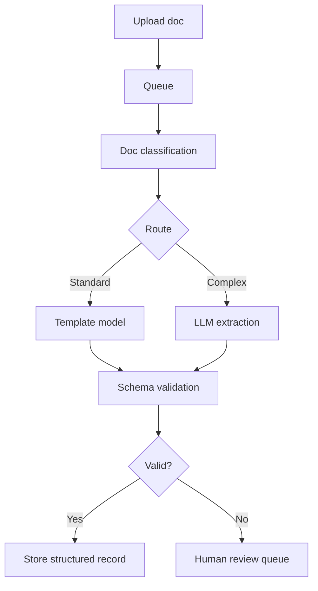

# Case Study: Automated Document Processing with LLMs

## 1. Business problem
Extract structured data from invoices, airway bills, and customs forms at high volume with low manual effort.

## 2. Document landscape
- highly variable templates
- multilingual content
- mixed scanned/typed quality

## 3. Architecture options
- OCR + rule engine (cheap, brittle)
- OCR + NER (better generalization, still template-sensitive)
- multimodal LLM extraction (robust, expensive)
- domain fine-tuned document AI (efficient for known templates)

## 4. Chosen architecture: hybrid router
- classify document type + complexity
- route standard forms to fine-tuned extractor
- route complex/low-confidence docs to multimodal LLM

## 5. Structured output
Use strict JSON schema with validation (Pydantic) and per-field confidence.

## 6. End-to-end flow

## 7. Evaluation
- field-level precision/recall
- full-document exact match
- latency and cost/document
- manual review rate

## 8. Cost strategy
- confidence-based routing
- batch low-priority docs
- cache repeated template decisions

## 9. Compliance
- PII masking in logs
- access controls by region
- immutable audit trail

## 10. Interview questions
1. How validate LLM extraction quality?
2. How design fallback when schema invalid?
3. How optimize quality/cost at 500k docs/day?
