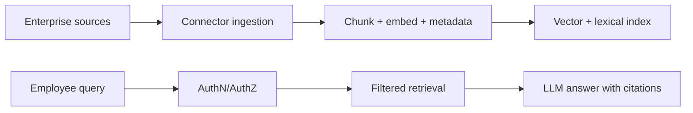

# Case Study: Internal LLM Knowledge Assistant

## 1. Business problem
Give employees fast, citeable answers from distributed internal systems while enforcing access control.

## 2. Unique challenges
- strict permissions
- stale/contradictory docs
- multi-source ingestion (Confluence, SharePoint, Slack, Jira)

## 3. Access control model
- document-level ACL metadata
- retrieval filtered by user role/group
- audit log for every query and source access

## 4. Ingestion architecture

## 5. Retrieval strategy
- hybrid retrieval with freshness weighting
- source attribution mandatory
- conflict handling: show competing evidence with timestamps

## 6. Evaluation
- faithfulness and citation correctness
- answer usefulness by employee feedback
- time-to-answer reduction and onboarding acceleration

## 7. Production concerns
- incremental sync and re-indexing
- data residency controls
- incident response for sensitive leak events

## 8. Interview questions
1. How enforce document-level ACL in RAG?
2. How resolve conflicting sources?
3. How measure ROI for internal assistant?
