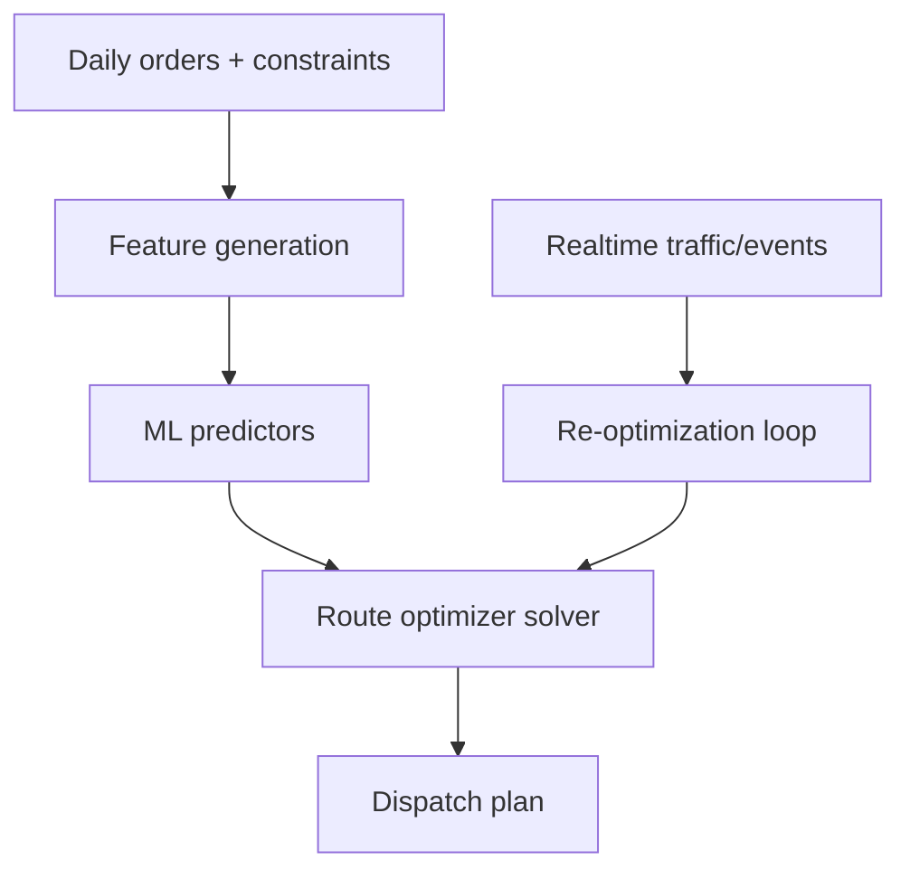

# Case Study: ML-Augmented Route Optimization

## 1. Business problem
Optimize last-mile route plans under capacity, time-window, and labor constraints.

## 2. OR + ML hybrid strategy
- OR solver handles hard constraints (VRP).
- ML predicts travel times, stop success probabilities, and disruption risk.

## 3. ML components
- ETA edge predictor (road segment model)
- delivery success risk model
- dynamic demand forecast per zone

## 4. GNN/RL options
- GNN for graph-level travel representation.
- RL for adaptive dispatch in dynamic environments.

## 5. System architecture

## 6. Evaluation
- route duration and distance reduction
- on-time delivery improvement
- constraint violation rate
- driver acceptance score

## 7. Interview questions
1. How combine ML and OR without violating hard constraints?
2. What to do during real-time disruptions?
3. Why pure RL may be risky in production logistics?
