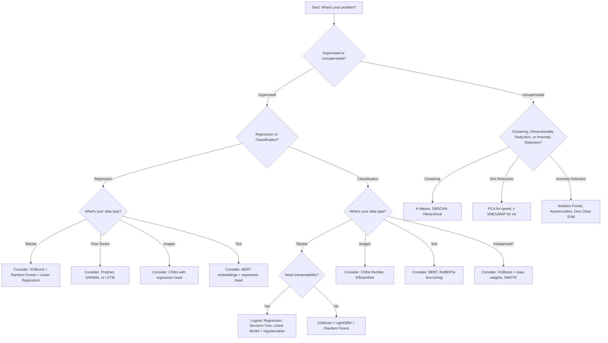

# ML Algorithm Selection Guide

> **Quick reference for choosing the right algorithm** - Interview essential!

## The Decision Flow



---

## Quick Lookup Tables

### For Tabular Data (Most Common)

| Scenario | Top 3 Algorithms | Rationale |
|----------|-----------------|-----------|
| **Need max accuracy** | 1. XGBoost<br>2. LightGBM<br>3. CatBoost | Ensemble methods dominate Kaggle |
| **Need interpretability** | 1. Logistic Regression<br>2. Decision Tree<br>3. Linear Regression + feature selection | Transparent coefficients |
| **Small dataset (< 1K rows)** | 1. Logistic/Linear Regression<br>2. SVM<br>3. K-NN | Less prone to overfitting |
| **Large dataset (> 1M rows)** | 1. LightGBM<br>2. SGD-based methods<br>3. Mini-batch Neural Nets | Scalability |
| **High-dimensional (many features)** | 1. Lasso (L1 regression)<br>2. Elastic Net<br>3. XGBoost | Automatic feature selection |
| **Many categorical features** | 1. CatBoost<br>2. LightGBM<br>3. Entity embeddings + NN | Native categorical handling |
| **Imbalanced classes (1:100+)** | 1. XGBoost + scale_pos_weight<br>2. Random Forest + class_weight<br>3. Logistic + SMOTE | Handle imbalance |
| **Need fast training** | 1. Logistic Regression<br>2. Decision Tree (single)<br>3. SGD Classifier | Quick iterations |
| **Need fast inference (<10ms)** | 1. Logistic Regression<br>2. Small tree (depth ≤ 5)<br>3. Linear model | Low latency |
| **Need probability estimates** | 1. Logistic Regression<br>2. Calibrated RF/XGBoost<br>3. Gradient Boosting | Well-calibrated |
| **Non-linear relationships** | 1. XGBoost<br>2. Random Forest<br>3. SVM (RBF kernel) | Capture complexity |
| **Outliers present** | 1. Random Forest<br>2. Gradient Boosting<br>3. Robust regression methods | Robustness |
| **Missing values** | 1. XGBoost<br>2. LightGBM<br>3. Random Forest | Native handling |

### For Computer Vision

| Task | Best Architectures | Framework Choice |
|------|-------------------|------------------|
| **Image Classification** | ResNet, EfficientNet, Vision Transformer (ViT) | PyTorch / TensorFlow |
| **Object Detection** | YOLO (speed), Faster R-CNN (accuracy), EfficientDet | PyTorch preferred |
| **Semantic Segmentation** | U-Net, DeepLab, Mask R-CNN | PyTorch / TensorFlow |
| **Few-shot Learning** | Siamese Networks, Prototypical Networks | PyTorch |
| **Transfer Learning** | Pre-trained ImageNet models (ResNet, EfficientNet) | Both frameworks |

### For NLP/Text

| Task | Best Models | Notes |
|------|------------|-------|
| **Text Classification** | BERT, RoBERTa, DistilBERT (fast) | Fine-tune pre-trained |
| **Named Entity Recognition (NER)** | BERT + CRF, SpaCy, Flair | Sequence labeling |
| **Question Answering** | BERT, RoBERTa, ELECTRA | Fine-tune on SQuAD |
| **Text Generation** | GPT-3/4, T5, BART | Decoder or encoder-decoder |
| **Summarization** | T5, BART, PEGASUS | Seq2seq models |
| **Sentiment Analysis** | BERT, RoBERTa, DistilBERT | Fine-tune on sentiment data |
| **Embeddings (for RAG, similarity)** | Sentence-BERT, OpenAI embeddings, Instructor | Dense vectors |
| **Translation** | MarianMT, mBART, NLLB | Multilingual seq2seq |

### For Time Series

| Scenario | Top Choices | Why |
|----------|-------------|-----|
| **Business forecasting (sales, demand)** | Prophet, SARIMA, XGBoost with lag features | Seasonality + trends |
| **High-frequency (stock prices, sensors)** | LSTM, GRU, Temporal Fusion Transformer | Complex patterns |
| **Univariate stationary** | ARIMA, Exponential Smoothing | Simple and effective |
| **Multivariate dependencies** | VAR, LSTM, Temporal Convolutional Networks | Multiple series |
| **Long-range dependencies** | Transformers (Informer, Autoformer) | Attention mechanism |
| **Anomaly detection** | Isolation Forest, LSTM Autoencoders | Detect outliers |

---

## By Business Objective

### Maximize Accuracy (Kaggle-style)
1. **XGBoost** or **LightGBM** with extensive hyperparameter tuning
2. Feature engineering (interactions, aggregations)
3. Ensemble multiple models (XGBoost + Neural Net + RF)
4. Stacking meta-learners

### Maximize Interpretability (Regulatory, Healthcare)
1. **Logistic Regression** with L1 regularization (feature selection)
2. **Decision Tree** (single tree, shallow depth ≤ 5)
3. **Linear Regression** with regularization
4. Use SHAP/LIME for black-box interpretation if needed

### Maximize Speed (Low Latency Serving)
1. **Logistic Regression** (<1ms inference)
2. **Small Decision Tree** (depth ≤ 3)
3. **Linear SVM**
4. Avoid deep neural nets, large ensembles

### Minimize Training Time (Fast Iteration)
1. **Logistic/Linear Regression**
2. **Single Decision Tree**
3. **SGD-based methods**
4. **LightGBM** (faster than XGBoost)

### Handle Small Data (<1K samples)
1. **Logistic Regression**
2. **SVM (RBF kernel)**
3. **K-Nearest Neighbors**
4. Use regularization heavily
5. Consider transfer learning if applicable

### Handle Big Data (>10M samples)
1. **LightGBM** (more scalable than XGBoost)
2. **SGD Classifier/Regressor** (online learning)
3. **Mini-batch gradient descent for neural nets**
4. Consider distributed frameworks (Spark ML, Dask)

---

## Algorithm Comparison Matrix

### Classification Algorithms

| Algorithm | Speed | Accuracy | Interpretability | Handles Non-linear | Handles Missing Data | Scalability | Overfitting Risk |
|-----------|-------|----------|------------------|-------------------|---------------------|-------------|-----------------|
| Logistic Regression | ⚡⚡⚡ | ⭐⭐ | ⭐⭐⭐ | ❌ | ❌ | ⚡⚡⚡ | Low |
| Decision Tree | ⚡⚡⚡ | ⭐⭐ | ⭐⭐⭐ | ✅ | ✅ | ⚡⚡ | High |
| Random Forest | ⚡⚡ | ⭐⭐⭐ | ⭐⭐ | ✅ | ✅ | ⚡⚡ | Medium |
| XGBoost/LightGBM | ⚡⚡ | ⭐⭐⭐ | ⭐⭐ | ✅ | ✅ | ⚡⚡⚡ | Medium |
| SVM | ⚡ | ⭐⭐⭐ | ⭐ | ✅ (kernel) | ❌ | ⚡ | Medium |
| K-NN | ⚡ | ⭐⭐ | ⭐⭐ | ✅ | ❌ | ⚡ | High (low k) |
| Naive Bayes | ⚡⚡⚡ | ⭐⭐ | ⭐⭐⭐ | ❌ | ✅ | ⚡⚡⚡ | Low |
| Neural Networks | ⚡ | ⭐⭐⭐ | ⭐ | ✅ | ❌ | ⚡⚡ | High |

**Legend:**
- ⚡⚡⚡ = Very fast, ⚡⚡ = Moderate, ⚡ = Slow
- ⭐⭐⭐ = Excellent, ⭐⭐ = Good, ⭐ = Fair

---

## Interview Cheat Sheet: How to Answer "Which algorithm would you use?"

### Step-by-Step Framework

**1. Clarify the Problem**
```
"First, I'd clarify a few things:
- What's the data type? (tabular, images, text, time series)
- How much data do we have?
- What are the business constraints? (latency, interpretability, accuracy priority)
- Is this a regression or classification problem?
- Are there class imbalance or missing data issues?"
```

**2. Start Simple (Baseline)**
```
"I'd start with a simple baseline:
- For classification: Logistic Regression
- For regression: Linear Regression
- This gives us a performance floor and helps understand linear relationships."
```

**3. Propose Advanced Methods**
```
"Then I'd move to more powerful models:
- For tabular data: XGBoost or LightGBM (state-of-the-art for structured data)
- For images: Pre-trained CNNs (ResNet, EfficientNet) with fine-tuning
- For text: Fine-tuned BERT or other transformers
- For time series: Prophet for business data, LSTM for complex patterns"
```

**4. Justify with Tradeoffs**
```
"XGBoost typically gives the best accuracy for tabular data, but:
- Pros: Handles non-linear relationships, missing values, feature interactions
- Cons: Longer training time, more hyperparameters, less interpretable

If we need fast inference (<10ms), I'd reconsider using Logistic Regression
or a small decision tree instead."
```

**5. Mention Validation Strategy**
```
"I'd evaluate using:
- Cross-validation (k-fold for i.i.d. data, time-series split for temporal data)
- Appropriate metrics (e.g., PR-AUC for imbalanced classification)
- Comparison across multiple models to ensure we're not overfitting"
```

**6. Production Considerations**
```
"For production, I'd also consider:
- Model size and memory requirements
- Inference latency
- Retraining frequency and cost
- Monitoring and debugging complexity"
```

---

## Common Pitfalls to Avoid

❌ **"XGBoost is always the best"**
→ ✅ "XGBoost often performs well on tabular data, but simpler models may be better depending on constraints."

❌ **"Neural networks can solve anything"**
→ ✅ "Neural networks are powerful but need large data and aren't always better than gradient boosting for tabular data."

❌ **"We should use the latest algorithm"**
→ ✅ "Newer isn't always better. For production, reliability and simplicity often matter more than cutting-edge techniques."

❌ **Ignoring business constraints**
→ ✅ Always ask about latency, interpretability, and cost constraints.

---

## Scikit-Learn Quick Start Templates

### Classification Pipeline
```python
from sklearn.pipeline import Pipeline
from sklearn.preprocessing import StandardScaler
from sklearn.ensemble import RandomForestClassifier
from sklearn.model_selection import cross_val_score

# Pipeline
pipeline = Pipeline([
    ('scaler', StandardScaler()),
    ('model', RandomForestClassifier(n_estimators=100, random_state=42))
])

# Cross-validation
scores = cross_val_score(pipeline, X, y, cv=5, scoring='f1_weighted')
print(f"CV F1: {scores.mean():.3f} (+/- {scores.std():.3f})")

# Train and predict
pipeline.fit(X_train, y_train)
y_pred = pipeline.predict(X_test)
```

### Regression Pipeline
```python
from sklearn.linear_model import Ridge
from sklearn.preprocessing import PolynomialFeatures

pipeline = Pipeline([
    ('poly', PolynomialFeatures(degree=2)),
    ('scaler', StandardScaler()),
    ('model', Ridge(alpha=1.0))
])

pipeline.fit(X_train, y_train)
y_pred = pipeline.predict(X_test)
```

### Hyperparameter Tuning
```python
from sklearn.model_selection import GridSearchCV

param_grid = {
    'model__n_estimators': [100, 200],
    'model__max_depth': [10, 20, None],
    'model__min_samples_split': [2, 5]
}

grid_search = GridSearchCV(pipeline, param_grid, cv=5, scoring='f1_weighted', n_jobs=-1)
grid_search.fit(X_train, y_train)

print(f"Best params: {grid_search.best_params_}")
print(f"Best score: {grid_search.best_score_:.3f}")
```

---

## Key Takeaways

1. **No universal best algorithm** - depends on data, constraints, and objectives
2. **Start simple** - Baseline models establish performance floor
3. **For tabular data** - XGBoost/LightGBM are go-to choices
4. **For images** - Pre-trained CNNs with fine-tuning
5. **For text** - Fine-tuned transformers (BERT, etc.)
6. **For time series** - Depends on characteristics (Prophet for business, LSTM for complex)
7. **Always consider tradeoffs** - Accuracy vs interpretability vs speed
8. **Validate properly** - Use cross-validation appropriate for your data
9. **Think production** - Model performance in lab ≠ model performance in production

---

**Next:** [Transformer Cheat Sheet](./transformer_cheat_sheet.md) | **Back:** [README](./README.md)
