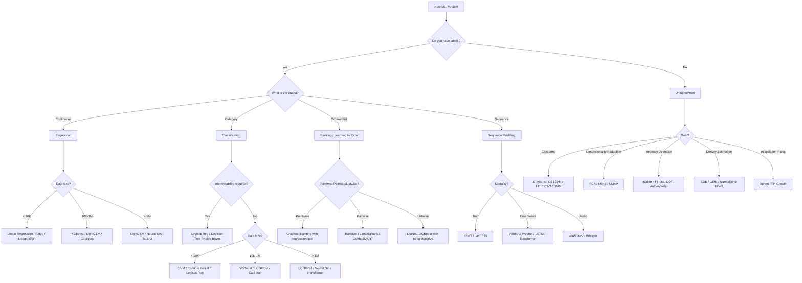
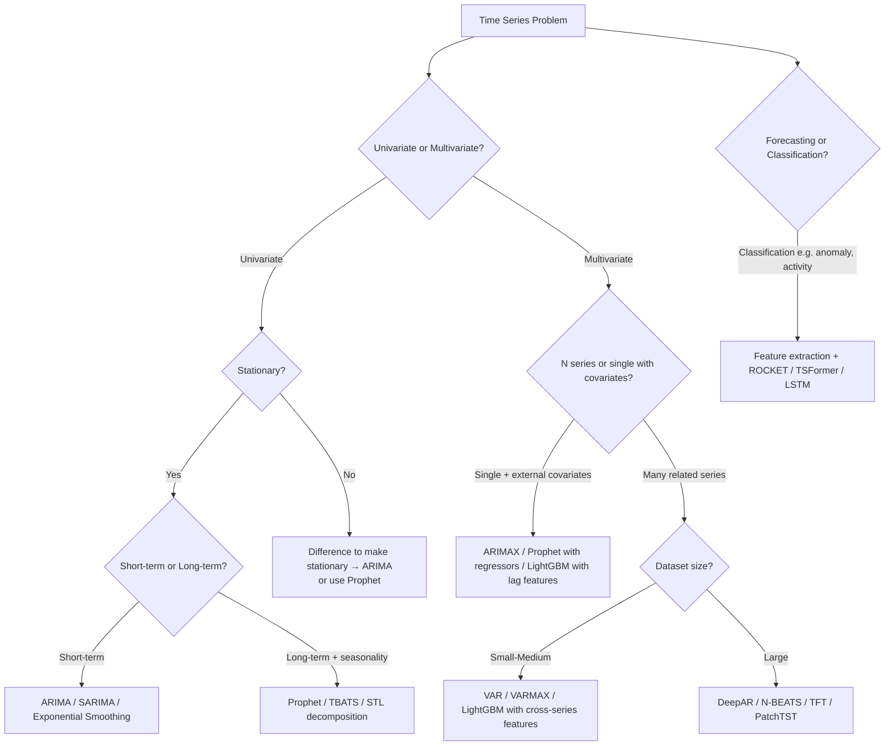
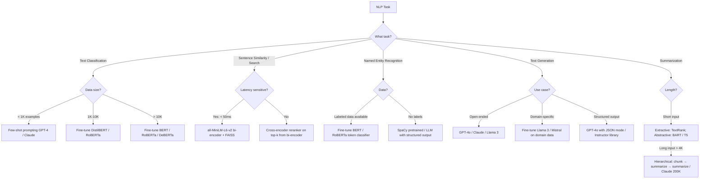

# ML Algorithm Selection Guide

> Last-minute revision reference. Assumes familiarity — use this to recall, not learn.

---

## 1. Master Decision Flowchart



---

## 2. Algorithm Quick-Reference Table

| Algorithm | Best For | Worst For | Key Hyperparameters | Interpretability | Training Speed | Inference Speed | Missing Values | Categorical |
|-----------|----------|-----------|---------------------|-----------------|----------------|-----------------|----------------|-------------|
| **Linear Regression** | Baseline regression, collinear features (Ridge) | Nonlinear relationships | alpha (Ridge/Lasso), fit_intercept | High (coefficients) | Very Fast | Very Fast | No (impute first) | No (encode first) |
| **Logistic Regression** | Binary/multiclass baseline, probability calibration | Complex nonlinear boundaries | C, penalty (l1/l2), max_iter | High | Very Fast | Very Fast | No | No |
| **Decision Tree** | Interpretable rules, quick baseline | Overfitting without pruning | max_depth, min_samples_split, min_samples_leaf | Very High | Fast | Very Fast | No | No (but can handle ordinal) |
| **Random Forest** | Robust general-purpose, feature importance | Memory-heavy for large n_estimators | n_estimators, max_features, max_depth | Medium | Medium | Medium | No | No |
| **Gradient Boosting (sklearn)** | Medium tabular data | Large datasets (slow) | n_estimators, learning_rate, max_depth, subsample | Medium | Slow | Medium | No | No |
| **XGBoost** | Competition tabular, handles sparsity | When LightGBM is faster | n_estimators, lr, max_depth, colsample_bytree, gamma | Medium | Medium-Fast | Fast | Yes (native) | No (encode) |
| **LightGBM** | Large tabular data, speed critical | Very small datasets | num_leaves, min_child_samples, feature_fraction | Medium | Very Fast | Very Fast | Yes (native) | Yes (native cat support) |
| **CatBoost** | High-cardinality categoricals, less tuning | When speed is critical | depth, l2_leaf_reg, iterations | Medium | Slow-Medium | Medium | Yes | Yes (native) |
| **SVM (RBF)** | High-dim, small-medium datasets | > 100K samples (quadratic scaling) | C, gamma, kernel | Low | Slow (n²) | Fast (for small) | No | No |
| **Naive Bayes** | Text classification, very fast baseline | Correlated features | var_smoothing (GNB), alpha (MNB) | High | Very Fast | Very Fast | No | Yes (MNB) |
| **K-Nearest Neighbors** | Anomaly detection, quick prototype | High-dim, large n | k, distance metric, weights | High (local) | None (lazy) | Slow (O(n)) | No | No |
| **Neural Network (MLP)** | Complex tabular + non-tabular combos | Small data, interpretability needed | layers, hidden_size, lr, dropout, batch_size | Very Low | Slow | Fast | No | No |
| **K-Means** | Clustering with known k, spherical clusters | Non-convex clusters, outliers | k, n_init, max_iter | Medium | Fast | Fast | No | No |
| **DBSCAN** | Arbitrary shape clusters, outlier detection | High-dim (distance concentration), varying density | eps, min_samples | Medium | Medium | N/A | No | No |
| **HDBSCAN** | Variable density clusters, robust | Very large datasets | min_cluster_size, min_samples | Medium | Medium | N/A | No | No |
| **PCA** | Dimensionality reduction, visualization, noise removal | Nonlinear structure, very large feature space | n_components | High (loadings) | Fast | Very Fast | No | No |
| **t-SNE** | 2D/3D visualization of high-dim data | Production use (non-parametric), large n | perplexity, n_iter, learning_rate | Low (visual only) | Slow | N/A (no out-of-sample) | No | No |
| **UMAP** | Visualization + reduction for production | When topology must be preserved | n_neighbors, min_dist, n_components | Low | Medium | Fast (parametric) | No | No |
| **Isolation Forest** | Unsupervised anomaly detection | Clustered anomalies | n_estimators, contamination, max_samples | Low | Fast | Fast | No | No |
| **LSTM/GRU** | Sequence modeling, time series | Short sequences (overkill), tabular | hidden_size, num_layers, dropout, lr | Very Low | Slow | Medium | No | No |
| **Transformer** | Long-range dependencies, NLP, multimodal | Small data without pretraining | n_heads, d_model, d_ff, n_layers, lr | Very Low | Very Slow | Medium | No | No |
| **ARIMA** | Univariate time series, stationary | Multivariate, long-term seasonality | p, d, q | High | Fast | Very Fast | No | N/A |
| **Prophet** | Time series with trend + seasonality, missing data | High-frequency data, complex patterns | changepoint_prior_scale, seasonality | High | Fast | Fast | Yes (native) | N/A |

---

## 3. Tabular Data Decision Guide

### By Data Size

```
< 1,000 rows
├── Risk of overfitting is HIGH
├── Prefer: Logistic Regression, Ridge, Lasso, Naive Bayes
├── Avoid: Deep neural nets, large ensembles
└── Technique: Strong regularization, cross-validation (k=10+), leave-one-out

1,000 – 10,000 rows
├── Classical ML territory
├── Prefer: Random Forest, SVM (RBF), Logistic Regression
├── Try: XGBoost with max_depth=3-5 to avoid overfitting
└── Technique: 5-fold CV, feature selection

10,000 – 1,000,000 rows
├── Gradient boosting dominates
├── Prefer: LightGBM > XGBoost > CatBoost > Random Forest
├── Why: LightGBM is 10x-20x faster than sklearn GBM
└── Technique: Bayesian hyperparam search, early stopping

> 1,000,000 rows
├── LightGBM still competitive
├── Consider: Neural networks (TabNet, FT-Transformer)
├── Consider: Distributed training (Spark MLlib, Dask-ML)
└── Prefer LightGBM if latency at training time matters
```

### Class Imbalance Strategy

| Imbalance Ratio | Primary Strategy | Secondary Strategy | Metric to Optimize |
|-----------------|------------------|--------------------|--------------------|
| 1:2 to 1:5 | Class weights | None | F1 / Accuracy |
| 1:5 to 1:20 | Class weights + threshold tuning | PR-AUC monitoring | PR-AUC |
| 1:20 to 1:100 | Threshold tuning (primary), oversample minority | Cost-sensitive learning | PR-AUC / F1 at business threshold |
| > 1:100 | Anomaly detection framing | One-class SVM / Isolation Forest | Recall @ fixed FPR |

**Key insight for interviews**: Never just report accuracy on imbalanced data. Always ask: "What is the class ratio?" If > 1:10, PR-AUC > ROC-AUC for honest evaluation.

```python
# Threshold optimization (do this, not just default 0.5)
from sklearn.metrics import precision_recall_curve
precisions, recalls, thresholds = precision_recall_curve(y_true, y_prob)
f1_scores = 2 * precisions * recalls / (precisions + recalls + 1e-8)
best_threshold = thresholds[f1_scores.argmax()]
```

### Feature Engineering Essentials for Tabular Data

```python
# High-cardinality categorical → target encoding (use CV to avoid leakage)
# Low-cardinality categorical → one-hot
# Ordinal categorical → ordinal encoding or treat as numeric
# Continuous skewed → log1p transform (for tree models: skip; for linear: apply)
# Date features: extract year, month, day_of_week, is_weekend, days_since_event
# Interaction features: multiply/divide if domain knowledge suggests it
```

---

## 4. Time Series Algorithm Selection



### Time Series Algorithm Comparison

| Algorithm | Type | Strengths | Weaknesses | When to Use |
|-----------|------|-----------|------------|-------------|
| ARIMA | Statistical | Interpretable, fast, proven | Univariate only, manual order selection | Short-term, stationary, single series |
| SARIMA | Statistical | Handles seasonality | Manual parameter tuning, slow for long series | Seasonal univariate |
| Prophet | Statistical | Trend + seasonality + holidays, robust to missing | Not good for noisy/irregular series | Business time series with clear seasonality |
| Exponential Smoothing (ETS) | Statistical | Fast, handles trend/seasonality | Limited capacity | Production baseline |
| LightGBM (with lags) | ML | Multivariate, handles non-linearity | Requires careful lag engineering | When tabular ML beats DL (often at < 1M rows) |
| LSTM / GRU | Deep Learning | Captures long-range dependencies | Needs large data, slow training | Multivariate, complex patterns |
| Temporal Fusion Transformer (TFT) | Deep Learning | Multi-horizon, variable selection, interpretable attention | Complex, slow | Large-scale probabilistic forecasting |
| N-BEATS / N-HiTS | Deep Learning | Best pure neural forecasters | Data hungry | Long-horizon univariate at scale |
| PatchTST | Transformer | Channel-independent, patch-based | GPU required | Very long sequences |

**Interview key point**: For most business forecasting (< 10K time series, monthly/weekly), LightGBM with lag features often beats LSTM. Neural approaches shine only with large datasets and high-frequency data.

---

## 5. NLP Algorithm Selection



### When to Use TF-IDF vs Embeddings vs Fine-tuned Model

| Approach | When to Use | When NOT to Use | Latency | Requires GPU |
|----------|-------------|-----------------|---------|--------------|
| TF-IDF + Logistic Reg | Baseline, keyword-important tasks, interpretability | Semantic similarity, paraphrase detection | < 1ms | No |
| TF-IDF + TF-IDF (BM25) retrieval | Keyword-heavy search, first-stage retrieval | When semantic understanding is needed | < 5ms | No |
| Static word embeddings (Word2Vec, GloVe, FastText) | Low-resource, fast prototyping | Context-sensitive tasks | < 5ms | No |
| Bi-encoder (Sentence-BERT, all-MiniLM) | Semantic search, similarity at scale | High accuracy + small query set | 10-50ms | Optional |
| Cross-encoder (BERT reranker) | Final-stage reranking (top 100→top 10) | First-stage retrieval (too slow) | 100-500ms per pair | Recommended |
| Zero-shot BERT (Hugging Face) | No labeled data available | When you have labeled data | 50-200ms | Yes |
| Fine-tuned BERT/RoBERTa | Labeled data > 1K, domain-specific | When GPT-4 prompting works well | 50-200ms | Yes |
| GPT-4 / Claude (prompting) | Complex reasoning, small data, quick prototype | Cost-sensitive at scale | 500ms-3s | No (API) |
| Fine-tuned LLaMA/Mistral | Domain-specific generation at scale, cost control | When prompting GPT-4 is accurate enough | 200ms-1s | Yes |

---

## 6. Common Algorithm Selection Interview Traps

### Trap 1: "I'd use a neural network"
**Wrong**: "For tabular data I'd use a neural network because it's powerful."
**Right**: "For tabular data < 1M rows, gradient boosting (LightGBM/XGBoost) is the default choice because it handles mixed feature types natively, is highly regularized, and consistently outperforms neural nets on structured data in benchmarks. I'd consider a neural network if I need to jointly train with embeddings or have > 10M rows."

### Trap 2: "I'd use accuracy as my metric"
**Wrong**: "I'll track accuracy."
**Right**: First ask the class distribution. If imbalanced, PR-AUC is more honest. Always ask: "What is the business cost of FP vs FN?"

### Trap 3: "I need to normalize for gradient boosting"
**Wrong**: Spending time normalizing features before feeding to XGBoost.
**Right**: Tree-based methods are invariant to monotonic feature transformations. Normalization has zero effect on splits in decision trees. Skip it.

### Trap 4: "More features = better model"
**Wrong**: Throwing all 500 features in without selection.
**Right**: Correlated features increase variance, slow training, and hurt interpretability. Use feature importance or mutual information filtering. Curse of dimensionality applies especially to distance-based methods.

### Trap 5: "SMOTE to fix imbalance"
**Wrong**: "I'll use SMOTE to oversample the minority class."
**Right**: SMOTE creates synthetic points that may not reflect real distribution. Prefer: (1) class weights in loss function, (2) threshold adjustment post-training, (3) if SMOTE must be used, apply only within cross-validation folds to avoid leakage.

### Trap 6: "Use cosine similarity for everything"
**Wrong**: Using raw dot product on non-normalized embeddings and calling it cosine.
**Right**: Cosine similarity = dot product / (||a|| × ||b||). If embeddings are L2-normalized, dot product = cosine. Always L2-normalize before doing dot product search, or use FAISS with cosine metric.

### Trap 7: "t-SNE for production dimensionality reduction"
**Wrong**: "I'll reduce dimensions with t-SNE for the production embedding."
**Right**: t-SNE is non-parametric — you cannot embed new points without re-running the entire algorithm. Use PCA (linear) or UMAP (parametric mode) for production. t-SNE is visualization only.

---

## 7. Feature Type Decision Guide

| Feature Type | Raw Input | Recommended Preprocessing | Notes |
|--------------|-----------|---------------------------|-------|
| Continuous numeric | float | For trees: none. For linear/NN: StandardScaler. For skewed: log1p | Outlier cap at 1st/99th percentile |
| Low-cardinality categorical (< 10 values) | string/int | One-hot encoding | Check for rare categories → group as "other" |
| High-cardinality categorical (> 50 values) | string | Target encoding (with CV), embedding layer (NN) | Never one-hot high-cardinality |
| Ordinal categorical | int | Ordinal encoding as integers | Preserve order |
| Free text | string | TF-IDF (baseline), BERT embedding | Context: search → embedding; classification → fine-tune |
| Image | pixel array | Normalize [0,1], ResNet/ViT features | Transfer learning for small datasets |
| Time series | array of floats | Lag features, rolling stats, FFT | Or use LSTM/Transformer directly |
| Date/time | datetime | Extract: year, month, DOW, hour, days_since, is_holiday | Never pass raw timestamp |
| Geographic | lat/lon | H3 hex encoding, distance to POI | Or cluster → cluster ID |
| Boolean | 0/1 | Use as-is | Check null strategy |

---

## 8. Hyperparameter Priority Guide

### XGBoost / LightGBM Priority Order (tune in this order)

```
1. learning_rate (lr): 0.01–0.3. Lower = more robust but slower.
2. n_estimators: Use early stopping → this becomes automatic.
3. max_depth (XGB) / num_leaves (LGBM): Controls overfitting. Start at 6 / 31.
4. subsample / bagging_fraction: 0.6–0.9. Reduces variance.
5. colsample_bytree / feature_fraction: 0.6–0.9. Reduces correlation between trees.
6. min_child_weight (XGB) / min_child_samples (LGBM): Smoothing on leaf splitting.
7. reg_alpha / reg_lambda: L1/L2 on leaf weights. Rarely critical.

# Rule of thumb: lower lr + more trees always wins if you have time.
# Use early stopping: XGB: early_stopping_rounds=50
```

### Neural Network Priority Order

```
1. Learning rate: Most critical. Try: 1e-4, 3e-4, 1e-3.
2. Batch size: 32–512. Larger = faster but worse generalization.
3. Architecture depth/width: Start small, scale up.
4. Dropout rate: 0.1–0.5. Only add if overfitting observed.
5. Weight decay: 1e-4 to 1e-2.
6. LR scheduler: Cosine annealing or ReduceLROnPlateau.
```

---

## 9. The "Start Simple" Protocol

Always demonstrate this reasoning in interviews:

```
Step 1: Establish baseline (1 hour)
  → Logistic Regression / Linear Regression / Majority class
  → Define metric, compute baseline score

Step 2: Feature Engineering (biggest ROI)
  → Domain-specific transformations
  → Missing value strategy
  → Interaction features

Step 3: Single strong model
  → LightGBM for tabular, fine-tuned BERT for text
  → Hyperparameter search with Optuna

Step 4: Ensemble if needed
  → Stacking: use OOF predictions as meta-features
  → Blending: weighted average of diverse models
  → Only do this if Step 3 is not hitting target

Step 5: Productionize the best single model (simpler to deploy)
```

**Say this in the interview**: "I always start with the simplest possible model that could work. It sets a baseline, catches data issues early, and gives me a deployment-ready artifact while I iterate on more complex approaches."
