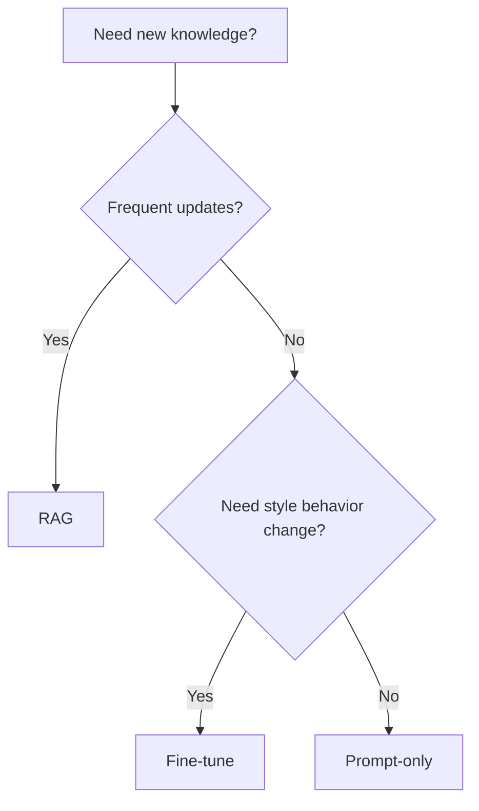

# RAG Design Checklist

## 1. RAG or not?
Use RAG when knowledge changes frequently, citation is required, or full fine-tuning is too costly.

## 2. Document processing
- [ ] Ingestion for PDF/HTML/DOCX/code
- [ ] Cleaning and deduplication
- [ ] Language detection
- [ ] Table strategy defined
- [ ] PII policy defined

## 3. Chunking
- [ ] strategy chosen (fixed/semantic/structure-aware)
- [ ] chunk size validated (128/256/512/1024)
- [ ] overlap tuned
- [ ] parent-child considered
- [ ] metadata attached (source/date/section)

## 4. Embeddings
- [ ] model selected by quality/latency/language
- [ ] similarity metric selected (cosine/dot/L2)
- [ ] normalization policy documented

## 5. Vector DB
- [ ] index type selected (HNSW/IVF)
- [ ] metadata filtering tested
- [ ] tenant isolation verified

## 6. Retrieval tuning
- [ ] top-k tuned
- [ ] hybrid search enabled where needed
- [ ] reranker benchmarked
- [ ] query rewrite/HyDE tested

## 7. Generation
- [ ] system prompt groundedness constraints
- [ ] "I don't know" behavior
- [ ] citation format enforced
- [ ] output schema validation

## 8. Evaluation
- [ ] Recall@k, MRR, NDCG
- [ ] Faithfulness and relevance metrics
- [ ] Human eval sample loop

## 9. Production
- [ ] latency budgets per component
- [ ] caching strategy
- [ ] index refresh process
- [ ] observability dashboards
- [ ] cost monitoring
