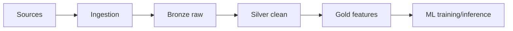

# Data Pipelines and ETL/ELT for ML Systems

## ETL vs ELT
- ETL: transform before loading; useful for strict downstream schemas.
- ELT: load raw first, transform in warehouse/lakehouse; common modern pattern.

## Processing modes
- Batch: scheduled, cost-efficient for large offline jobs.
- Streaming: low-latency event processing.
- Micro-batch: compromise between both.

## Reliability concepts
- Idempotency: safe reruns produce same result.
- Delivery semantics: at-most-once, at-least-once, exactly-once.

## Orchestration tools
- Airflow: DAG-first scheduler.
- Prefect: Python-native dynamic workflows.
- Dagster: asset-centric orchestration.
- dbt: SQL transformations + tests + docs.

## Streaming stack
- Kafka topics, partitions, consumer groups.
- Flink/Spark Streaming for stateful transforms.
- Late-arriving data handling via watermark/window strategies.

## Data quality
- Great Expectations and dbt tests.
- Contracts between producers and consumers.
- Alerting and incident playbooks.

## Logistics example
Pipeline for package scan events:
- ingest scans
- deduplicate and order by event time
- compute route-level rolling stats
- publish features for ETA model

## Interview questions
1. Why idempotency is critical in ETL?
2. How handle late events in streaming?
3. ETL vs ELT for enterprise ML?
