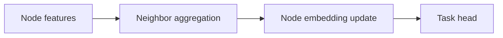

# Graph ML Basics for Data Scientists

## Why graph ML
Many enterprise systems are relational: supply chains, fraud networks, road networks, knowledge graphs.

## Graph fundamentals
- nodes and edges
- directed/undirected
- weighted/unweighted
- homogeneous/heterogeneous graphs

## Classic graph algorithms
- BFS/DFS
- shortest path (Dijkstra)
- PageRank
- community detection

## Graph ML tasks
- node classification
- link prediction
- graph classification
- anomaly detection on networks

## GNN message passing
Each layer aggregates neighbor information.
General form:
`h_v^{l+1} = UPDATE(h_v^l, AGG({h_u^l: u in N(v)}))`

## GNN families
- GCN
- GraphSAGE
- GAT
- heterogeneous GNN variants

## Practical frameworks
- PyTorch Geometric
- DGL
- NetworkX (analysis, not deep learning training)

## Logistics use cases
- route network travel-time prediction
- fraud rings in claims graph
- supplier risk propagation over network graph

## Interview questions
1. What is message passing?
2. When use GNN vs tabular model?
3. What is over-smoothing in deep GNNs?
