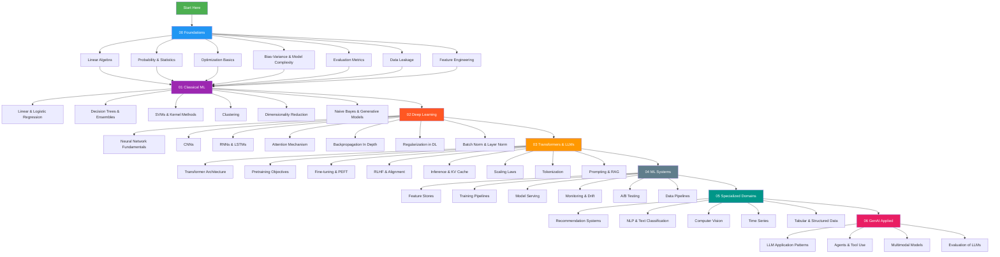

# AI / ML / LLM Interview Preparation Repository

A senior-level, technically rigorous interview preparation resource covering the full ML stack - from mathematical foundations through production systems. Built for engineers targeting senior ML, applied scientist, and LLM/GenAI roles at top-tier technology companies.

---

## Repository Purpose

This repository is structured to fill the gap between "I know how to use sklearn" and "I can reason deeply about why algorithms work, when they fail, and how to engineer ML systems at scale." Every section is written at the depth expected in senior technical interviews at companies like Google DeepMind, Meta AI, OpenAI, Amazon, and similar organizations.

**What makes this different from tutorials:**
- Derivations, not just definitions
- Failure modes and when things break
- Production considerations alongside theory
- Interview questions that are actually asked at senior levels
- Code that demonstrates understanding, not just API usage

---

## Learning Roadmap



---

## Recommended Study Order

The order below is not arbitrary - each section builds on the previous. Skipping foundations creates gaps that surface in system design and follow-up questions.

### Phase 1: Foundations (Week 1-2)
| # | Topic | File | Rationale |
|---|-------|------|-----------|
| 1 | Linear Algebra | `00_Foundations/linear_algebra.md` | Everything in DL is matrix operations. Cannot reason about transformers without this. |
| 2 | Probability & Statistics | `00_Foundations/probability_and_statistics.md` | Loss functions, distributions, MLE/MAP - every model assumes a probabilistic framework. |
| 3 | Optimization Basics | `00_Foundations/optimization_basics.md` | Training IS optimization. Adam, learning rate schedules, saddle points. |
| 4 | Bias-Variance & Complexity | `00_Foundations/bias_variance_and_model_complexity.md` | The fundamental tradeoff. Explains regularization, ensemble methods, double descent. |
| 5 | Evaluation Metrics | `00_Foundations/evaluation_metrics.md` | Every interview has a metric choice question. Know NDCG, AUC-PR, BLEU cold. |
| 6 | Data Leakage | `00_Foundations/data_leakage.md` | The most common real-world mistake. Demonstrates production maturity. |
| 7 | Feature Engineering | `00_Foundations/feature_engineering.md` | Still critical even in LLM era for structured/tabular data. |

### Phase 2: Classical ML (Week 2-3)
| # | Topic | Rationale |
|---|-------|-----------|
| 8 | Linear & Logistic Regression | Baseline for everything. Derive MLE = MSE, derive sigmoid from Bernoulli MLE. |
| 9 | Trees & Ensembles | XGBoost/LightGBM dominate tabular. Know gradient boosting derivation. |
| 10 | SVMs | Margin maximization, kernels, duality - frequent at research-heavy companies. |
| 11 | Clustering | K-means assumptions, GMMs, DBSCAN. Unsupervised learning questions. |
| 12 | Dimensionality Reduction | PCA, t-SNE, UMAP. SVD connection to PCA. |

### Phase 3: Deep Learning (Week 3-4)
| # | Topic | Rationale |
|---|-------|-----------|
| 13 | Neural Network Fundamentals | Universal approximation, activation functions, weight initialization. |
| 14 | Backpropagation | Derive it. Chain rule through computation graphs. Every senior interview asks. |
| 15 | CNNs | Inductive biases, receptive field, pooling, modern architectures. |
| 16 | Attention Mechanism | The most important primitive in modern AI. Understand from scratch. |
| 17 | Regularization in DL | Dropout, weight decay, data augmentation, early stopping. |
| 18 | Batch Norm & Layer Norm | Why they work, when to use which, training vs inference behavior. |

### Phase 4: Transformers & LLMs (Week 4-5)
| # | Topic | Rationale |
|---|-------|-----------|
| 19 | Transformer Architecture | Scaled dot-product attention, MHA, FFN, positional encoding. |
| 20 | Pretraining Objectives | MLM, CLM, span corruption. Why GPT vs BERT. |
| 21 | Fine-tuning & PEFT | LoRA, prefix tuning, adapter layers. Parameter efficiency. |
| 22 | RLHF & Alignment | PPO, reward modeling, DPO. Critical for any LLM role. |
| 23 | Inference & KV Cache | Autoregressive generation, speculative decoding, quantization. |
| 24 | Scaling Laws | Chinchilla, compute-optimal training, emergent abilities. |
| 25 | Tokenization | BPE, WordPiece, SentencePiece. Byte-level tokenization. |
| 26 | Prompting & RAG | Few-shot, chain-of-thought, retrieval augmented generation. |

### Phase 5: ML Systems (Week 5-6)
| # | Topic | Rationale |
|---|-------|-----------|
| 27 | Feature Stores | Online vs offline, point-in-time correctness, Feast. |
| 28 | Training Pipelines | Orchestration, experiment tracking, distributed training. |
| 29 | Model Serving | Latency vs throughput, batching, model compression. |
| 30 | Monitoring & Drift | Data drift, concept drift, PSI, KL divergence monitoring. |
| 31 | A/B Testing | Statistical power, multiple comparisons, novelty effects. |

### Phase 6: Specialized Domains (Week 6-7)
| # | Topic | Rationale |
|---|-------|-----------|
| 32 | Recommendation Systems | Two-tower, collaborative filtering, ListNet, online learning. |
| 33 | NLP & Text Classification | Pre-LLM and LLM-era approaches. |
| 34 | Time Series | ARIMA, TCN, Temporal Fusion Transformer. |
| 35 | Tabular & Structured Data | XGBoost vs TabNet vs LLM for tables. |

---

## Estimated Time Per Section

| Section | Depth | Suggested Time |
|---------|-------|----------------|
| 00 Foundations | Mandatory, heavy | 2 weeks |
| 01 Classical ML | Medium-heavy | 1 week |
| 02 Deep Learning | Heavy | 1.5 weeks |
| 03 Transformers & LLMs | Critical for modern roles | 2 weeks |
| 04 ML Systems | System design focus | 1 week |
| 05 Specialized Domains | Role-specific | 0.5-1 week |
| 06 GenAI Applied | Modern AI roles | 0.5 week |
| **Total** | | **~9-10 weeks** |

For accelerated prep (3-4 weeks): Prioritize Foundations, Deep Learning fundamentals (backprop, attention), Transformer architecture, and the domain most relevant to your target role.

---

## How to Use This Repository for Interview Prep

### For Coding Interviews
1. Read the theory sections to understand why algorithms work
2. Run all code examples - modify parameters to build intuition
3. Implement key algorithms from scratch without reference (gradient descent, backprop, attention)
4. Time yourself: can you write K-means in 15 minutes? Logistic regression in 10?

### For ML System Design Interviews
1. Read each section's "Production Considerations" blocks
2. Study the mermaid diagrams - these represent system flows you'll draw on whiteboards
3. Practice narrating tradeoffs: "I'd choose X over Y because..."
4. Know the failure modes of every component

### For Theoretical / Research Interviews
1. Focus on derivations - can you derive the ELBO? Gradient of softmax cross-entropy?
2. Understand connections between concepts (MLE = minimize cross-entropy = minimize KL divergence from data distribution)
3. Be prepared to extend: "How would this change if you had label noise?"

### Study Technique
- **Active recall**: After reading each section, close the file and write down every concept you can remember
- **Teach it**: Explain sections out loud as if to a junior engineer
- **Connect concepts**: After each section, ask "How does this connect to what I already know?"
- **Interview simulation**: Have a friend ask you questions from the interview Q&A sections

---

## Quick Revision Path: Last 24 Hours Before Interview

If you have only 24 hours, focus on these high-yield topics:

### Must-Know Cold (No Hesitation)
- [ ] Bias-variance tradeoff definition and formula
- [ ] Gradient descent update rule and variants (SGD, Adam)
- [ ] Attention mechanism: Q, K, V and scaled dot-product formula
- [ ] Transformer architecture: encoder, decoder, what each does
- [ ] Precision vs Recall vs F1 - when to optimize which
- [ ] What is overfitting? How to diagnose and fix?
- [ ] What is data leakage? Give three examples.
- [ ] Cross-entropy loss derivation from MLE
- [ ] What is backpropagation? Derive for one layer.
- [ ] What is regularization? L1 vs L2 effect on weights.

### Should Know Well
- [ ] SVD and its connection to PCA
- [ ] KL divergence definition and why it's not symmetric
- [ ] RLHF pipeline (reward model, PPO, DPO alternative)
- [ ] LoRA: what it does and why it works
- [ ] KV cache: what it stores and why it matters for inference
- [ ] AUC-ROC vs AUC-PR: when to prefer each
- [ ] Batch norm vs layer norm: training vs inference behavior
- [ ] XGBoost vs Random Forest tradeoffs
- [ ] Cosine similarity vs dot product in embedding search
- [ ] Chinchilla scaling laws: tokens vs parameters

### System Design Essentials
- [ ] Feature store architecture (online vs offline)
- [ ] A/B testing: how to detect drift, minimum detectable effect
- [ ] Model serving: latency vs throughput tradeoff, batching strategies
- [ ] RAG pipeline components and failure modes

### Domain Specific (Check Role)
- [ ] **Recommendations**: Two-tower model, ANN search, exploration vs exploitation
- [ ] **NLP/LLM**: BLEU/ROUGE/BERTScore, perplexity, tokenization edge cases
- [ ] **CV**: CNN inductive biases, data augmentation strategies
- [ ] **Time Series**: Temporal leakage, evaluation with expanding window

---

## Repository Structure

```
ai-ml-llm-interview-prep/
├── README.md                          # This file
├── 00_Foundations/
│   ├── README.md                      # Foundations overview
│   ├── linear_algebra.md
│   ├── probability_and_statistics.md
│   ├── optimization_basics.md
│   ├── bias_variance_and_model_complexity.md
│   ├── evaluation_metrics.md
│   ├── data_leakage.md
│   └── feature_engineering.md
├── 01_Classical_ML/
│   ├── README.md
│   ├── linear_regression.md
│   ├── logistic_regression.md
│   ├── decision_trees.md
│   ├── random_forests.md
│   ├── gradient_boosting_xgboost.md
│   ├── svms.md
│   ├── clustering.md
│   ├── dimensionality_reduction.md
│   └── naive_bayes.md
├── 02_Deep_Learning/
│   ├── README.md
│   ├── neural_network_fundamentals.md
│   ├── backpropagation.md
│   ├── cnns.md
│   ├── rnns_lstms.md
│   ├── attention_mechanism.md
│   ├── regularization_in_dl.md
│   └── normalization_layers.md
├── 03_Transformers_and_LLMs/
│   ├── README.md
│   ├── transformer_architecture.md
│   ├── pretraining_objectives.md
│   ├── finetuning_and_peft.md
│   ├── rlhf_and_alignment.md
│   ├── inference_and_kv_cache.md
│   ├── scaling_laws.md
│   ├── tokenization.md
│   └── prompting_and_rag.md
├── 04_ML_Systems/
│   ├── README.md
│   ├── feature_stores.md
│   ├── training_pipelines.md
│   ├── model_serving.md
│   ├── monitoring_and_drift.md
│   └── ab_testing.md
├── 05_Specialized_Domains/
│   ├── README.md
│   ├── recommendation_systems.md
│   ├── nlp_text_classification.md
│   ├── computer_vision.md
│   ├── time_series.md
│   └── tabular_structured_data.md
└── 06_GenAI_Applied/
    ├── README.md
    ├── llm_application_patterns.md
    ├── agents_and_tool_use.md
    ├── multimodal_models.md
    └── llm_evaluation.md
```

---

## Interview Strategy Tips

### How to Handle Questions You Don't Know
1. **State your reasoning process out loud** - interviewers often care more about how you think than the exact answer
2. **Start with what you do know** - anchor to related concepts: "I know X, and this seems related because..."
3. **Ask clarifying questions** - "Are you asking about the batch normalization in the context of CNNs or transformers?"
4. **Propose experiments** - "I'd approach this empirically by..."
5. **Never fake expertise** - experienced interviewers catch bluffing instantly

### Handling Math on a Whiteboard
- Write down the goal first (what are we optimizing?)
- Define all notation before using it
- Check limiting cases (what happens as learning rate → 0? → ∞?)
- Connect your result to intuition: "This makes sense because..."

### Structuring ML System Design Answers
Use this framework for every system design question:
1. **Clarify requirements** (2 min): What are we predicting? Latency constraints? Scale? Online vs batch?
2. **Problem formulation** (3 min): Frame as ML task, define label, features, loss function
3. **Data pipeline** (5 min): Collection, storage, preprocessing, feature engineering
4. **Model selection** (5 min): Baseline → improved model, justify with tradeoffs
5. **Training infrastructure** (3 min): Distributed training, experiment tracking
6. **Serving & latency** (5 min): Online vs offline, caching, model compression
7. **Monitoring** (3 min): KPIs, drift detection, retraining triggers
8. **Improvements** (2 min): What you'd try next with more time

### Common Anti-patterns to Avoid
- Jumping to deep learning when a linear model suffices
- Not discussing data quality and collection strategy
- Ignoring class imbalance
- Proposing a model without defining the evaluation metric first
- Confusing model accuracy with business impact
- Not discussing failure modes and edge cases

---

## Key Themes Across All Sections

These themes recur throughout ML interviews at senior levels. Keep them in mind across all topics.

### 1. The Bias-Variance-Complexity Triangle
Everything in ML is about this tradeoff. When you see regularization, ensemble methods, or model selection - it's this tradeoff in different forms.

### 2. Probabilistic Thinking
Most loss functions are negative log-likelihoods of some distribution. Understanding this unifies classification (cross-entropy = Bernoulli MLE), regression (MSE = Gaussian MLE), and generative models (VAE ELBO).

### 3. Inductive Biases
Every architectural choice encodes an assumption about the data. CNNs assume spatial locality and translation invariance. RNNs assume sequential dependence. Transformers assume arbitrary pairwise interactions. Know what assumption you're making.

### 4. The Scale Problem
Modern ML is largely about making things work at scale: data scale (distributed training), inference scale (KV cache, quantization), and parameter scale (PEFT, LoRA). Every serving decision involves this.

### 5. Evaluation Is Hard
The gap between the metric you can measure and the business outcome you care about is where most production ML systems fail. Always think about this gap.

### 6. Distribution Shift Is Everywhere
Training distribution != serving distribution. This is the root cause of most production failures. Understand covariate shift, label shift, and concept drift.

### 7. The No Free Lunch Reality
No single algorithm dominates all problems. Knowing when NOT to use a method is as important as knowing how it works.

---

## Contributing and Extending

Each section follows a consistent format:
1. **Conceptual Overview** - Build intuition before formalism
2. **Mathematical Framework** - Rigorous derivations
3. **Implementation** - Code that demonstrates understanding
4. **Connections** - How this topic relates to others
5. **Interview Q&A** - Real interview questions with thorough answers
6. **Common Mistakes** - What interviewers catch people on

When studying, actively look for the connections between sections. The mark of a senior ML engineer is the ability to draw on multiple concepts simultaneously to reason about novel problems.

---

*Last updated: 2026. All LLM-related content reflects architectures and techniques through 2025.*
