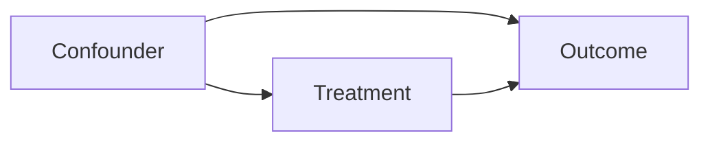

# Causal Inference Basics for ML Practitioners

## Why causality
Prediction answers "what will happen"; causality answers "what happens if we intervene".

## Potential outcomes
- `Y(1)`: outcome under treatment
- `Y(0)`: outcome under control
- ATE = `E[Y(1)-Y(0)]`

Fundamental challenge: we never observe both outcomes for same unit.

## Confounding
Confounder influences both treatment and outcome, biasing naive estimates.

## DAG reasoning
Use causal graphs to decide adjustment set.
Avoid conditioning on colliders.

## Methods
- RCT: gold standard when feasible.
- Propensity score methods (matching/IPW).
- Difference-in-Differences.
- Instrumental Variables.
- Regression Discontinuity.

## Heterogeneous effects
Estimate CATE for subgroup-aware policies (uplift targeting).

## Interview questions
1. Correlation vs causation with example?
2. What is a confounder and how handle it?
3. When use DiD?
