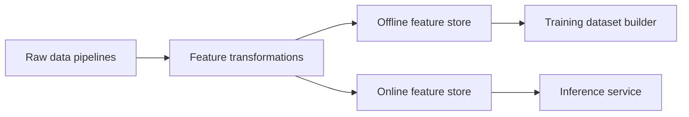

# Feature Stores in Production ML

## Why feature stores
Solve training-serving skew by centralizing feature definitions and point-in-time retrieval.

## Core architecture
- Offline store: historical features for training.
- Online store: low-latency features for serving.
- Registry: feature definitions, ownership, lineage.

## Training-serving skew
Happens when feature logic differs between offline training and online serving.
Feature store prevents this with shared transformation code and versioned definitions.

## Point-in-time correctness
Training features must be reconstructed using only data available at prediction timestamp.
Without this, leakage occurs.

## Materialization
Move selected offline features to online store on schedule or stream.

## Tool comparison
- Feast: open-source, flexible.
- Tecton: managed enterprise features.
- Vertex AI / SageMaker / Databricks feature stores: cloud-native integrations.

## Interview questions
1. What is training-serving skew?
2. Why point-in-time retrieval is critical?
3. When invest in a feature store?

## Logistics use case
ETA prediction features:
- depot congestion index
- carrier historical reliability
- route weather risk
All defined once, reused across training and real-time scoring.
